# Hermes 고급 렌더 효과 및 화면 전환 계획 검토 보고서 (HERMES_ADVANCED_RENDER_EFFECTS_REVIEW)

본 보고서는 `2026-05-26-advanced-render-effects-plan.md` 구현 계획과 현행 FFmpeg 기반 오디오-비디오 병합 파이프라인, 그리고 데이터베이스(DB) 구조를 깊이 있게 대조·분석하여 고급 렌더 효과(Ken Burns, xfade 등) 도입 시 발생할 수 있는 타임라인 프리징 오류 및 시스템 자원 병목을 미연에 방지하기 위한 의견서입니다.

---

## 1. 아키텍처 흐름 및 핵심 요약

본 계획은 렌더러에 시각적 완성도를 높여주는 **세부 모션 효과(Ken Burns-style zoom/pan 11종)**와 **화면 전환 효과(FFmpeg `xfade` 기반 트랜지션 4종)**를 추가하는 것을 골자로 합니다. 

특히 비디오가 서로 중첩되면서 전체 길이가 짧아져 오디오/자막 싱크가 어긋나는 대다수의 `xfade` 구현 버그를 예방하기 위해, **마지막 씬을 제외한 모든 씬의 비디오 트랙에 트랜지션 길이만큼의 추가 테일(Visual Tail)을 생성한 후 xfade 오프셋을 오디오 누적 시간에 매핑하는 시간 보정 설계**는 기술적으로 매우 훌륭하고 정교합니다.

다만, 가변 프레임(VFR) 소스로 인한 xfade 충돌 방지, FFMPEG 필터 해석 실패 시의 복구 메커니즘, 그리고 일관성 있는 데이터베이스(DB) 통합에 있어 몇 가지 수정 보완이 요구됩니다.

```mermaid
graph TD
    A[Electron UI: 렌더 효과 & 전환 프리셋 선택] --> B[youtube-workflow: job options 파싱]
    B -->|옵션 DB 적재| C[(SQLite bot_data.db)]
    B --> D[youtube-workflow-stages]
    D -->|전환 시간 반영| E[각 씬 비디오 생성: scene_N_synced.mp4]
    E -->|마지막 씬 제외 transitionSeconds 추가 렌더| F[FFmpeg xfade 필터 그래프 링킹]
    F -->|성공| G[고급 렌더링 결합 비디오 완성]
    F -->|실패: Filter Graph Error| H[자동 폴백: 일반 concat 결합 복귀]
    G --> I[자막 Overlay 및 렌더 리포트 v2 적재]
    H --> I
```



---

## 2. 주요 문제점 및 개선사항 분석

### ① VFR(가변 프레임 레이트) 클립의 xfade 타임라인 왜곡 리스크
- **문제점:** Google Flow에서 생성 및 다운로드된 동영상은 비고정 프레임(VFR) 코덱 구조를 가지는 경우가 빈번합니다. 프레임의 정확한 프레임 레이트와 타임스탬프(PTS) 정합성이 일치하지 않으면 `xfade` 오버랩 지점에서 비디오 렌더가 크래시를 일으키거나 프레임이 심하게 튀는(Frame Skip) 현상이 발생합니다.
- **개선안:** 
  - `scene-video-normalizer.mjs`에서 비디오 소스를 정제할 때 프레임 속도를 `fps=30`으로 단순 변경하는 것에 그치지 말고, **FFmpeg PTS 초기화 필터(`-vf "setsar=1,fps=30,setpts=PTS-STARTPTS"`)를 강제 적용**하여 모든 클립의 타임라인 타임스탬프 시작점(Zero-origin PTS)을 물리적으로 일치시켜 오차가 누적되지 않게 막아야 합니다.

### ② Xfade 오프셋 계산 안전 가드(Offset Boundary Guard) 추가
- **문제점:** 계획서의 `buildXfadeFilterGraph`는 각 씬의 누적 오디오 소요 시간(`cumulativeAudioDuration`)을 오프셋(`offset`) 값으로 매핑합니다. 만약 특정 씬의 실제 생성된 비디오 파일 길이가 예기치 않게 이 오프셋보다 짧다면(예: TTS 음성 길이 계산 미스매치), FFmpeg가 그래프 매핑 에러(`offset + duration exceeds input stream length`)로 실행을 즉각 거부하고 중단됩니다.
- **개선안:** 
  - 필터 그래프를 문자열로 빌드하기 전에, **각 씬 비디오의 실제 재생 시간(duration)을 `ffprobe` 등을 통해 사전 수집 및 검증**하여 오프셋 경계 범위를 벗어날 경우 xfade 렌더를 안전하게 차단하고 즉시 Safe Concat 폴백 모드로 우회시키는 사전 가드(Offset Validation Guard) 코드를 반영해야 합니다.

### ③ 렌더링 옵션의 SQLite DB 스키마 완전 통합
- **문제점:** 본 계획에 추가된 `renderEffectPreset`, `transitionPreset`, `transitionSeconds` 등의 렌더링 옵션들은 단순 로컬 JSON 구조에 머물러 있습니다. 시스템 관리 및 작업 히스토리의 연속성을 유지하려면 이전 리뷰들의 합의안처럼 이 모든 옵션이 DB에 정형 데이터로 영구 보관되어야 합니다.
- **개선안:**
  - SQLite `jobs` 테이블 스키마에 `render_effect_preset`, `transition_preset`, `transition_seconds` 등의 설정 필드를 반영하고, IPC 통신 시 메인 프로세스가 이 컬럼에 정상 보관하도록 `bot_db_helper.py`를 확장하여 데이터 일관성을 구현하십시오.

### ④ `minterpolate` (모션 보간) 필터의 극심한 자원 부하 제어
- **문제점:** 계획서 내에 언급된 `minterpolate`(Motion Interpolation) 필터는 CPU 모션 벡터 연산량이 상상을 초과하여, 저사양 클라이언트 PC 환경에서는 단 10초짜리 비디오를 생성하는 데도 수십 분 동안 CPU 100% 점유 현상을 유발할 수 있습니다.
- **개선안:** 
  - `minterpolate`는 기본값으로 절대 개입되지 않도록 완전히 잠금 처리하고, 사용자가 UI 상에서 "부드러운 시네마틱 프레임 보간(Cinematic Smooth Frame Interpolation)"을 명시적으로 수동 체크(Opt-in)했을 때에만 제한적으로 활성화되도록 제어해야 합니다. 또한 선택 시 UI 상에 "렌더링 속도가 크게 느려질 수 있습니다"라는 주의 팝업을 반드시 띄우도록 가이드를 수정해야 합니다.

---

## 3. SQLite 스키마 제안 및 FFMPEG 최적화 코드안

### A. SQLite 테이블 연동 제안
기존 `jobs` 테이블 스키마에 렌더링 옵션과 고급 효과 복귀 기록(Fallback Status)을 반영합니다.

```sql
-- jobs 테이블 옵션 필드 및 폴백 플래그 추가
ALTER TABLE jobs ADD COLUMN render_effect_preset TEXT DEFAULT 'cinematic';
ALTER TABLE jobs ADD COLUMN transition_preset TEXT DEFAULT 'scene-fade';
ALTER TABLE jobs ADD COLUMN transition_seconds REAL DEFAULT 0.3;
ALTER TABLE jobs ADD COLUMN advanced_effects_fallback INTEGER DEFAULT 0;
```

### B. FFmpeg PTS 정규화 필터 적용 제안 (`scene-video-normalizer.mjs`)
하이브리드 모드와 xfade 전환에 의한 프레임 이탈을 막기 위해 타임스탬프를 초기화하는 정규화 필터 체인 구성안입니다.

```javascript
// scene-video-normalizer.mjs 필터 체인 강화
const normalizedVf = [
  "scale=1080:1920:force_original_aspect_ratio=increase",
  "crop=1080:1920",
  "fps=30",
  "setsar=1",
  "setpts=PTS-STARTPTS", // PTS 리셋을 통해 VFR의 스티칭 노이즈 차단
  "format=yuv420p"
].join(",");
```

### C. FFMPEG Xfade 그래프 빌더 예외 가드 추가 (`timeline-transition-renderer.mjs`)
오프셋 계산 경계 위반으로 인한 FFmpeg 폭사를 사전 차단하는 경계 가드 로직입니다.

```javascript
// timeline-transition-renderer.mjs 가드 보강
export function buildXfadeFilterGraph({ sceneCount, transitionName = "fade", transitionSeconds = 0.3, sceneDurations = [] } = {}) {
  if (sceneCount < 2 || transitionSeconds <= 0) return "";
  const filters = [];
  let previous = "[0:v]";
  let cumulativeAudioDuration = Number(sceneDurations[0] || 0);

  for (let i = 1; i < sceneCount; i += 1) {
    const nextSceneDuration = Number(sceneDurations[i] || 0);
    // [가드] 누적 오프셋이 이전 비디오의 실제 길이를 넘거나 다음 씬 비디오의 길이가 트랜지션 길이보다 작으면 에러 방지용으로 결합 우회
    if (cumulativeAudioDuration >= (cumulativeAudioDuration + nextSceneDuration) || nextSceneDuration < transitionSeconds) {
       throw new Error(`Xfade duration boundary violated at scene index ${i}. Reverting to local fade.`);
    }

    const out = i === sceneCount - 1 ? "[vout]" : `[v${i}]`;
    const offset = Math.max(0, cumulativeAudioDuration).toFixed(3);
    filters.push(`${previous}[${i}:v]xfade=transition=${transitionName}:duration=${transitionSeconds}:offset=${offset}${out}`);
    
    previous = out;
    cumulativeAudioDuration += nextSceneDuration;
  }
  return filters.join(";");
}
```

---

## 4. 최종 구현 수용을 위한 권장 체크리스트

1. **Zero-origin PTS 리셋 강제:** VFR 클립의 타임라인 왜곡 방지를 위해 `scene-video-normalizer.mjs`에서 `setpts=PTS-STARTPTS`를 반드시 강제 적용할 것.
2. **Xfade 오프셋 바운더리 체크:** `ffprobe`나 씬 메타데이터의 실제 비디오 트랙 길이를 누적 오프셋과 비교하여 경계 침범 시 Safe Concat 폴백을 사전에 능동 실행할 것.
3. **DB 옵션 스키마 확장:** `render_effect_preset` 및 `transition_preset` 등을 SQLite `jobs` 테이블 컬럼에 통합시켜 히스토리를 DB에 정형 보관할 것.
4. **Motion Interpolation 안전 잠금:** `minterpolate`를 숨겨진 고급 옵션으로 격리하고 선택 시 렌더 지연 팝업을 반드시 표시해 사용자 이탈을 방지할 것.
