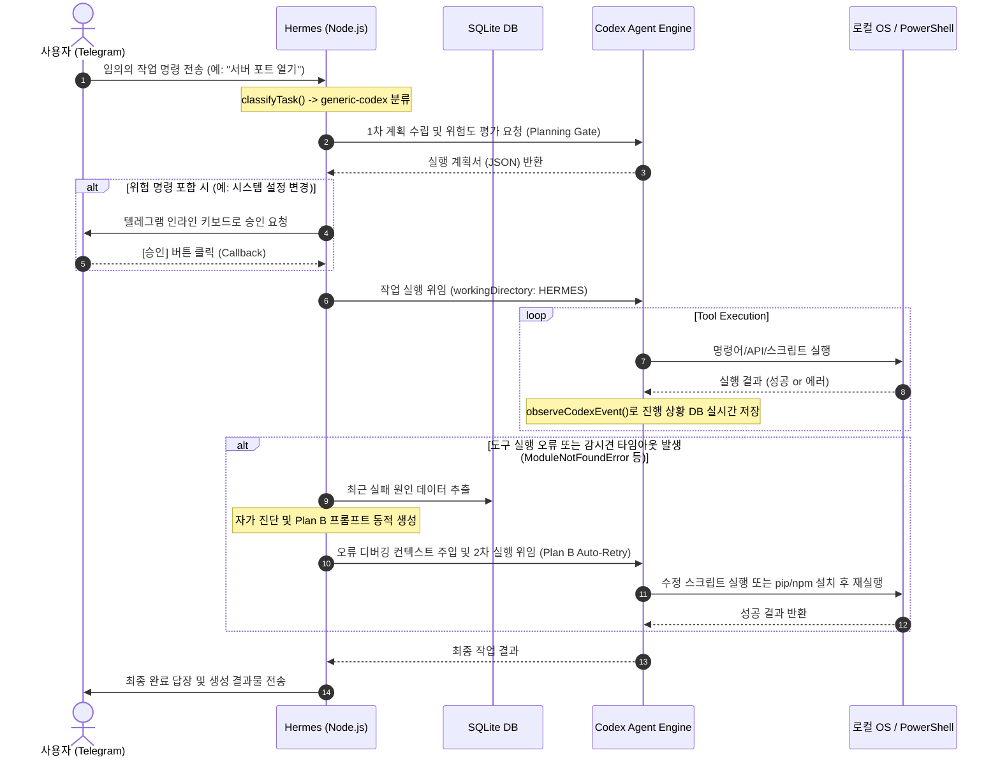

# Hermes Autonomous Agent Engine v2 업그레이드 분석 및 설계 리뷰 문서

본 문서는 사용자의 요청에 따라 텔레그램 봇(Hermes)이 주식 랭킹이나 뉴스 요약 같은 정해진 시나리오를 넘어, 시스템 관리, 파일 제어, 자율 코딩, 에러 진단 및 패키지 설치 등의 **임의의 복잡한 로컬 작업**에서도 Antigravity/Claude Code 수준의 강력한 자율 에이전트 능력을 발휘하도록 업그레이드하기 위한 설계 의견과 아키텍처 분석을 담고 있습니다.

---

## 1. 업그레이드의 핵심 목표 및 사상

현재의 Hermes는 특정 규칙에 맞는 질문(주식 조회, 뉴스 요약)에 최적화된 핸들러들을 보유한 '고성능 챗봇'에 가깝습니다. 일반적인 명령이 오면 Codex SDK로 우회하긴 하지만, 에러가 났을 때 자율적으로 디버깅하여 해결하려는 시도(Self-Correction)가 없으며, 감시견에 걸리면 단순히 멈춰 서서 사용자에게 원시 에러를 출력하고 마는 한계를 지니고 있습니다.

**v2 업그레이드의 사상**은 다음과 같습니다:
1. **문제 해결을 위한 다각적 시도**: 작업 중 예외(Exception)나 도구 실행 에러가 나면 프로세스를 끝내지 않고 에이전트가 "무엇 때문에 실패했는가?"를 직접 진단하게 만듭니다.
2. **지식 축적 및 반성(Self-Reflection)**: 실패한 이유(예: 의존성 패키지 없음, 파일 경로 누락, 구문 오류)를 Context Memory에 등록하고 이를 바탕으로 스스로 보완 스크립트를 짜거나 패키지를 설치한 뒤 다시 수행하는 피드백 루프를 가동합니다.
3. **통제 가능한 자율성(Controlled Autonomy)**: 무제한적 로컬 권한을 주되, 파일 일괄 삭제나 시스템 구성 변경 등 위험 행동 감지 시 텔레그램 메신저로 승인 버튼을 보내 안전 장치를 마련합니다.

---

## 2. v2 에이전트 핵심 아키텍처 (Workflow)

---

## 3. 세부 기능 구현 방안 및 분석

### 1) 자율적 오류 분석 및 복구 루프 (Self-Correction & Plan B Loop)
* **상세**: 에이전트가 로컬 명령어를 수행하다 에러(Exit Code가 0이 아니거나 `stderr`에 예외 로그 기록)를 뱉으면, `hermesReply` 루프 내에서 이 오류를 파싱합니다.
* **작동 메커니즘**:
  1. 발생한 오류 텍스트에서 핵심 예외명(예: `ModuleNotFoundError: No module named 'matplotlib'`, `PermissionError`)을 추출합니다.
  2. 에이전트 실패 데이터베이스에 이를 적재합니다.
  3. 프롬프트 생성기에 다음과 같은 **디버깅 룰**을 주입해 2차 시도를 보냅니다.
     * *"직전 시도에서 파이썬 실행 중 'A' 모듈 누락 에러가 발생하여 실패했습니다. 먼저 `pip install A`를 실행하여 모듈을 설치한 뒤, 원본 파이썬 스크립트를 다시 구동하십시오."*
     * *"직전 시도에서 파일 쓰기 권한 에러가 발생했습니다. 해당 경로의 존재 여부와 권한을 확인하고, 쓰기 가능한 임시 폴더(`C:\Users\amd\hermes\outputs`)를 대상으로 재시도하십시오."*
* **의의**: 이 복구 프롬프트와 즉각적인 1회 자동 재시도 루프를 통해 에이전트는 사람이 직접 명령어를 하나하나 쳐주지 않아도 스스로 의존성을 보완하며 해결에 도달하는 "Antigravity 스타일"의 생명력을 가집니다.

### 2) 텔레그램 대화식 승인 게이트 (Interactive Approval Gate)
* **상세**: 로컬 터미널에 무제한 접근하는 에이전트는 편리하지만 보안상 극도로 위험할 수 있습니다. 텔레그램의 **인라인 키보드(InlineKeyboardMarkup)**를 사용하여 위험이 큰 명령어의 실행을 제어합니다.
* **작동 메커니즘**:
  * Codex가 제안하는 명령어가 `rm`, `del`, `rmdir`, `git clean`, `format` 등의 패턴을 포함하는지 분석합니다.
  * 감지 시 텔레그램 메시지로 `"⚠️ 에이전트가 다음 로컬 명령을 실행하려고 합니다: [명령어 내용]. 승인하시겠습니까?"`를 보내고 하단에 `[승인 (Approve)]` / `[거절 (Reject)]` 버튼을 띄웁니다.
  * Node.js 봇은 `callback_query` 이벤트를 수신하기 전까지 Codex 스레드를 대기(Promise resolve 보류)시킵니다. 사용자가 승인하면 스레드가 마저 돌며, 거절하면 "사용자에 의해 거절되었습니다"라는 예외를 던져 안전하게 차단합니다.

### 3) 캔슬 가능한 백그라운드 대기열 (Jobs Queue & Cancel Command)
* **상세**: 현재는 단일 `busy = true` 플래그로 인해 봇이 긴 연산을 할 때 무반응 상태가 됩니다. 
* **작동 메커니즘**:
  * SQLite DB에 `jobs_queue` 테이블을 구성해 작업 진행 상태를 원격 관리합니다.
  * Node.js가 에이전트 구동 프로세스를 생성할 때 자식 프로세스의 `pid`를 DB에 등록합니다.
  * 사용자가 모바일 텔레그램 상에서 `/cancel` 명령을 치면, 봇이 즉각 DB에서 현재 구동 중인 `pid`를 가져와 `process.kill(pid, 'SIGKILL')`을 때리거나 Codex SDK AbortController에 중단 시그널을 날려 스레드를 회수합니다.

---

## 4. 확장성 및 향후 발전 가능성

이 v2 에이전트 아키텍처가 탑재되면, Hermes는 단순한 주식/뉴스 알림방이 아닌 **"내 개인용 로컬 서버 원격 개발자(Remote Autonomous Dev)"**가 됩니다.
* **코드 수정 요청 가능**: 텔레그램에서 `"c:\Users\amd\hermes\naver-stock-charts.mjs 파일 열어서 캡처 갯수 제한 15개로 늘려서 수정해줘"` 라고 요청하면, 봇이 스스로 해당 파일을 찾아 `replace_file_content` 또는 코드 변경을 수행하고 정상 컴파일 여부까지 직접 테스트하여 보고합니다.
* **장애 자체 대응**: 트레이딩 백엔드 프로세스가 뻗었을 때, `auto-trade-main-okx` 디렉토리에 접근해 `git pull`을 받고 `requirements.txt` 의존성을 확인해 재시작하는 운영 업무(Ops)를 텔레그램 대화 한 줄로 완전 자동화할 수 있습니다.

---
*본 분석 의견 보고서는 사용자 요청에 따라 **UTF-8** 형식으로 인코딩하여 저장되었습니다.*
*저장 경로: `C:\Users\amd\hermes\HERMES_AGENT_ENGINE_V2_REVIEW.md`*
