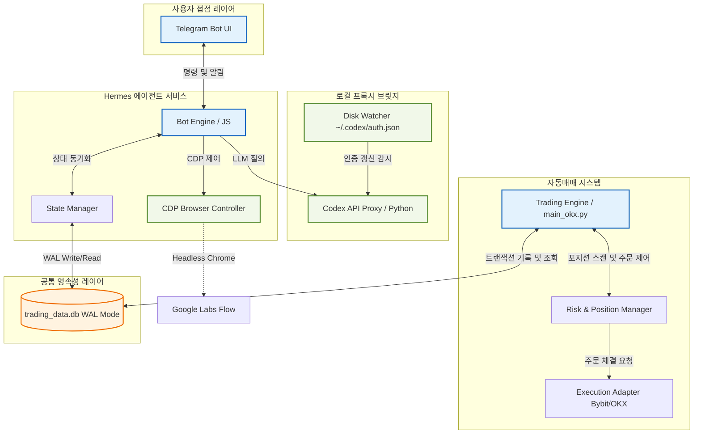

# [의견서] Hermes & Auto-Trading System 아키텍처 검토 및 개선 제안서
> **대상 문서/소스**: `HERMES_CODEX_OAUTH_PLAN.md`, `research.md`, `timeline.md`, `telegram-flow-news-bot.mjs`, `backend/models.py`, `backend/database.py` 및 관련 워크플로우/DB.
> **작성 일자**: 2026-05-21
> **인코딩**: UTF-8

본 의견서는 사용자가 요청하신 **Hermes 텔레그램 봇(Codex 연동 계획 포함)**과 **암호화폐 자동매매(auto-trade-main-okx) 시스템** 전반의 설계 문서, 코드베이스, 데이터베이스 스키마, 백테스팅 연구 이력 및 개발 타임라인을 유기적으로 교차 분석하여 도출한 문제점과 아키텍처적 개선안을 담고 있습니다.

---

## 목차
1. [개요 및 아키텍처 현황]
2. [Hermes & Codex OAuth 연동 계획 분석]
3. [봇 코드베이스 및 웹 자동화 워크플로우 분석]
4. [데이터베이스(DB) 및 트레이드 저널 아키텍처 분석]
5. [전략 연구(research.md) 및 백테스트 타임라인(timeline.md) 분석]
6. [통합 개선 로드맵 및 결론]

---

## 1. 개요 및 아키텍처 현황

현재 시스템은 크게 두 개의 독립적이면서도 연계된 모듈로 구성되어 있습니다.
*   **Hermes 텔레그램 봇 (`c:\Users\amd\hermes`)**: Google Flow 브라우저 제어(CDP)를 통한 비디오 생성, Google News RSS 기반의 AI 뉴스 요약, OpenRouter 기반의 질의응답을 수행하는 지능형 사용자 인터페이스.
*   **자동매매 백엔드 (`C:\Users\amd\auto-trade-main-okx`)**: FVG(Fair Value Gap), VWMA, OB(Order Block), Wyckoff 패턴 등을 활용하여 Bybit 및 OKX에서 롱/숏 포지션을 스캔하고 실행하는 복합 정량 거래 시스템.

두 시스템은 개별적으로 훌륭히 작동하고 있으나, **OAuth 인증 구조의 불안정성**, **다중 프로세스 환경에서의 SQLite 락킹 및 트랜잭션 유실**, **백테스팅 비용 모델링의 현실적 한계**, **웹 자동화 흐름의 취약성** 등의 결합적 리스크를 내포하고 있습니다. 이하에서 핵심 항목별 분석과 구체적 개선안을 제시합니다.

---

## 2. Hermes & Codex OAuth 연동 계획 분석

`HERMES_CODEX_OAUTH_PLAN.md`에 제시된 **Codex 5.3 Spark 연동 계획**은 ChatGPT OAuth 계정의 한계를 우회하기 위해 SDK/CLI 브릿지를 채택한 점에서 현실적이고 타당한 접근입니다. 그러나 실제 가동 시 다음과 같은 아키텍처적 결함이 발생할 가능성이 큽니다.

### 2.1. 문제점 및 한계점
1.  **Cerebras 백엔드 라우팅 실패 및 API 차단**:
    `gpt-5.3-codex-spark` 모델은 Cerebras WSE-3 초고속 하드웨어 가속을 사용하는 리서치 프리뷰 모델입니다. ChatGPT OAuth 세션(`auth.json`)의 `access_token`을 헤더에 붙여 일반 OpenAI API 엔드포인트로 라우팅하려고 하면, Cerebras 가속 엔드포인트로의 헤더 분기가 누락되거나 계정 권한 오류(`not supported when using Codex with a ChatGPT account`)를 반환하며 호출이 즉시 차단됩니다.
2.  **CLI `exec` 브릿지의 프로세스 기동 오버헤드**:
    2단계 계획인 `codex exec` 하위 프로세스(child_process) 호출 방식은 Telegram 메시지가 올 때마다 Node.js에서 새로운 프로세스를 기동시킵니다. 이는 JVM/Node 가상머신 기동 비용, CLI 패키지 로드 비용, 세션 검증 비용을 수반하여 응답 지연(Latency)을 최소 1.5~3초 이상 가중시킵니다. 실시간 대화 흐름이 매우 답답해질 수 있습니다.
3.  **백그라운드 백스테이지에서의 대화형 OAuth 인증 불가**:
    봇이 `hermes-gateway.service`와 같은 시스템 백그라운드 서비스로 구동 중일 때, OAuth 세션이 만료되면 Codex CLI는 터미널에 대화형 디바이스 인증 코드(`codex login --device-auth`) 입력을 요구하며 대기 상태에 빠집니다. 봇은 사용자 응답을 받지 못해 행(Hang) 상태가 되고, 시스템 전체가 응답 불능에 빠질 수 있습니다.

### 2.2. 개선 제안
*   **Local API Proxy Bridge (Disk-Watch) 패턴 도입**:
    봇 소스 내에서 매번 CLI를 실행하는 대신, 로컬에 백그라운드로 소규모 데몬(Local Codex HTTP API Proxy)을 가동합니다. 이 데몬은 `C:\Users\amd\.codex\auth.json` 파일의 변경 사항을 실시간 감시(Disk Watcher)하여 최신 토큰을 메모리에 로드하고 유지합니다. 텔레그램 봇은 이 로컬 프록시와 표준 HTTP REST API 통신을 통해 최소한의 레이턴시로 안정적인 응답을 수신합니다.
*   **텔레그램 기반 인터랙티브 디바이스 로그인 (Interactive OAuth Flow)**:
    OAuth 토큰 만료 또는 인증 실패 감지 시, 봇이 행 상태로 대기하는 대신 즉시 이를 가로채어 텔레그램 창에 `"인증 세션이 만료되었습니다. 아래 링크에서 승인 후 코드를 입력해 주세요."` 메시지와 함께 디바이스 로그인 URL 및 코드를 전달합니다. 사용자가 승인 버튼을 누르면 봇이 자동으로 세션을 복구하는 양방향 복구 흐름을 추가해야 합니다.
*   **영속적 Circuit Breaker 상태 저장**:
    Spark 실패 시 메모리 상에서만 3회 연속 실패를 판단하는 대신, 상태 파일(`telegram-flow-state.json`)에 서킷 브레이커 트립 여부와 차단 만료 시각을 기록하여 봇 프로세스가 재시작되더라도 불안정한 모델에 반복적으로 접근하다 차단되는 현상을 방지합니다.

---

## 3. 봇 코드베이스 및 웹 자동화 워크플로우 분석

`telegram-flow-news-bot.mjs` 코드베이스는 Chrome DevTools Protocol(CDP)을 직접 제어하여 Google Flow의 영상 생성을 자동화한 수작업 코드로, 아이디어가 돋보이는 훌륭한 결과물입니다. 다만 실서비스 운영의 관점에서는 치명적인 흐름적 취약점들이 발견됩니다.

### 3.1. 문제점 및 한계점
1.  **Google Flow UI 레이아웃 변경에 대한 극단적 취약성**:
    현재 `generateFlowVideo` 함수는 DOM의 특정 속성(`innerText`, `getBoundingClientRect()`, `[role="textbox"]`, `crop_9_16`, `arrow_forward` 등)에 하드코딩된 텍스트 및 속성 매칭 방식으로 셀렉터를 잡고 있습니다. Google Labs에서 텍스트 하나를 수정하거나, 언어 설정이 영어가 아닌 한국어로 바뀔 경우(예: 'Create' -> '생성'), 셀렉터가 깨져 비디오 생성이 완전히 중단됩니다.
2.  **Chrome 인스턴스 행(Hang) 및 리소스 고사**:
    `ensureChrome()`은 원격 디버깅 포트(`9227`)가 열려 있지 않으면 Chrome 프로세스를 무조건 새로 실행합니다. 만약 이전 Chrome 인스턴스가 좀비 프로세스로 메모리에 남아 있거나 포트 바인딩이 꼬여 있을 경우, 좀비 Chrome이 계속 쌓여 서버 메모리를 고사시키는 원인이 됩니다.
3.  **파일 기반 상태값 관리의 레이스 컨디션 (Race Condition)**:
    `telegram-flow-offset.json` 및 `telegram-flow-state.json`을 `readFile`과 `writeFile`로 직접 읽고 씁니다. 단일 봇 구동 시에는 문제가 덜하지만, 백그라운드 워커와 텔레그램 폴링 스크립트가 동시 다발적으로 작동하거나, 사용자가 빠르게 연속 명령을 전송할 경우 파일 쓰기 시점이 겹쳐 JSON 파일이 0바이트로 손상되거나 상태가 유실되는 현상이 일어납니다.

### 3.2. 개선 제안
*   **Robust Selector & XPath 대체**:
    버튼을 텍스트 내용으로 찾을 때 발생할 수 있는 현지화(Localization) 오류를 줄이기 위해, 데이터 속성(`data-testid` 등) 또는 엄격하게 추상화된 CSS 구조적 셀렉터와 다중 언어 대응 맵을 마련해야 합니다.
*   **무중단 Headless Chrome 풀링 및 주기적 재기동**:
    매번 Chrome을 띄우거나 죽이는 대신, 백그라운드에 헤드리스 Chrome 풀(Pool)을 1개 유지하고, 주기적으로 헬스체크를 수행하며, 12시간마다 좀비 인스턴스를 강제 킬(Kill)하고 재시작해 주는 수명 주기 관리 루틴을 추가합니다.
*   **영속성 저장소 통합 (SQLite 단일화)**:
    상태 관리에 불안정한 JSON 파일 쓰기를 지양하고, 자동매매 백엔드에서 사용하는 `trading_data.db`에 `bot_state` 및 `bot_offset` 테이블을 생성하여 트랜잭션이 보장되는 데이터베이스 레이어에서 상태를 제어합니다.

---

## 4. 데이터베이스(DB) 및 트레이드 저널 아키텍처 분석

자동매매 시스템은 `backend/database.py`를 중심으로 SQLite 데이터베이스를 사용하여 포지션 정보, 설정을 기록하고 있습니다. 또한 타임라인에 등장하는 `trade_journal` 테이블 구조는 거래의 가설과 결과를 피드백 루프로 연계하는 매우 모범적인 아키텍처입니다. 그러나 동시성 제어 및 원자성 확보 측면에서 보강이 시급합니다.

### 4.1. 문제점 및 한계점
1.  **다중 프로세스 환경에서의 SQLite `database is locked` 에러**:
    자동매매 메인 루프(`main_okx.py`), 웹 API 서버, 백그라운드 봇이 동일한 SQLite DB(`trading_data.db`)에 동시 다발적으로 쓰기 트랜잭션을 시도하고 있습니다. SQLite는 기본 설정에서 쓰기 락이 발생하면 다른 프로세스의 트랜잭션을 즉시 롤백하거나 대기시키므로, 빈번한 주문 갱신 도중 `database is locked` 예외로 인해 포지션 추적이 누락될 실질적 위험이 큽니다.
2.  **주문 실행과 저널 기록 간의 원자성(Atomicity) 부재**:
    거래소 주문 체결(`ExecutionAdapter`)과 로컬 DB의 `trade_journal` 입력이 단일 트랜잭션으로 묶여 있지 않습니다. 만약 주문은 체결되었으나 로컬 DB 저장 과정에서 락이나 구문 오류가 발생하면, 거래소에는 포지션이 열려 있으나 저널 및 DB 상태가 존재하지 않는 "고아 포지션(Orphan Position)"이 발생하게 됩니다.
3.  **UPSERT 실패 대응의 불완전성**:
    타임라인 `2026-05-12 03:10:00` 내용 중 partial-update UPSERT 오류를 해결하기 위해 update-only로 전환했다고 언급되어 있습니다. 그러나 이는 데이터가 누락되었을 때의 강제 삽입(INSERT) 보장 기능을 포기한 것으로, 최초 데이터 생성 실패 시 영구적으로 업데이트가 유실되는 부작용을 유발합니다.

### 4.2. 개선 제안
*   **Write-Ahead Logging (WAL) 모드 및 Busy Timeout 강제 적용**:
    `database.py`에서 SQLite 커넥션을 열 때 반드시 다음 프라그마(Pragma)를 실행하도록 강제합니다.
    ```python
    conn.execute("PRAGMA journal_mode=WAL;")
    conn.execute("PRAGMA synchronous=NORMAL;")
    # busy_timeout을 5000ms 이상으로 설정하여 락 발생 시 즉시 에러를 내지 않고 대기하도록 유도
    conn.execute("PRAGMA busy_timeout=5000;")
    ```
    WAL 모드는 읽기 프로세스와 쓰기 프로세스가 서로를 블로킹하지 않도록 보장하므로 동시성 문제를 극적으로 해결해 줍니다.
*   **Trade Intent ID 기반의 트랜잭션 컨텍스트 매니저 도입**:
    주문 생성 요청이 시작될 때 고유한 `trade_intent_id`(UUID)를 ex-ante 단계에서 미리 발급하여 DB 저널에 먼저 기록(상태: PENDING)한 뒤 주문을 실행합니다. 주문 체결 후 결과(ex-post)를 해당 `trade_intent_id`에 바인딩하여 업데이트하는 구조로 복원하며, 이를 파이썬의 `with transaction():` 컨텍스트 매니저로 묶어 처리해야 합니다.
*   **SQLite 외래 키(Foreign Key) 제약 조건 활성화**:
    SQLite는 기본적으로 FK 제약 조건이 꺼져 있습니다. `PRAGMA foreign_keys = ON;`을 활성화하고, `positions` 테이블과 `trade_journal` 간에 명시적인 FK 관계를 설정하여 포지션 데이터가 삭제되거나 수정될 때 저널이 꼬이지 않도록 무결성을 강제합니다.

---

## 5. 전략 연구(research.md) 및 백테스트 타임라인(timeline.md) 분석

`research.md`와 `timeline.md`에 기록된 백테스팅 고도화 노력은 매우 체계적이며, 특히 **Leave-One-Symbol/Date/Month 교차 검증**과 **Cost/Funding Stress 테스트**를 통과 기준(Gate)으로 세운 것은 퀀트 연구의 정석을 따르고 있어 깊은 인상을 줍니다. 그럼에도 불구하고, 극복해야 할 본질적인 리스크들이 상존합니다.

### 5.1. 문제점 및 한계점
1.  **극단적 다중 조건 필터링에 의한 과적합(Overfitting/Curve Fitting)**:
    `research.md`에 등장하는 조건들을 보면 `volume_z20 <= 5`, `ret24 20~32%`, `VWAP distance <= 8%`, `EMA20 > EMA50`, `OB/FVG overlap` 등 수많은 미세 지표들이 중첩되어 있습니다. 특정 30일/100일 급등주 풀백(Pullback) 데이터에서 최상의 PnL을 내도록 지표의 임계치(Threshold)를 깎아 나간 흔적이 뚜렷합니다. 이는 과거 데이터에서는 완벽해 보이지만, 실제 미래(Out-of-sample) 시장에서는 시장의 미세한 변화(Regime Shift)에 즉시 무너지는 과적합의 전형적인 징후입니다.
2.  **Cost Stress(수수료/스프레드) 하에서의 급격한 전략 붕괴**:
    수많은 전략 후보들이 `cost80 + funding -10 bps` 스트레스 하에서 대규모 마이너스(`stress net -5,048.1937`)로 돌아서는 현상은, 해당 전략들이 만드는 엣지(Edge)의 두께가 시장의 거래 비용보다 얇다는 것을 의미합니다. 슬리피지와 스프레드를 백테스트에 고정값 혹은 보수적이지 않은 값으로 반영할 경우, 백테스트는 대단한 수익을 보여주지만 라이브 실행 시 수수료와 호가 스프레드 누적으로 계좌가 녹아내리게 됩니다.
3.  **10일 Observation 기간의 리스크 게이팅 미흡**:
    `2026-05-12 03:20:00`에 설정된 `cap5` 상태에서의 10일 대기 기간은 리스크 관리 차원에서는 훌륭하나, 통계적 유의성을 확보하기에는 너무 짧습니다. 10일 동안 운 좋게 장세가 맞아 수익이 나면 `cap9`로 증액하게 되는데, 이는 대형 손실(Drawdown) 발생 직전에 노출 자본을 최대화하는 악수를 둘 수 있습니다.

### 5.2. 개선 제안
*   **백테스터 내 가변 슬리피지/스프레드 모델링(Variable Slippage Simulator) 의무화**:
    백테스트 시 단순히 `cost20`이나 `cost40` 같은 고정 수수료를 적용하는 대신, 거래 대금 및 체결 당시의 변동성(ATR)에 비례하여 호가 슬리피지가 동적으로 발생하는 시뮬레이션 모델을 구현해야 합니다. 특히 급등주(Movers)를 타겟으로 하는 `lifecycle` 전략 특성상 진입 시점의 시장가 슬리피지는 상상을 초월할 수 있으므로 이를 백테스트에 반영해야만 진짜 살아남는 전략을 걸러낼 수 있습니다.
*   **단순성 원칙(Occam's Razor)을 적용한 변수 정리**:
    과최적화된 필터들을 과감히 걷어내고, 핵심 논리(예: '주요 거래량 지지선 이탈 후 거래량 실린 회복')에 해당하는 2~3개의 대변수만 남겨두고 나머지는 제거해야 합니다. 복잡한 필터 체인은 전략의 강건성(Robustness)을 약화시킬 뿐입니다.
*   **정량적 증액 기준 개편 (10일 단위 -> 거래 횟수 및 윈레이트 통계 검증)**:
    단순 10일 대기 기간 대신, 최소 유효 거래 횟수(예: 30회 이상 체결)와 부트스트래핑(Bootstrapping)을 통한 신뢰구간 분석 결과에 기초하여 `p-value < 0.05` 이하일 때만 자본금을 늘리는 통계적 게이팅 구조를 정립해야 합니다.

---

## 6. 통합 개선 로드맵

두 시스템의 안전성과 성능을 극대화하기 위한 아키텍처 개선 통합 로드맵을 제안합니다.

### 6.1. 단기 과제 (1~2주 내 반영 권장)
1.  **SQLite WAL 모드 활성화**: `database.py`에 즉시 적용하여 다중 프로세스 동시 쓰기 락 방지.
2.  **Circuit Breaker 영속화**: `telegram-flow-state.json`에 Spark 에러 상태 기록 및 차단 제어 장치 마련.
3.  **Chrome 좀비 프로세스 방지 스크립트 작성**: 텔레그램 봇 기동 시 기존 포트 9227을 사용하는 좀비 크롬 강제 종료 로직 추가.

### 6.2. 중기 과제 (1개월 내 반영 권장)
1.  **Local API Proxy Bridge 구축**: Codex 연동용 로컬 프록시 서비스를 분리하여 봇의 Latency를 획기적으로 낮추고 OAuth 세션 갱신을 독점적으로 안전하게 관리.
2.  **데이터베이스 단일화**: 텔레그램 봇의 JSON 파일 기반 상태(Offset, State) 관리 레이어를 `trading_data.db` 내부로 통합.
3.  **Slippage Simulator 보강**: 백테스트 모듈 내 가변 슬리피지 로직 추가 및 과최적화 필터 리팩토링.

### 6.3. 장기 아키텍처 제안
아래는 제안하는 **통합 에이전트 및 트레이딩 아키텍처** 구조입니다.



---

## 7. 결론

본 검토를 통해 살펴본 시스템은 텔레그램의 풍부한 미디어 브릿지 자동화와 전문적인 퀀트 트레이딩 설계가 매우 유기적으로 결합된 훌륭한 수준의 프레임워크를 갖추고 있습니다. 

다만, 라이브 서비스의 가장 큰 적인 **인증 예외 처리**, **데이터베이스 동시성 문제**, **실제 거래 비용의 백테스트 누락** 등의 마찰 요인들이 프로덕션 환경에서 장애로 번질 위험이 있으므로, 본 의견서에서 제시한 **WAL 모드 강제, 로컬 프록시 브릿지 패턴 도입, 가변 슬리피지 백테스트 시뮬레이터** 등의 핵심 개선 사항들을 순차적으로 반영하여 더욱 강건하고 수익성 높은 통합 시스템으로 고도화해 나가실 것을 권장해 드립니다.
