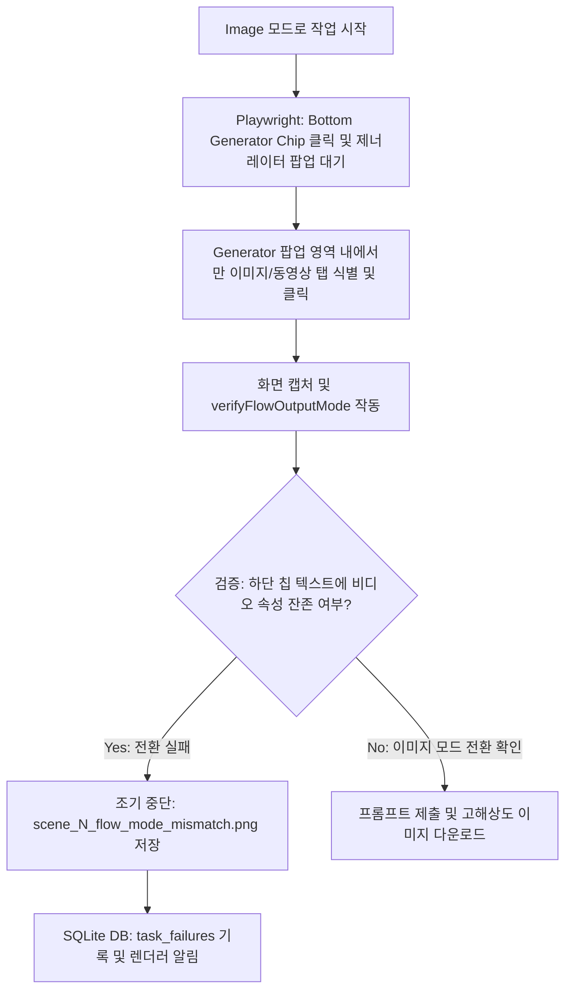

# 구글 플로우 이미지 모드 실제 비디오 선택 오류 해결 계획 검토 보고서 (HERMES_FLOW_IMAGE_MODE_FIX_REVIEW)

본 보고서는 `2026-05-26-flow-image-mode-actual-video-selection-fix-plan.md` 구현 계획과 현행 코드베이스, 데이터베이스(DB), 그리고 구글 플로우(Google Flow) 자동화 워크플로우를 자세히 점검하여 제안된 해결책의 유효성을 평가하고 안정성을 강화할 수 있는 개선안을 제공합니다.

---

## 1. 근본 원인(Root Cause) 및 아키텍처 평가

사용자의 "콘솔에서 이미지를 선택했으나 구글 플로우에서는 계속 동영상으로 생성된다"는 버그 제보는 100% 사실이며, 기획서의 버그 추론 과정 또한 매우 정확합니다.

- **기존 방식의 맹점:** `automation/google-flow-output-mode.mjs`에서 단순히 전체 뷰포트 내의 `image` 혹은 `이미지` 텍스트를 순회하며 `some()`을 통해 하나의 클릭이라도 성공하면 전환 완료로 간주했습니다. 이로 인해 우측 제너레이터 팝업 메뉴 내의 모드 전환 버튼이 아닌, 왼쪽 사이드바나 라이브러리의 텍스트를 잘못 클릭하여 **실제 생성 모드가 전환되지 않았음에도 시스템은 성공한 것으로 속아 동영상 생성을 지속**했습니다.
- **제안된 해결책의 타당성:** 변경하려는 타겟 영역(화면 하단 68% 이하 좌표의 제너레이터 칩)을 엄격하게 필터링하여 정확한 클릭 위치를 타겟팅하고, 클릭 후 UI 텍스트(예: `동영상`, `00:10:00` 등 비디오 속성)의 존재 여부를 통해 모드가 실제 변환되었는지 검증(`verifyFlowOutputMode()`)하여 불일치 시 중단하는 **Fail-Fast** 전략은 이 문제를 영구히 해결할 수 있는 올바른 접근입니다.



---

## 2. 추가적인 개선 제안 및 보완점

### ① 다국어 UI 환경에서의 검증 실패 방지 (Playwright Locale Enforce)
- **문제점:** 구글 플로우는 사용자의 구글 계정 기본 언어 및 브라우저의 로케일에 따라 한국어(`동영상`, `이미지`) 또는 영어(`video`, `image`)로 인터페이스를 로딩합니다. 계정 세션의 환경에 따라 텍스트 검증 결과가 엇갈릴 리스크가 있습니다.
- **개선안:** 
  - `google-flow-media.mjs`에서 Playwright 브라우저 컨텍스트를 기동하는 `launchPersistentContext` 설정 시, 한국어 로케일을 명시적으로 강제(`locale: "ko-KR"`)하여 구글 플로우가 일관되게 한국어 UI로 응답하도록 환경을 물리적으로 제어해야 검증 정규식의 오판을 방지할 수 있습니다.
  ```javascript
  const context = await chromium.launchPersistentContext(profileDir, {
    executablePath: chromePath,
    headless: false,
    locale: "ko-KR", // 한국어 UI 강제 설정
    acceptDownloads: true,
    args: ["--no-first-run", "--no-default-browser-check"],
  });
  ```

### ② 일시적인 UI 지연 극복을 위한 새로고침(Reload) 복구 전략
- **문제점:** 구글 플로우 웹앱의 비동기 반응 속도 저하나 팝업 렌더링 지연으로 인해 일시적으로 하단 제너레이터 칩이 열리지 않거나 오동작하여 `verifyFlowOutputMode()`가 에러를 던질 수 있습니다. 단순 1회 실패로 작업을 완전히 중단시키는 것은 전체 파이프라인의 이탈율을 높입니다.
- **개선안:** 
  - 모드 불일치 감지 시 즉시 에러를 내지 않고, **웹페이지를 새로고침(`page.reload()`) 하거나 프로젝트 URL로 재접속한 뒤 모드 변경을 1회 재시도(Retry with Reload)**하도록 복구 시나리오를 구성하면 일시적인 웹앱 프리징 오류를 크게 줄일 수 있습니다.

### ③ SQLite DB 연동 및 텔레그램 /diagnose 기능 강화
- **문제점:** 모드 미스매치로 인한 조기 중단이 발생할 때, 렌더러 화면에만 경고가 노출되고 DB에 명확한 원인이 쌓이지 않으면 관리가 어려워집니다.
- **개선안:**
  - `flow-mode-mismatch` 상황 발생 시 `workflow-db-events.mjs`를 통해 SQLite `task_failures` 테이블에 `recovered = 0` 상태로 기록하고, 상세 JSON 데이터 필드에 `selectedOutputMode: "video" (실제 작동 상태)`와 `requestedOutputMode: "image" (요청 상태)` 정보를 기록하십시오. 이를 통해 텔레그램 원격 봇 명령어 `/diagnose`에서 사용자에게 "구글 플로우가 동영상 모드에서 이미지 모드로 전환되지 않았습니다"라는 조치 가이드를 제공할 수 있습니다.

### ④ 성공적인 검증 파일(JSON)의 파일 오버헤드 최소화
- **문제점:** 매 씬마다 `scene_N_flow_mode_switch.json` 및 `scene_N_flow_mode_verification.json` 파일을 작업 폴더에 정적으로 생성하면 디렉토리에 지나치게 많은 파편 파일이 쌓입니다.
- **개선안:**
  - 모드 전환 및 검증이 정상 완료(`ok: true`)된 경우에는 상세 JSON 파일을 생성하지 않고 최종 `draft.json`의 각 씬 객체에 메타데이터 필드로 보존하게 하며, **검증에 실패(`ok: false`)하여 에러가 발생한 상황에서만 미스매치 파일 및 스크린샷을 물리적으로 저장**하도록 구현하여 산출물 디렉토리를 단순화할 수 있습니다.

---

## 3. 최종 구현 수용을 위한 권장 체크리스트

1. **Playwright 로케일 한국어 고정:** 다국어 세션 충돌 방지를 위해 `locale: "ko-KR"` 컨텍스트 옵션을 강제 적용할 것.
2. **제너레이터 팝업 외 영역 필터링:** `generatorMenuOnly` 옵션을 활성화하여 사이드바나 다른 임의의 영역을 클릭하지 않도록 엄격하게 클릭 좌표 범위를 한정할 것.
3. **새로고침 기반 1회 복구 추가:** 불일치 시 `page.reload()`를 경유하는 재시도 로직을 탑재하여 일시적인 구글 웹앱 로딩 에러율을 낮출 것.
4. **DB task_failures 미스매치 코드 등록:** 실패 시 `flow-mode-mismatch` 타입을 데이터베이스에 명시적으로 기록하여 사후 진단 분석을 지원할 것.
