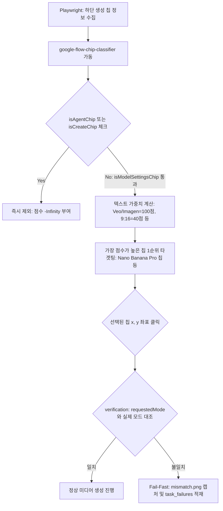

# Google Flow 비디오 모드 에이전트 칩 클릭 버그 해결 계획 검토 보고서 (HERMES_FLOW_VIDEO_MODE_AGENT_CHIP_REVIEW)

본 보고서는 `2026-05-27-flow-video-mode-mismatch-agent-chip-fix-plan.md` 구현 계획과 현행 Playwright 브라우저 자동화 모듈, 오케스트레이터, 그리고 데이터베이스(DB) 간의 의존성을 면밀히 검토하여, 구글 플로우(Google Flow) 내 칩 클릭 버그의 근본 대책과 시스템 완성도를 보장하기 위한 추가 기술적 조치들을 제안합니다.

---

## 1. 실패 진단 및 칩 분류기 아키텍처 평가

하이브리드 첫 씬 생성 시 비디오 생성 모드로 전환되어야 함에도 불구하고 화면 상의 `에이전트` 칩을 클릭하여 결국 생성 방식 전환에 실패하고 `Google Flow output mode mismatch` 크래시로 귀결되었던 현상은 Hermes 자동화 프로세스의 주요 내결함성(Fault tolerance) 한계였습니다.

- **원인 판명:** 기존 셀렉터가 하단 버튼 칩의 너비(`width > 48`) 등 단순 기하학적 정보나 광범위한 텍스트 매칭에 의존하여, 실제 이미지/비디오 타겟 모델명이 적힌 버튼이 아닌 그 좌측의 `에이전트` 혹은 `요청 사항` 칩을 선택해 버린 것이 원인입니다.
- **제안된 칩 분류기(`google-flow-chip-classifier.mjs`)의 유효성:** 
  - 브라우저 의존성이 없는 순수 JS 분류 모듈로 `isAgentChip`을 엄격히 차단하고, 실제 생성 모델 단어(Veo, Imagen, Nano Banana 등) 및 비디오/이미지 텍스트 가중치 점수(`scoreFlowGeneratorChip`)를 계산하여 정렬하는 로직은 이 버그를 완전하게 예방합니다.
  - 실패한 실제 작업(`youtube-1779881814681`)의 칩 데이터를 목 데이터(failedJobBottomButtons)화하여 static 검증을 통과하도록 강제하는 회로 테스트(`check-flow-chip-classifier.mjs`)는 향후 유사한 UI 레이아웃 노이즈 유입 시에도 회귀 에러를 막는 신뢰도 높은 예방 장치입니다.



---

## 2. 추가적인 기술 보완점 및 개선 제안

### ① 브라우저 내 동적 함수 파싱 예외 처리 (Browser Eval Error Bridge)
- **문제점:** ESM 파일 모듈 구조상 `google-flow-chip-classifier.mjs` 코드를 Playwright 브라우저 컨텍스트(`page.evaluate`) 내부로 넘기기 위해 `Function()` 문자열 바인딩 방식을 사용합니다. 이때 브라우저 콘솔 내에서 오타나 런타임 예외가 발생할 경우, Node.js 부모 터미널에 에러 추적이 되지 않고 브라우저 자체가 멈추거나 원인 미상의 락에 걸릴 리스크가 있습니다.
- **개선안:** 
  - 브라우저 컨텍스트 내의 `Function` 기동부를 `try/catch` 블록으로 래핑하여, 에러 발생 시 원인 메시지(`eval-failed`)와 stack을 부모의 리턴 JSON 객체에 담아 Node.js 터미널 콘솔 및 `scene_N_flow_mode_switch.json` 파일에 즉각 안전하게 전송하도록 예외 브릿지를 강화해야 합니다.

### ② 신규 이미지/비디오 모델 출현 대비 정규식 확장성 보완
- **문제점:** 현재 `isModelSettingsChip`에 사용된 정규식 패턴은 `/Nano Banana|Imagen|Veo/i` 등입니다. 구글 랩스가 모델 업데이트를 단행하여 새로운 비디오 생성 모델인 `Veo 3.2` 또는 차세대 이미지 모델 명칭이 도입되면 매칭 점수가 떨어져 칩 선택이 오작동할 수 있습니다.
- **개선안:**
  - 텍스트 비교 대상을 항상 소문자(`toLowerCase()`)로 강제 통일하여 일관성을 다지고, 향후 신규 모델명의 유연한 수용을 위해 `/veo\s*\d*|imagen\s*\d*/i`와 같은 **정밀 버전 와일드카드 정규식**을 보강하는 것이 제품 생명주기 관리에 이롭습니다.

### ③ SQLite DB의 task_failures 오류 필드 및 칩 레이블 연동
- **문제점:** 칩 토글 불일치(`flow-mode-mismatch`) 장애 발생 시 단순히 에러 코드만 저장하면 어떤 칩을 잘못 클릭해서 전환이 안 됐는지 히스토리 추적이 어려워집니다.
- **개선안:** 
  - SQLite `task_failures` 테이블에 에러를 인서트할 때, `error_msg` 컬럼에 `flow-mode-mismatch` 코드와 함께 **실제 Playwright가 선택해서 클릭했던 오류 버튼의 텍스트 레이블 정보(예: `selectedChipLabel: 에이전트`)를 함께 주입**하도록 `youtube-workflow-stages.mjs`와 `bot_db_helper.py` 연동 구간에 매개변수를 추가하십시오. 이를 통해 텔레그램 `/diagnose` 분석 창에서 현장 스크린샷 검사 없이 즉각적인 원인 진단이 가능해집니다.

---

## 3. 세부 리팩토링 구현 제안 코드

### A. 브라우저 컨텍스트 예외 브릿지 보강 (`google-flow-output-mode.mjs`)
브라우저 내부 파싱 실패 시 상위 Node.js로 상세 에러 스택을 이송하는 안전 코드 구성안입니다.

```javascript
// findBottomGeneratorChip 내의 browser evaluate 예외 보충
const findBottomGeneratorChip = () => page.evaluate((classifierSource) => {
  try {
    const { chooseFlowGeneratorChip } = Function(`${classifierSource}; return { chooseFlowGeneratorChip };`)();
    
    // ... 기존 el 검색 및 mapping 로직 생명주기 동일 ...
    const bottomItems = Array.from(document.querySelectorAll("button,[role='button']")).map(/* 생략 */);
    const selected = chooseFlowGeneratorChip(bottomItems);
    
    if (!selected) {
      return { ok: false, reason: "model/settings chip not found", bottomButtons: bottomItems };
    }
    return {
      ok: true,
      text: selected.label,
      bottomGeneratorChip: true,
      x: Math.round(selected.x + selected.width / 2),
      y: Math.round(selected.y + selected.height / 2),
      score: selected._score,
      bottomButtons: bottomItems
    };
  } catch (error) {
    // 브라우저 내 에러를 상위 Node.js로 정상 전달
    return {
      ok: false,
      reason: `Browser-side classifier evaluation crash: ${error.message}`,
      stack: error.stack
    };
  }
}, getFlowChipClassifierBrowserSource());
```

### B. SQLite task_failures 연동을 위한 인자 확장 제안 (`youtube-workflow-stages.mjs`)
장애 원인을 SQLite 데이터베이스에 완전 동기화하는 구조안입니다.

```javascript
// youtube-workflow-stages.mjs 내 에러 캐치 부분
catch (error) {
  if (error.message.includes("output mode mismatch")) {
    const failurePayload = {
      failureCode: "FLOW_MODE_MISMATCH",
      requestedOutputMode: outputMode,
      selectedChipLabel: error.details?.selectedChipLabel || "unknown",
      message: error.message
    };
    // SQLite DB에 상세 코드 및 클릭 칩 레이블 인서트
    context.dbHelper?.logFailure(
      "youtube-workflow", 
      context.chatId, 
      context.messageId, 
      JSON.stringify(failurePayload)
    );
  }
  throw error;
}
```

---

## 4. 최종 구현 수용을 위한 권장 체크리스트

1. **브라우저 에러 래핑 탑재:** 브라우저 evaluate 내부에 `try/catch` 블록을 탑재하여 렌더러 터미널에 브라우저 내 스크립트 에러가 정확히 리포팅되게 할 것.
2. **와일드카드 모델명 정규식 튜닝:** `isModelSettingsChip`에서 차세대 모델 출시 대비 `/veo\s*\d*|imagen\s*\d*/i` 형태로 모델 정규식 버전을 유연하게 변경할 것.
3. **DB 실패 로그 연동:** `task_failures` DB의 `error_msg`에 클릭 오판된 칩 텍스트 레이블 정보를Prefix하여 봇 진단 가시성을 강화할 것.
4. **Shared Classifier 테스트 검증:** `check-flow-chip-classifier.mjs` 회귀 테스트를 main `check` 체인에 포함시켜 칩 우선순위 스코어가 절대 틀어지지 않게 방어할 것.
