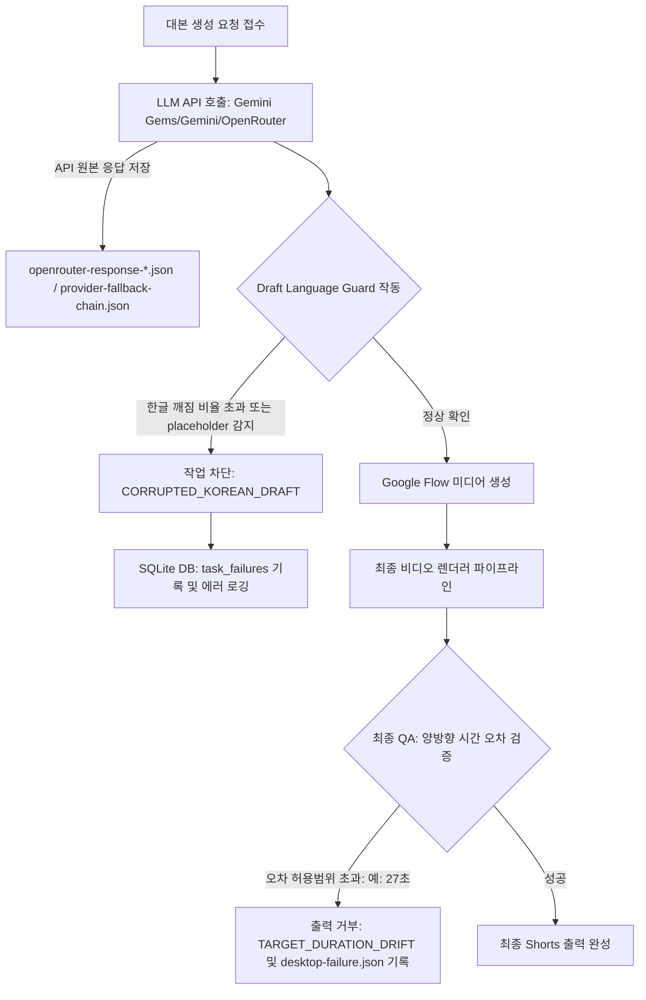

# Gemini Gems 대본 생성 오류 해결 및 렌더 효과 세분화 계획 검토 보고서 (HERMES_GEMINI_GEMS_DRAFT_FIX_REVIEW)

본 보고서는 `2026-05-26-gemini-gems-draft-failure-root-cause-plan.md` 구현 계획과 현행 대본 생성 파이프라인, 모션 렌더링 및 SQLite DB 구조를 종합적으로 비교·분석하여 대본 품질 검증 및 렌더 강도 설정 적용 시 보완해야 할 기술적 개선점을 제시합니다.

---

## 1. 근본 원인 분석 및 아키텍처 평가

최근 식별된 실패 작업(`youtube-1779789068109`)에서 드러난 버그는 시스템의 다중 실패(Multi-stage failure)가 겹친 결과입니다.

1. **API 응답 검증 미흡:** Gemini Gems 자동화 프로세스 중 API가 대본 대신 스키마 설명 텍스트를 반환했음에도, 1차 파싱 필터에서 이를 정상적인 초안으로 잘못 인정했습니다.
2. **한글 깨짐(Mojibake) 방치:** 인코딩 오류로 한글이 깨진 텍스트가 입력되었음에도 걸러지지 않아, 결국 구글 플로우에 비정상적인 프롬프트가 주입되었습니다.
3. **양방향 시간 오차 검사 부재:** 타겟 영상의 길이는 60초임에도 실제 렌더링된 비디오가 27초 수준으로 반토막 났음에도 최종 QA가 통과되는 시간 오차 필터의 맹점이 존재했습니다.

기획서에서 제안한 **(1) 한글 깨짐 분석기 탑재를 통한 Fail-Fast 처리, (2) 제공자별 응답 이력(`provider-fallback-chain.json`) 적재, (3) 양방향 시간 오차 필터(Bidirectional Duration Drift), (4) 결정론적 랜덤 렌더 효과 강도 분리**는 시스템의 완성도를 혁신적으로 올릴 수 있는 올바른 방향입니다.



---

## 2. 세부 문제점 및 개선 방안

### ① 한글 깨짐(Mojibake) 오진 가드 완화 (False Positive Guard)
- **문제점:** 기획서에 제안된 깨진 한글 정규식과 물음표 클러스터 감지 로직(`questionClusterCount >= 3`)은 정상적인 대본에서도 오진을 유발할 리스크가 있습니다.
  - 예: 사용자가 강조를 위해 문장 끝에 물음표를 연달아 사용한 대본(예: "설마 AI가 개발자를 대체할까요???")이나, 한자어 비중이 높은 학술적 뉴스 대본이 깨진 텍스트로 오인되어 전체 파이프라인이 즉각 강제 종료될 수 있습니다.
- **개선안:** 
  - 단순 매칭 카운트가 아니라, **정상적인 완성형 한글 대비 깨진 문자의 상대적인 백분율 비율(Percentage Ratio)**을 함께 결합하여 판단해야 합니다.
  - 전체 텍스트 길이가 30자 이상일 때 한글 완성형 자모(`[\uac00-\ud7af]`)가 차지하는 비율이 전체 글자 수의 25% 미만인 경우에 한해서만 한글 깨짐(`CORRUPTED_KOREAN_DRAFT`)으로 최종 확정하는 안전 예외 비율 조건을 결합하십시오.

### ② 무한 루프 API 크레딧 낭비 방지를 위한 회로 차단기(Circuit Breaker) 도입
- **문제점:** Gemini Gems부터 일반 Gemini, OpenRouter까지 다단계로 이어지는 Fallback 체인에서 생성된 대본이 연속해서 Mojibake 에러를 낼 경우, 시스템이 지연 시간과 유료 API 비용을 과도하게 소모하게 됩니다.
- **개선안:**
  - 동일한 형태의 에러(예: 3회 연속 JSON 파싱 실패 또는 한글 깨짐 감지)가 누적될 경우, 즉각 Fallback 루프를 정지하고 사용자에게 API 품질 오류 알림과 함께 조기 차단하는 **회로 차단기(Circuit Breaker)** 정책을 `buildGeminiResearchDraft` 초입에 배치해야 합니다.

### ③ 렌더 강도(`motionIntensity`) 파라미터의 SQLite DB 스키마 통합
- **문제점:** 새롭게 제안된 렌더 효과의 강도 설정(`motionIntensity: none | light | strong`) 옵션이 로컬 메모리와 JSON 파일에만 머물러 있습니다. 이전 리뷰의 데이터 관리 일관성 원칙에 의거하여, 이 설정 또한 데이터베이스 스키마에 완전히 편입되어야 합니다.
- **개선안:** 
  - SQLite `jobs` 테이블에 `motion_intensity` TEXT 컬럼을 추가하고, 앱 초기화 시점에 이 스키마가 업데이트되도록 `bot_db_helper.py` 파일의 마이그레이션 로직에 연동하십시오.

### ④ `desktop-failure.json` 내 민감정보 누출 방지
- **문제점:** Electron 메인 프로세스에서 크래시 발생 시 상세한 `desktop-failure.json`을 저장하게 설계되었습니다. 이 과정에서 `input` 내에 시스템 API 키, 개인 계정 프로필 세션 경로 등의 민감 정보가 여과 없이 플랫 텍스트로 저장될 위험이 있습니다.
- **개선안:** 
  - `desktop-failure.json`을 기록할 때, `input` 객체 내의 `apiKey`, `password`, `cookie` 등 인증 관련 민감 키값을 마스킹(Sanitize/Filter)하여 파일 시스템에 안전하게 적재하도록 보안 마스킹 처리를 필수화해야 합니다.

---

## 3. SQLite DB 연동 및 한글 검증 최적화 설계안

### A. SQLite 테이블 연동 제안
렌더 효과 강도 설정을 DB 상에서 확실하게 영구 보관할 수 있도록 스키마를 갱신합니다.

```sql
-- jobs 테이블에 motion_intensity 옵션 컬럼 영구 통합
ALTER TABLE jobs ADD COLUMN motion_intensity TEXT DEFAULT 'light';
```

### B. 한글 깨짐 오진 예방 검증기 코드 제안 (`youtube-draft-quality.mjs`)
상대 비율 검증을 포함해 정상 대본의 폐기를 방어하는 코드안입니다.

```javascript
// youtube-draft-quality.mjs 내 검증 로직 고도화
export function detectCorruptedKorean(text = "") {
  const value = String(text || "").trim();
  if (value.length < 20) return { corrupted: false };

  const totalLen = value.length;
  const hangulCount = Array.from(value.matchAll(/[\uac00-\ud7af]/gu)).length;
  const mojibakeCount = Array.from(value.matchAll(/[]|(?:\?[가-힣]?){2,}|[媛-힣][\u0080-\uffff]*|[李-璘]|[寃-힣]/gu)).length;
  const questionClusterCount = Array.from(value.matchAll(/\?{3,}/g)).length; // 물음표 3개 이상 연속만 감지

  // 완성형 한글 비율 계산
  const hangulRatio = hangulCount / totalLen;

  // 한글 비율이 극도로 낮으면서 깨진 패턴이 있거나, 물음표 클러스터 비중이 이상치인 경우만 확정
  const isCorrupted = (mojibakeCount >= 4 && hangulRatio < 0.20) || 
                      (questionClusterCount >= 4 && hangulRatio < 0.15) || 
                      (hangulCount < 4 && totalLen > 30);

  return {
    hangulCount,
    hangulRatio: Number(hangulRatio.toFixed(3)),
    mojibakeCount,
    corrupted: isCorrupted
  };
}
```

---

## 4. 최종 구현 수용을 위한 권장 체크리스트

1. **상대 비율 기반 한글 깨짐 탐지:** 물음표 3개 연속 입력 등 단순 입력으로 인한 오진 방지를 위해 한글 완성 자모 비율 검증을 병합할 것.
2. **에러 파일 내 보안 마스킹:** `desktop-failure.json` 저장 시 민감 정보(API Key, Token 등)를 필터링하는 마스킹 로직을 내장할 것.
3. **SQLite 렌더 강도 컬럼 연동:** `motion_intensity` 컬럼을 DB에 영구 반영하여 작업 이력 복원 시 일관되게 조회할 수 있게 할 것.
4. **Fallback API 회로 차단기:** 동일 유형의 구조 파싱 및 Mojibake 오류 3회 연속 시 즉각 중단하고 하드 페일 에러를 발생시켜 API 요금 낭비를 방지할 것.
