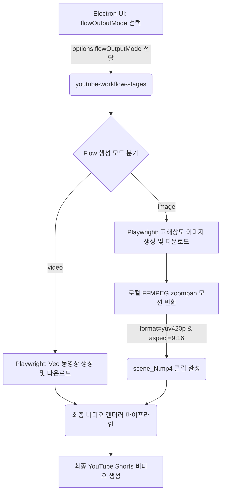

# Hermes Google Flow 출력 모드 및 스타일 일관성 계획 검토 보고서 (HERMES_GOOGLE_FLOW_OUTPUT_MODE_REVIEW)

본 보고서는 `2026-05-26-google-flow-output-mode-and-style-consistency-plan.md` 구현 계획을 기반으로 코드베이스, 워크플로우, 데이터베이스(DB) 구조를 깊이 있게 검토하여 예상되는 취약점과 이에 대한 해결 방안 및 아키텍처적 개선안을 제시합니다.

---

## 1. 아키텍처 흐름 및 핵심 요약

본 계획은 구글 플로우(Google Flow)에서 미디어를 비디오(Veo) 대신 **이미지(Imagen 등)**로도 생성할 수 있는 옵션(`flowOutputMode: "video" | "image"`)을 제공합니다. 

이미지로 생성된 장면은 로컬 FFMPEG를 통해 모션 비디오 클립으로 변환된 후 기존 렌더링 파이프라인에 통합됩니다. 이는 비디오 생성이 지연되거나 잦은 차단(Policy Block)이 발생할 때 매우 강력한 백업 시나리오(Stability Fallback)로 작동합니다. 또한, 모든 씬 프롬프트에 `GLOBAL STYLE LOCK`을 걸고 **Stickman Explainer** 프리셋을 신설하여 비주얼 일관성을 향상시키는 실용적인 방안을 수용하고 있습니다.

다만, FFMPEG 변환 성능, UI 하드코딩의 취약성, 그리고 이전 리뷰에서 합의된 데이터베이스(DB) 통합 원칙에 비추어 아래의 개선점들이 요구됩니다.



---

## 2. 주요 문제점 및 개선사항 분석

### ① FFMPEG `zoompan` 필터의 자원 소모 및 지터링(Jittering) 현상
- **문제점:** FFMPEG의 `zoompan` 필터는 프레임 단위의 좌표 재계산이 수반되어 연산량이 매우 높으며, 스케일링이 적절하지 않을 경우 화면이 뭉개지거나(Pixellation) 프레임이 미세하게 떨리는(Jittering) 현상이 나타납니다. 특히, 고해상도 이미지를 직접 `zoompan`에 투입하면 싱글 코어 병목으로 인해 렌더링 지연이 심화될 수 있습니다.
- **개선안:** 
  1. `zoompan` 연산 수행 전에 미리 대상 이미지를 1080x1920 해상도에 최적화(혹은 줌 여유를 위해 `scale=1296:2304` 등으로 스케일링)한 뒤 필터 체인에 진입하게 설정하여 연산 오버헤드를 크게 줄여야 합니다.
  2. 프레임 보간과 안정적인 재생을 위해 `-preset veryfast` 및 인코딩 멀티스레딩 옵션(`-threads 0`)을 보강해야 합니다.

### ② Playwright 자동화 중 Google Flow 이미지 모델(`Nano Banana`) 매칭 취약점
- **문제점:** 계획 내 `configureFlowImage` 헬퍼는 구글 랩스 UI에서 이미지 모델 명칭인 `Nano Banana`를 텍스트 매칭하여 클릭하도록 작성되었습니다. 구글의 AI 모델 네이밍은 `Imagen 3` 등으로 매우 빈번하게 바뀌므로, 모델 명칭을 하드코딩하면 구글 측의 마이너 업데이트 시 자동화 스크립트가 오작동합니다.
- **개선안:** 
  - 모델 탭(`이미지` / `Image`)만 성공적으로 클릭했다면 개별 세부 모델(`Nano Banana`) 매칭에 실패하더라도 크래시를 내지 않고, 경고 로그 발행 후 기본 탑재된 이미지 모델로 흐름을 이어가는 **유연한 매칭 폴백(Loose Matching Fallback)** 설계를 적용해야 합니다.

### ③ FFMPEG 바이너리 경로(`ffmpegBin`) 탐색의 이식성
- **문제점:** Windows Electron 패키징 환경(ASAR)에서는 `ffmpeg-static`이나 시스템 FFMPEG 경로가 환경 변수나 특정 리소스 디렉토리(`process.resourcesPath`)에 위치하게 됩니다. `image-scene-renderer.mjs`에서 경로 주입 실패 시 비디오 클립 변환 단계에서 즉시 멈춥니다.
- **개선안:** 
  - `ffmpegBin`을 직접 전달받는 것 외에, 전달된 경로가 없거나 유효하지 않은 경우 **Electron resource path -> 시스템 PATH 환경 변수 -> 로컬 workspace 디렉토리** 순으로 FFMPEG 실행 파일을 알아서 서칭해내는 안전장치(Path Detection Fallback)를 추가하는 것이 바람직합니다.

### ④ 스타일 프리셋 일관성 메타데이터의 SQLite DB 통합
- **문제점:** Task 3에서 `style-presets.mjs`에 `characterContinuity`, `worldContinuity`, `negativePrompt` 컬럼형 데이터를 정적으로 추가하였습니다. 그러나 이전 합의안에 따라 프리셋의 관리 주체가 SQLite DB(`bot_data.db`의 `style_presets` 테이블)로 이전되어야 하므로, 해당 정보들 역시 DB 테이블 컬럼에 완전히 반영되어야 합니다.
- **개선안:** `style_presets` 테이블 스키마에 스타일 일관성 메타데이터 컬럼을 명확히 명시하고 초기 마이그레이션 시 시드 데이터로 적재하십시오.

---

## 3. SQLite DB 연동 및 FFMPEG 내결함성 구체 설계안

### A. SQLite 스키마 마이그레이션 확장
`style_presets` 테이블을 다음과 같이 고도화하여, 스타일 일관성 데이터를 영구 관리합니다.

```sql
-- style_presets 테이블 고도화 마이그레이션
CREATE TABLE IF NOT EXISTS style_presets (
    id TEXT PRIMARY KEY,
    label TEXT NOT NULL,
    aesthetic TEXT NOT NULL,
    camera TEXT,
    lighting TEXT,
    color_palette TEXT,
    character_continuity TEXT,
    world_continuity TEXT,
    negative_prompt TEXT,
    preferred_output_modes TEXT DEFAULT '["video", "image"]',
    prompt_suffix TEXT NOT NULL,
    is_custom INTEGER DEFAULT 0,
    created_at TEXT NOT NULL
);

-- Stickman Explainer 프리셋 DB 시드 데이터 삽입
INSERT OR IGNORE INTO style_presets (
    id, label, aesthetic, camera, lighting, color_palette, 
    character_continuity, world_continuity, negative_prompt, 
    preferred_output_modes, prompt_suffix, is_custom, created_at
) VALUES (
    'stickman-explainer', 
    'Stickman Explainer', 
    'minimal black stickman explainer animation on a clean whiteboard canvas', 
    'locked-off whiteboard composition with gentle digital pan', 
    'flat clean high-key lighting', 
    'white, black, one accent color',
    'same simple stickman proportions, round head, thin black limbs, consistent line thickness, no gender or age drift',
    'same whiteboard canvas, same black line weight, same single accent color, simple icon-like props',
    'no realistic humans, no photorealistic faces, no complex backgrounds, no readable text, no logos, no watermarks',
    '["image", "video"]',
    'Style: minimal black stickman explainer. Camera: locked-off whiteboard composition... Negative constraints: no realistic humans...',
    0, 
    datetime('now')
);
```

### B. FFMPEG 이미지-비디오 변환 성능 최적화 코드 제안 (`image-scene-renderer.mjs`)
지터링 현상을 제어하고 변환 연산을 최소화하는 필터 옵션을 빌드합니다.

```javascript
// image-scene-renderer.mjs 내 FFMPEG 필터 최적화
const scaleAndCrop = "scale=1080:1920:force_original_aspect_ratio=increase,crop=1080:1920";

// x, y 좌표의 미세 떨림(Jittering)을 보정하기 위한 정밀 zoompan 표현식
const zoomExpr = motionPreset === "slow-pan-left"
  ? "zoompan=z='1.10':x='iw*0.05-(iw*0.08)*on/(25*d)':y='ih*0.02':d=1:s=1080x1920:fps=25"
  : "zoompan=z='min(zoom+0.0012,1.15)':x='iw/2-(iw/zoom/2)':y='ih/2-(ih/zoom/2)':d=1:s=1080x1920:fps=25";

const args = [
  "-y",
  "-loop", "1",
  "-t", String(duration),
  "-i", imagePath,
  "-vf", `${scaleAndCrop},${zoomExpr},format=yuv420p`,
  "-an",
  "-r", "25",
  "-threads", "0",              // 멀티스레드 활성화로 처리 속도 극대화
  "-c:v", "libx264",
  "-preset", "veryfast",        // 인코딩 지연 최소화
  "-pix_fmt", "yuv420p",
  outputPath
];
```

---

## 4. 최종 구현 수용을 위한 권장 체크리스트

1. **DB 기반 일관성 데이터 관리:** 프리셋의 `characterContinuity`, `worldContinuity`, `negativePrompt` 컬럼을 DB에 설계하여, 하드코딩 관리 체계를 DB 주도로 전환하십시오.
2. **FFMPEG zoompan 필터 보정:** 떨림 방지를 위해 줌 속도 변화폭을 소수점 4자리(`0.0012` 등) 수준으로 부드럽게 조정하고, CPU 점유율 최적화를 위해 멀티스레딩 옵션을 결합하십시오.
3. **구글 이미지 모델 매칭 가드:** `Nano Banana` 텍스트 탐색 실패 시에도 에러 크래시를 내지 않는 Loose Match 메커니즘을 구비하십시오.
4. **FFMPEG 실패 원인 상세 파이프 로깅:** `image-scene-renderer.mjs` 실패 시 FFMPEG 표준 에러의 앞 100글자 정도를 추출하여 `task_failures` 테이블에 적재해 진단 편의성을 기하십시오.
