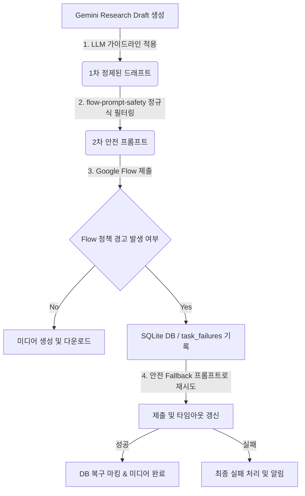

# Hermes Google Flow 정책 안전 프롬프트 계획 검토 보고서 (HERMES_GOOGLE_FLOW_POLICY_SAFE_REVIEW)

본 보고서는 `2026-05-25-google-flow-policy-safe-prompt-plan.md` 구현 계획과 Hermes 프로젝트의 현행 코드베이스, 데이터베이스(DB), 그리고 전반적인 워크플로우를 자세히 대조·분석하여 발견된 잠재적 문제점과 아키텍처적 개선안을 제시합니다.

---

## 1. 종합 평가 및 아키텍처 핵심 요약

제안된 계획은 Google Flow에서 실존 유명인이나 공인(Celebrity/Public Figure)의 이름, 초상 묘사가 포함되었을 때 발생하는 정책 경고(`이 프롬프트는 유명인의 동영상 생성에 관한 Google 정책을 위반할 가능성이 있습니다.`)에 대한 훌륭한 방어 대책을 담고 있습니다. 

다만, 실제 운영 환경에서의 완성도와 **관측 가능성(Observability)**, 그리고 **프로세스 안정성** 측면에서 다음과 같은 한계와 보완이 필요합니다.



---

## 2. 주요 문제점 및 개선사항 분석

### ① 테스트 이식성(Portability) 및 하드코딩 경로 문제
- **문제점:** 계획 문서의 `Task 1` 및 `Task 6` 검증 단계에서 `C:/Users/amd/hermes/...`와 같이 로컬의 절대경로를 하드코딩하여 불러오는 테스트 코드가 식별되었습니다. 이러한 구조는 협업 개발자 환경이나 CI/CD 자동화 환경에서 경로 탐색 실패로 이어집니다.
- **개선안:** ESM 환경에서 절대 경로 의존성을 완전히 탈피해야 합니다. `fileURLToPath(import.meta.url)`와 `path.resolve`를 조합하여 동적으로 루트 디렉토리를 식별하도록 수정해야 합니다.
  ```js
  // 개선 예시 (check-flow-prompt-safety.mjs)
  import { fileURLToPath } from "node:url";
  import { dirname, resolve } from "node:path";
  
  const __dirname = dirname(fileURLToPath(import.meta.url));
  const rootDir = resolve(__dirname, "..");
  const safetyModulePath = resolve(rootDir, "electron/services/flow-prompt-safety.mjs");
  ```

### ② 정적 치환 사전(`PUBLIC_FIGURE_REPLACEMENTS`)의 실시간 확장 한계
- **문제점:** 계획 내의 정규식 매핑은 `Elon Musk`, `Donald Trump`, `손흥민` 등 극히 소수의 대표 유명인만 등록되어 있습니다. 정치인, 최신 IT 업계 리더, 국내외 돌발 이슈 중심 인물 등 매일 새로 생성되는 뉴스 대본의 인물명을 하드코딩된 사전만으로 완벽하게 필터링할 수는 없습니다.
- **개선안:** 
  1. **LLM 1차 필터링 강제:** `gemini-research-draft.mjs` 단계의 시스템 프롬프트를 더욱 고도화하여, 초안 작성 시점부터 실존 인물명을 일반 명사(예: "a political leader", "a tech CEO")로 묘사하도록 LLM 지침을 1순위 방어선으로 구축합니다.
  2. **동적 치환 딕셔너리 빌드:** 초안 작성 단계에서 뉴스 원문이나 대본에 언급된 주요 고유명사 목록(예: `draft.title`이나 키워드 메타데이터)을 분석하여, 실행 시점에 실시간으로 치환 룰에 동적 추가하는 로직을 고려해야 합니다.

### ③ 브라우저 세션 락(Session Lock) 충돌 리스크
- **문제점:** `google-flow-media.mjs`는 Playwright의 `launchPersistentContext(profileDir)`를 사용하여 Google 계정 세션이 저장된 프로필을 구동합니다. 만약 다른 백그라운드 태스크(예: Gemini Research Flow)가 동일한 `profileDir`을 사용 중이거나, Electron 앱이 켜진 상태에서 자동화 프로세스가 동시에 수행되면 `ProcessSingleton` 잠금 에러가 발생해 전체 렌더링 파이프라인이 멈추게 됩니다.
- **개선안:** 
  1. Google Flow 자동화와 Gemini 리서치 자동화가 사용하는 사용자 데이터 프로필 경로(`flowProfileDir`, `geminiProfileDir`)를 완전히 독립시켜 물리적으로 격리해야 합니다.
  2. 프로세스 시작 전 `releaseAppManagedAuthWindow(profileDir)`의 프로세스 종료 대기 시간 및 예외 처리를 정밀화하여 브라우저 좀비 프로세스를 더 견고하게 수거해야 합니다.

### ④ SQLite 데이터베이스 연동 누락 및 관측성(Observability) 부재
- **문제점:** 현재 계획에서는 정책 위반 감지 및 재시도 상태를 단순히 `scene_N_policy-warning.json` 로컬 파일에 기록하고 말기 때문에, 원격 제어용 텔레그램 봇의 `/diagnose` 진단이나 DB 통계 쿼리에서 이러한 자동화 장애를 실시간으로 모니터링할 방법이 없습니다.
- **개선안:** `youtube-workflow-stages.mjs`와 `workflow-db-events.mjs`를 연동하여, 정책 경고 발생 시 SQLite `task_failures` 및 `task_events` 테이블에 이벤트 메타데이터(원래 프롬프트, 감지 문구, 안전Fallback 적용 여부)를 즉각 적재해야 합니다.

### ⑤ 재시도 시 타임아웃 타임라인(Dynamic Deadline) 미조정
- **문제점:** Google Flow는 미디어 생성에 수분이 소요될 수 있습니다. 만약 프롬프트 제출 후 약 2~3분이 흐른 시점에 정책 경고가 뒤늦게 발견되어 재시도(`submitPromptToFlowAgain`)가 시작되는 경우, 기존에 설정된 `timeoutMs` 데드라인을 그대로 유지하면 재시도한 비디오가 생성되기도 전에 전체 제한 시간이 끝나 에러로 이어집니다.
- **개선안:** 1회 재시도가 확정되는 시점에, 전체 루프 대기 시간의 남은 Deadline을 초기 `timeoutMs`만큼 혹은 최소 5분 이상 동적으로 늘려주는 연장 코드가 삽입되어야 합니다.

---

## 3. SQLite 데이터베이스(DB) 및 워크플로우 연동 구체 설계안

Hermes의 SQLite 데이터베이스(`bot_data.db`)와 `bot_db_helper.py`를 적극 활용하여, 시스템 안정성을 극대화하기 위한 구체적인 DB 연동 구조를 제안합니다.

### A. SQLite 테이블 연동 스키마 매핑
정책 위반 발생 상황에 맞춰 DB 테이블을 다음과 같이 업데이트합니다.

1. **`task_failures` 테이블 기록 (장애 관리):**
   - **경고 발생 시:** `recovered = 0` 상태로 기록하여 현재 장애 상황임을 알림.
   - **안전 Fallback 재시도로 성공 시:** `bot_db_helper.py`의 `mark_recovered(chat_id, message_id, note)` API를 호출하여 `recovered = 1`, `recovery_note = "Google Flow Policy Warning resolved via Safe Fallback Prompt"`로 업데이트.
   
2. **`task_events` 테이블 기록 (워크플로우 분석):**
   - `flow-prompt-safety` 유형으로 이벤트를 추가하여, 원래의 프롬프트에서 어떤 키워드(예: `Elon Musk` -> `a tech company CEO`)가 치환되었는지 상세 JSON을 `data_json` 컬럼에 적재.

### B. 코드베이스 반영 가이드라인 (예시)

#### 1. `youtube-workflow-stages.mjs`에서의 DB 연동 적용
정책 위반 및 복구 내역을 DB로 동기화하기 위해, `workflow-db-events.mjs`를 호출하는 로직을 삽입합니다.

```javascript
// youtube-workflow-stages.mjs 수정 방향 제안
import { mirrorWorkflowEventToDb } from "./workflow-db-events.mjs";

// google-flow-media 실행 중 발생한 진행 이벤트 수신부
const onFlowProgress = (progressEvent) => {
  // progressEvent.details?.warning === "policy-warning" 등 식별 시
  if (progressEvent.details?.warning === "policy-warning") {
    // 1. DB에 실패 로그 남기기 (임시 실패 상태)
    mirrorWorkflowEventToDb({
      type: "desktop-job-warning",
      phase: "flow-prompt-safety",
      message: `장면 ${progressEvent.details.sceneOrder} 정책 경고 감지: 재시도합니다.`,
      details: {
        originalPrompt: progressEvent.details.originalPrompt,
        fallbackPrompt: progressEvent.details.safeFallbackPrompt,
        warningText: progressEvent.details.warningText
      }
    }, context);
  }
};
```

#### 2. `google-flow-media.mjs` 내 재시도 타임아웃 연장
```javascript
// google-flow-media.mjs 수정 방향 제안
if (isFlowPolicyWarningText(warningState.text)) {
  // ... 생략 ...
  if (safeFallbackPrompt && safeFallbackPrompt !== prompt) {
    onProgress?.({ 
      message: `장면 ${sceneOrder} Flow 정책 경고 감지: 안전 프롬프트로 1회 재시도합니다.`, 
      details: { 
        sceneOrder, 
        warning: "policy-warning",
        originalPrompt: prompt,
        safeFallbackPrompt,
        warningText: warningState.text
      } 
    });
    
    // [개선!] 재시도 시작에 따른 타임아웃 마감 시간(deadline) 재조정
    deadline = Date.now() + timeoutMs; // 타임아웃 대기 시간 초기화
    
    prompt = safeFallbackPrompt;
    await submitPromptToFlowAgain(page, prompt);
    await verifyFlowSubmissionStarted(page, jobDir, sceneOrder);
  } else {
    throw new Error(`Google Flow policy warning for scene ${sceneOrder}.`);
  }
}
```

---

## 4. 최종 결론 및 권장 구현 시나리오

본 계획(`2026-05-25-google-flow-policy-safe-prompt-plan.md`)은 실제 배포 환경에서 Google Flow의 빈번한 정책 차단 오류를 효과적으로 예방하는 필수적인 개선 사항입니다. 

다만, 안정적인 서비스를 지속하기 위해 아래 3가지 권장 조치를 최종 반영할 것을 제안합니다.

1. **이중 방어선:** LLM 드래프트 프롬프트 고도화(1차)와 정규식 치환 모듈(2차)을 조화롭게 결합하십시오.
2. **이식성 보장:** 스크립트 검증 파일들(`check-*.mjs`)의 하드코딩된 절대 경로를 모두 제거하고 프로젝트 상대 경로로 동적 처리되도록 즉시 리팩토링하십시오.
3. **가시성 확보:** 로컬 JSON 로그에 그치지 말고, `workflow-db-events.mjs` 및 `bot_db_helper.py`와의 연동을 확장하여 정책 경고 및 복구 성공 이벤트를 SQLite DB에 완전히 기록해 관리 편의성을 기하십시오.
