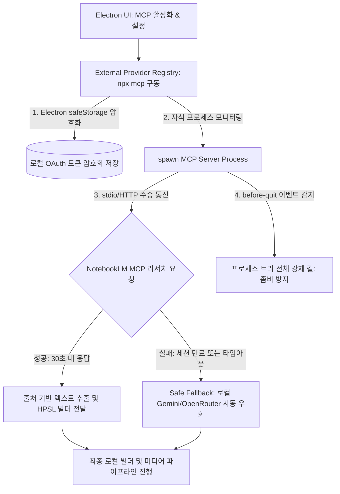

# Google MCP 및 Skills 통합 계획 검토 보고서 (HERMES_GOOGLE_MCP_INTEGRATION_REVIEW)

본 보고서는 `2026-05-26-google-mcp-skills-research-integration-plan.md` 구현 계획과 현행 코드베이스, 외부 프로세스 오케스트레이션, 그리고 데이터베이스(DB) 구조를 깊이 있게 대조·분석하여 외부 도구 연동 시 발생할 수 있는 보안 취약점과 프로세스 좀비화 리스크를 완벽히 해결하기 위한 의견서입니다.

---

## 1. 아키텍처 흐름 및 핵심 요약

본 계획은 공식 및 커뮤니티형 **Model Context Protocol (MCP) 서버**인 Chrome DevTools MCP( diagnostics), NotebookLM MCP( research), Google Workspace MCP( archive/ingestion)를 도입하여 Hermes Studio의 도구적 한계를 영리하게 확장하려는 의도를 품고 있습니다.

로컬의 핵심 파이프라인(Canonical Local Runner)을 침범하지 않고, 외부 도구를 추상화 레이어(`external-provider-registry.mjs`) 뒤에 감추어 기능 플래그로 조율하는 **디커플링(Decoupling) 아키텍처**는 시스템의 안정성과 이식성을 저해하지 않는 훌륭한 설계 방향입니다.

다만, 외부 CLI/자식 프로세스 구동 시의 생명주기 관리, 비공식 브라우저 자동화 도구(NotebookLM 등)의 세션 단절 복구 시나리오, 그리고 OAuth 크레덴셜 보안 관점에서 다음과 같은 핵심 보완점이 요구됩니다.



---

## 2. 주요 문제점 및 개선사항 분석

### ① 외부 MCP 자식 프로세스의 좀비화 및 메모리 누수 리스크
- **문제점:** Node.js의 `child_process.spawn`을 통해 백그라운드에서 실행되는 MCP 서버(예: `npx notebooklm-mcp@latest`)는 Electron 앱이 강제 종료되거나 예외 에러로 메인 프로세스가 갑자기 죽을 때 함께 소멸되지 않고 메모리에 계속 상주하는 좀비 프로세스(Zombie Process)가 되기 매우 쉽습니다. 특히 Playwright 세션이 엮여 있는 경우 헤드리스 크롬까지 무더기로 윈도우 백그라운드에 잔존하게 됩니다.
- **개선안:** 
  - `external-provider-registry.mjs`에 **프로세스 생명주기 클린업 가드(Lifecycle Cleanup Guard)**를 구현해야 합니다. Electron 메인 프로세스의 `app.on('before-quit', ...)` 이벤트가 호출될 때와 부모 프로세스의 `SIGTERM` 수신 시 실행 중인 모든 MCP 하위 프로세스 트리(PID 그룹)를 추적하여 확실하게 종료(`tree-kill` 유틸리티 연동 등)시키는 클린업 루틴을 필수적으로 추가해야 합니다.

### ② NotebookLM MCP의 세션 만료 및 비공식 UI 변경 내결함성 대책
- **문제점:** NotebookLM은 공식 API가 열려 있지 않아 `PleasePrompto/notebooklm-mcp` 등은 내부적으로 Puppeteer/Playwright 브라우저 프로필 자동화에 전적으로 의존합니다. 이는 구글 로그인 세션의 유실이나 구글의 임의 UI 구조 변경 시 전체 리서치 태스크가 멈춰 서게 됨을 뜻합니다.
- **개선안:**
  - NotebookLM MCP 사용 시 **엄격한 시간 경계선(예: 30초 타임아웃)**을 적용하고, 타임아웃 혹은 세션 에러 감지 즉시 로컬 Gemini나 OpenRouter로 즉시 전환되는 **즉각 폴백(Instant Fallback) 가드**를 워크플로우에 내장하여 외부 요인으로 인한 렌더러의 연쇄 크래시를 방어해야 합니다.

### ③ Google Workspace OAuth2 토큰 저장소의 보안 취약점
- **문제점:** Google Workspace MCP 연동을 위해 드라이브 및 Docs 접근 권한이 부여된 OAuth 액세스/리프레시 토큰이 로컬 파일 시스템에 평문(Plaintext JSON)으로 보존될 경우, 동일 디바이스 내의 다른 악성 스크립트나 외부 침입에 의해 구글 계정 권한 전체가 탈취될 수 있는 심각한 보안 리스크가 있습니다.
- **개선안:**
  - 토큰 정보를 단순 텍스트 파일로 쓰지 말고, **Electron의 `safeStorage` API를 통해 토큰 문자열을 암호화(Encryption)**하여 OS 수준의 자격 증명 키체인에 연동해 보존하도록 보안 사양을 고도화해야 합니다.

### ④ 프로바이더 토글 설정의 SQLite DB 스키마 통합
- **문제점:** 사용자가 프로젝트별로 선택하는 리서치 프로바이더(`researchProvider`) 및 아카이브 프로바이더(`archiveProvider`) 옵션이 단지 로컬 메모리 상태에 머무르면 앱 재시동 시 유실됩니다.
- **개선안:**
  - SQLite `jobs` 및 `projects` 테이블에 `research_provider`, `archive_provider` 컬럼을 신설하고, 작업 실행 시 이 스키마 옵션 정보가 DB에서 정확히 로드 및 바인딩되도록 `bot_db_helper.py`를 연동하십시오.

---

## 3. SQLite 스키마 제안 및 프로세스 보안 제어 설계안

### A. SQLite 테이블 연동 제안
설정값을 DB에 안전하게 보존하도록 jobs 테이블 스키마에 통합합니다.

```sql
-- jobs 테이블에 MCP 및 외부 프로바이더 설정 필드 반영
ALTER TABLE jobs ADD COLUMN research_provider TEXT DEFAULT 'gemini-gems-browser';
ALTER TABLE jobs ADD COLUMN archive_provider TEXT DEFAULT 'local-files';
```

### B. Electron 암호화 보관 처리 코드 제안 (`workspace-archive-provider.mjs`)
OAuth 토큰 탈취 방지를 위해 암호화 유틸리티를 적용합니다.

```javascript
// safe-storage-helper.mjs 제안
import { safeStorage } from "electron";
import { writeFile, readFile } from "node:fs/promises";

export async function encryptAndSaveToken(filePath, tokenData) {
  const plainText = JSON.stringify(tokenData);
  if (!safeStorage.isEncryptionAvailable()) {
    throw new Error("Secure OS storage is not available on this platform.");
  }
  const encryptedBuffer = safeStorage.encryptString(plainText);
  await writeFile(filePath, encryptedBuffer);
}

export async function readAndDecryptToken(filePath) {
  const encryptedBuffer = await readFile(filePath);
  if (!safeStorage.isEncryptionAvailable()) {
    throw new Error("Secure OS storage is not available.");
  }
  const decryptedText = safeStorage.decryptString(encryptedBuffer);
  return JSON.parse(decryptedText);
}
```

### C. 자식 프로세스 클린업 가드 제안 (`external-provider-registry.mjs`)
앱 종료 시 백그라운드 Node/Chrome 좀비 프로세스를 수거하는 루틴입니다.

```javascript
// external-provider-registry.mjs 프로세스 생명주기 제어
import { spawn } from "node:child_process";
import treeKill from "tree-kill"; // 트리 킬 라이브러리 활용 권장

const activeMcpProcesses = new Map();

export function spawnMcpServer(providerId, command, args, options) {
  const child = spawn(command, args, options);
  activeMcpProcesses.set(providerId, child.pid);

  child.on("close", () => {
    activeMcpProcesses.delete(providerId);
  });

  return child;
}

// Electron 메인 프로세스 종료 시 자식 프로세스 전체 소멸 처리
export function killAllActiveMcpServers() {
  for (const [providerId, pid] of activeMcpProcesses.entries()) {
    treeKill(pid, "SIGKILL", (err) => {
       if (err) console.error(`Failed to kill MCP process ${pid}:`, err);
    });
  }
  activeMcpProcesses.clear();
}
```

---

## 4. 최종 구현 수용을 위한 권장 체크리스트

1. **프로세스 킬 트리(Tree-kill) 적용:** Electron 메인 프로세스 종료 이벤트 감지 시 활성화된 모든 MCP 자식 프로세스 및 관련 Chrome 백그라운드 스레드를 즉시 강제 수거할 것.
2. **타임아웃 및 즉각 폴백 내장:** NotebookLM MCP 툴 호출부에 최대 30초 내외의 시간 제약을 걸어 로그인 유실 등으로 인한 무한 행(Hang) 상태를 예방할 것.
3. **Electron safeStorage 토큰 암호화:** 로컬에 보관되는 Google Workspace OAuth 크레덴셜은 평문 보관을 불허하고 OS 암호화 보관함에 저장할 것.
4. **SQLite 스키마 동기화:** 프로젝트 설정에 따른 프로바이더 타겟 정보를 SQLite `jobs` 스키마 컬럼에 통합 관리할 것.
