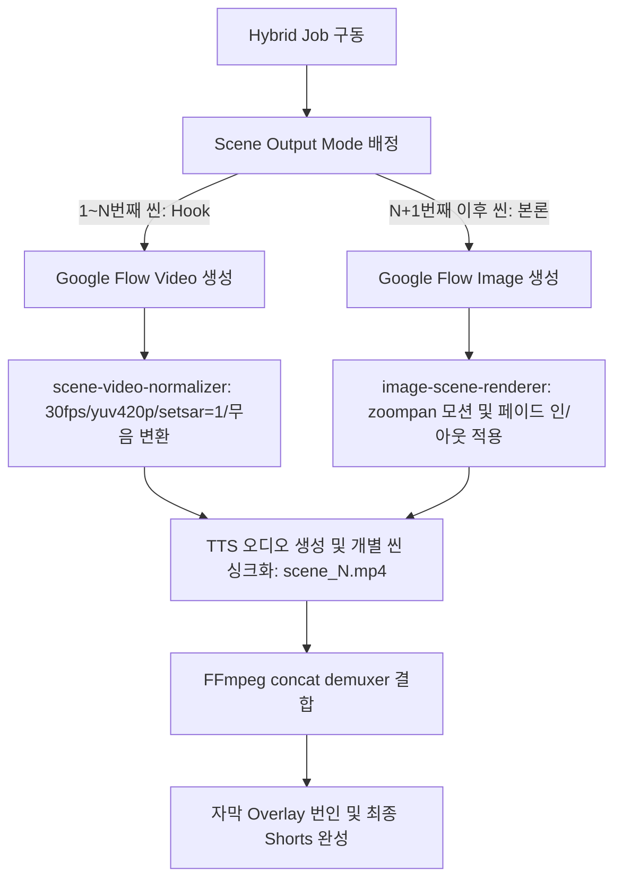

# Hermes 하이브리드 훅 비디오 및 이미지 렌더링 계획 검토 보고서 (HERMES_HYBRID_RENDER_REVIEW)

본 보고서는 `2026-05-26-hybrid-hook-video-image-render-plan.md` 구현 계획과 현행 코드베이스, 오디오-비디오 병합 파이프라인, 그리고 데이터베이스(DB) 구조를 깊이 있게 점검하여 하이브리드 모드 도입 시 예상되는 비디오 동결 및 싱크 이탈 문제점을 방지하고 제품의 안정성을 극대화하기 위한 기술적 개선안을 제시합니다.

---

## 1. 아키텍처 흐름 및 핵심 요약

하이브리드 모드(`flowOutputMode: "hybrid"`)는 쇼츠 비디오의 가장 중요한 구간인 초반 Hook(첫 N개 씬)을 동적이고 생생한 Google Flow Video(Veo)로 채우고, 후반부 본론 및 교훈 파트는 고해상도 고정 이미지(Imagen 등)에 FFmpeg zoompan 모션을 가미하여 효율성과 일관성을 도모하는 실용적인 기획입니다.

하지만 이종(Heterogeneous) 비디오 소스가 한 타임라인에 병합되는 파이프라인 특성상, 미세한 코덱 속성 불일치나 재생 시간 불균형에 의한 화면 프리징 리스크를 방지하기 위해 정교한 **정규화(Normalization) 가드**가 수반되어야 합니다.



---

## 2. 세부 문제점 및 개선 방안

### ① 이종 미디어 결합 시 타임베이스 및 무음(Silent Audio) 불일치 문제
- **문제점:** Google Flow에서 다운로드한 무음 비디오(Veo)와 로컬에서 이미지로 변환한 비디오 클립은 비디오 컨테이너 상의 오디오 스트림 유무, 오디오 샘플레이트, 타임베이스가 다를 수 있습니다. 이를 개별 씬 싱크 단계에서 정밀하게 맞추지 않고 단순 concat 하면, 비디오 뒷부분에서 소리와 화면이 어긋나는 **오디오 디싱크(Desync) 또는 최종 렌더러 실패**가 발생할 가능성이 높습니다.
- **개선안:** 
  - `scene-video-normalizer.mjs`와 `image-scene-renderer.mjs`에서 비디오 클립을 정규화할 때, **모든 중간 비디오 산출물에 동일한 규격의 더미 무음 오디오 스트림(Silent Audio Stream)**을 강제 삽입(예: FFmpeg의 `-f lavfi -i anullsrc=r=44100:cl=mono` 등)하여 오디오 채널 및 코덱 사양을 완벽히 동기화한 뒤 최종 TTS 합성 루프로 전달하는 방식을 강제해야 합니다.

### ② Hook 비디오 재생 시간 부족으로 인한 동결(Freeze Frame) 및 배속 문제
- **문제점:** Google Flow 동영상은 기본 5초 길이로 고정 생성되는 경향이 있습니다. 만약 첫 N개 씬의 한국어 나레이션 문장이 길어 TTS 목소리가 8~10초간 재생되는 경우, 5초짜리 비디오를 억지로 늘려야 하므로 비디오 뒷부분이 멈추거나 재생 속도를 과도하게 늦춰야 해서 화면이 부자연스러워집니다.
- **개선안:**
  - **대본 생성 엔진(Gemini)에 물리적 나레이션 제약 조건 추가:** `gemini-research-draft.mjs` 단계의 시스템 프롬프트에 "하이브리드 모드 시 1~N번째 씬의 나레이션은 한국어 기준 35자(공백 포함) 이내로 제한하여 소요 시간이 5초를 넘지 않게 할 것"을 명시하는 가이드라인(Sentence Length Cap)을 1차적으로 강제하는 것이 가장 깔끔한 해결책입니다.

### ③ 이미지와 비디오 클립 간 페이드(Fade) 효과 불일치
- **문제점:** 기획서에서는 `image-scene-renderer.mjs`에서 변환한 이미지 모션 클립에만 `fade=t=in` 및 `fade=t=out`을 적용하는 방식을 구상했습니다. 이 경우 비디오 씬에서 이미지 씬으로 넘어갈 때, 비디오는 페이드 없이 칼같이 잘리고 이미지로 된 씬만 부드럽게 페이드 처리되어 화면 연출의 일관성이 무너집니다.
- **개선안:**
  - 이미지 모듈에 페이드 코드를 가두지 말고, `scene-video-normalizer.mjs` 단으로 페이드 처리 필터 체인을 통합하여, **비디오 씬과 이미지 씬 전체에 균일한 페이드 인/아웃(예: 0.25초)이 자동 일괄 적용**되도록 정규화 레이어에서 공통 제어하는 것을 제안합니다.

### ④ 다이나믹 줌앤팬(zoompan) 필터의 해상도 가변 최적화
- **문제점:** 이미지 해상도와 FFmpeg `zoompan` 필터 속 해상도의 비율이 맞지 않으면 화면 테두리에 검은 여백(Letterbox)이 남거나 이미지가 심하게 찌그러집니다.
- **개선안:** 
  - `zoompan`에 투입하기 전 이미지 해상도를 `scale=1296:2304` 등으로 9:16 최적 스케일링을 미리 거치게 한 뒤, `zoompan` 필터 인자의 타겟 사이즈(`s=1080x1920`)와 줌 속도 변화폭을 소수점 4자리 이하로 미세 제어하여 뚝뚝 끊기는 프레임 노이즈를 완벽히 억제합니다.

### ⑤ SQLite DB 연동 및 씬별 하이브리드 라이프사이클 추적
- **문제점:** 하이브리드 모드는 비디오 파이프라인과 이미지 파이프라인이 공존하기 때문에, 에러 발생 시 어떤 씬이 어떤 프로세스(예: Flow Video 대기, 이미지 다운로드, FFMPEG 변환) 도중 멈췄는지 직관적으로 파악하기 어렵습니다.
- **개선안:**
  - SQLite `task_events`에 기록할 때, `sceneOutputModes` 정보와 함께 **각 씬 번호별 세부 프로세스 진척도(예: `scene_1: flow-video-download`, `scene_3: ffmpeg-zoompan-render`)를 상세 메타데이터로 로깅**하게 구현하여 원격 모니터링 및 복구 완성도를 끌어올립니다.

---

## 3. SQLite 스키마 설계 및 파이프라인 코드 제안

### A. SQLite 테이블 연동 제안
진단 및 분석을 위해 `task_events`에 적재될 하이브리드 세부 JSON 포맷을 다음과 같이 표준화합니다.

```json
{
  "phase": "hybrid-scene-render",
  "status": "in-progress",
  "message": "장면 3 (Image 모드) 모션 비디오 변환 시작",
  "details": {
    "jobId": "youtube-1779769182837",
    "flowOutputMode": "hybrid",
    "hybridIntroVideoSceneCount": 2,
    "sceneOrder": 3,
    "sceneOutputMode": "image",
    "motionPreset": "slow-pan-left",
    "durationSeconds": 8
  }
}
```

### B. FFmpeg 무음 오디오 통합 정규화 스크립트 제안 (`scene-video-normalizer.mjs`)
하이브리드 결합 시 코덱 디싱크를 유발하지 않도록 더미 오디오 트랙을 통합해 빌드하는 인자 구성안입니다.

```javascript
// scene-video-normalizer.mjs 필터 및 오디오 강제 주입
const videoFilter = [
  "scale=1080:1920:force_original_aspect_ratio=increase",
  "crop=1080:1920",
  "fps=30",
  "setsar=1",
  "format=yuv420p"
].join(",");

const args = [
  "-y",
  "-i", inputPath,
  // 1. 더미 오디오 소스를 백그라운드에 동시 주입
  "-f", "lavfi",
  "-i", "anullsrc=channel_layout=mono:sample_rate=44100",
  "-vf", videoFilter,
  "-c:v", "libx264",
  "-preset", "veryfast",
  "-crf", "20",
  // 2. 비디오 길이에 맞춰 더미 오디오 트랙을 자동으로 자르고 AAC 인코딩
  "-c:a", "aac",
  "-shortest",
  "-pix_fmt", "yuv420p",
  "-r", "30",
  "-t", String(durationSeconds),
  outputPath
];
```

---

## 4. 최종 구현 수용을 위한 권장 체크리스트

1. **더미 오디오 트랙 Enforce:** 이미지 변환 클립과 비디오 클립 전체에 동일 사양의 무음 오디오 트랙을 탑재하여 demuxer concat 시 싱크 정합성을 확보할 것.
2. **Hook 씬 대본 분량 통제:** `gemini-research-draft.mjs` 프롬프트 단에서 Hook 씬의 글자 수를 35자 미만으로 강제하여 비디오가 조기 종료되어 프리징되는 리스크를 사전 차단할 것.
3. **페이드 정규화 레이어 이관:** 이미지 모듈에 격리된 페이드 효과를 `scene-video-normalizer.mjs` 등 공통 정규화 모듈로 확장하여 화면 질감을 일관되게 맞출 것.
4. **SQLite 씬별 정밀 진척도 적재:** `task_events` 테이블에 하이브리드 미디어의 개별 씬 단위 상태를 세분화하여 적재하고, 에러 시 텔레그램 봇을 통한 `/diagnose` 분석을 매끄럽게 연결할 것.
