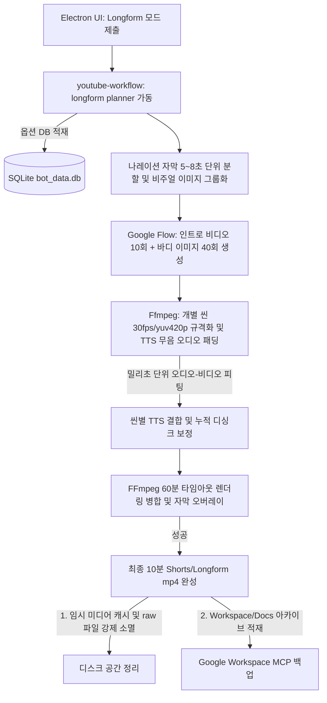

# Hermes 장편 10분 하이브리드 비디오 계획 검토 보고서 (HERMES_LONGFORM_HYBRID_REVIEW)

본 보고서는 `2026-05-26-longform-10min-hybrid-video-plan.md` 구현 계획과 현행 코드베이스, 데이터베이스(DB), 그리고 장시간 렌더링 오케스트레이션 파이프라인을 자세히 대조·분석하여 대규모 렌더링에 따른 누적 싱크 오차 및 디스크 병목을 해결하기 위한 의견서입니다.

---

## 1. 아키텍처 흐름 및 핵심 요약

장편(10분 이상, `videoFormat: "longform"`) 영상 제작 계획은 쇼츠의 1씬-1대본 매핑 한계를 극복하기 위해 **자막/TTS 세그먼트와 비주얼 에셋(Scene Media)을 분리하는 구조적 분리(Decoupling)**를 채택했습니다. 

초반 1분 동안 구글 플로우 비디오 10개로 시청자 시선을 사로잡고, 나머지 9분은 약 40~60개의 고해상도 이미지만을 생성하여 줌/팬 효과로 풍부하게 연출함으로써 구글 플로우 API 호출 횟수를 현실적인 수준(46~70회)으로 묶어 제한 속도 및 계정 블락 리스크를 극적으로 제어하는 아키텍처는 매우 영리하고 필수적인 기획입니다.

다만, 10분이라는 장시간 영상이 기동될 때의 누적 디싱크(Accumulated Sync Drift) 위험, 자원 소모성 임시 파일 정리, 그리고 DB 통합 완성도 관점에서 개선 조치가 동반되어야 합니다.



---

## 2. 세부 문제점 및 개선 방안

### ① 장시간 오디오-비디오 Concat 시 발생하는 누적 싱크 오차(Accumulated Drift)
- **문제점:** 단일 씬에서는 0.05~0.1초의 미세한 오디오-비디오 길이 편차가 티가 나지 않지만, 10분(600초) 분량의 장편 비디오는 50~70개에 달하는 다량의 개별 씬이 연속 결합됩니다. 각 씬의 누적 오차가 보정 없이 더해지면 **비디오 끝부분에서 최대 5~7초 이상의 심각한 오디오-비디오 디싱크(Desync)**를 일으켜 자막과 음성 화면이 완전히 따로 노는 불량 결과물이 나옵니다.
- **개선안:** 
  - `render-youtube-with-tts.mjs`에서 개별 씬 비디오를 TTS 오디오 길이에 맞추어 늘리거나 줄일 때, 오디오의 정확한 재생 시간을 소수점 3자리(밀리초) 단위로 정밀 수집하고, 이에 맞춰 비디오 트랙 프레임 타임스탬프를 밀리초 단위로 정확히 리스케일링(또는 패딩)하여 결합해야 최종 concat 병합본의 오차 누적을 0.5초 이내로 억제할 수 있습니다.

### ② FFMPEG 대규모 렌더링에 따른 디스크 공간 관리 및 가비지 컬렉션(GC) 누락
- **문제점:** 10분 분량의 1080x1920 세로형 고화질 비디오를 인코딩할 때 생성되는 70여 개의 원본 비디오, 무음 비디오, TTS 싱크 비디오, 임시 오디오 파일들의 합산 크기는 수 기가바이트(GB)를 초과합니다. 렌더 완료 후 임시 파일을 방치하면 로컬 디렉토리 디스크가 포화되어 후속 작업이 불가능해집니다.
- **개선안:**
  - 렌더러 스크립트(`render-youtube-with-tts.mjs`) 맨 끝에 **가비지 컬렉션(GC) 클린업 루틴**을 명문화하여, 최종 완성본 `final-youtube-*.mp4`와 요약 리포트 작성이 완결되는 즉시 `scene_N_flow_raw.*`, `scene_N_synced.mp4`, `tts_N.wav` 등 중간 단계의 모든 캐시성 파일들을 파일 시스템에서 강제 삭제(rm)해 주어야 안정성이 보장됩니다.

### ③ 장편 대본 분량 예측 및 Gemini 생성 글자 수 검증 강화
- **문제점:** 타겟 시간(예: 720초)에 대본 분량이 너무 짧거나 지나치게 길 경우, 비디오 전체 흐름이 망가지거나 오디오 유실이 생깁니다.
- **개선안:**
  - `youtube-draft-quality.mjs`와 `youtube-draft-duration.mjs`에 **장편 전용 대본 밀도 검증 규칙(Longform Character density rule)**을 추가하십시오. 한글 대본 기준 1분당 약 180~220자(공백 포함) 범위로 제한하도록 LLM 가이드라인을 명문화하여, 10분 분량에 최소 1,800자 ~ 최대 2,500자 범위의 대본 글자 수를 충족하는지 사전 필터링하는 안전장치를 갖추어야 합니다.

### ④ 장편 모드 옵션의 SQLite DB 스키마 영구 통합
- **문제점:** 새롭게 설계된 `videoFormat`, `longformTargetSeconds`, `introVideoClipCount` 등의 옵션 필드들이 데이터베이스(DB) 스키마에 통합되어 있지 않습니다. 
- **개선안:**
  - SQLite `jobs` 테이블에 `video_format` TEXT, `longform_target_seconds` INTEGER, `intro_video_clip_count` INTEGER 컬럼을 추가하고, 앱 초기화 시 마이그레이션하도록 `bot_db_helper.py`를 연동 확장하십시오.

---

## 3. SQLite 스키마 제안 및 렌더 가비지 컬렉션 설계안

### A. SQLite 테이블 연동 제안
장편 모드 매개변수를 안정적으로 저장 및 복구할 수 있도록 jobs 테이블 스키마에 추가 컬럼을 정의합니다.

```sql
-- jobs 테이블에 장편 포맷 매개변수 컬럼 반영
ALTER TABLE jobs ADD COLUMN video_format TEXT DEFAULT 'shorts';
ALTER TABLE jobs ADD COLUMN longform_target_seconds INTEGER DEFAULT 720;
ALTER TABLE jobs ADD COLUMN intro_video_clip_count INTEGER DEFAULT 10;
```

### B. 렌더 완료 후 가비지 컬렉션(GC) 코드 제안 (`render-youtube-with-tts.mjs`)
대용량 렌더 작업 후 캐시 파일을 소멸시켜 디스크 누수를 막는 루틴입니다.

```javascript
// render-youtube-with-tts.mjs 내 클린업 루틴 추가 제안
import { rm } from "node:fs/promises";
import { join } from "node:path";

async function cleanupTemporaryRenderAssets(jobDir, sceneCount) {
  console.log(`[GC] ${jobDir} 디렉토리 내 임시 렌더 자원을 정리하는 중입니다...`);
  for (let i = 1; i <= sceneCount; i += 1) {
    try {
      // 1. 개별 씬의 원본/싱크 비디오 캐시 삭제
      await rm(join(jobDir, `scene_${i}_flow_raw.mp4`), { force: true });
      await rm(join(jobDir, `scene_${i}_flow_raw.webm`), { force: true });
      await rm(join(jobDir, `scene_${i}_synced.mp4`), { force: true });
      // 2. 씬별 개별 오디오 소스 삭제
      await rm(join(jobDir, `tts_${i}.wav`), { force: true });
    } catch (err) {
      console.warn(`[GC Warning] scene ${i} 임시 파일 삭제 실패:`, err.message);
    }
  }
}
```

---

## 4. 최종 구현 수용을 위한 권장 체크리스트

1. **밀리초 단위 싱크 보정 적용:** concat demuxer 결합 시 싱크가 누적 왜곡되는 현상을 막기 위해 각 개별 씬 비디오 길이를 TTS 오디오의 총 밀리초 길이로 완벽하게 리스케일링할 것.
2. **렌더 완료 임시 리소스 소멸:** 10분 이상 대규모 인코딩 종료 즉시 씬 캐시 미디어를 자동 가비지 컬렉션(GC) 하여 디스크 누수를 사전 방지할 것.
3. **DB 장편 스키마 확장:** SQLite `jobs` 테이블에 `video_format`, `longform_target_seconds` 등의 매개변수를 완전히 컬럼화할 것.
4. **장편 글자 수 검증 규칙:** 분량 예측 오차 방지를 위해 1분당 한국어 180~220자 비중의 대본이 입력 및 생성되었는지 검증 가드를 탑재할 것.
