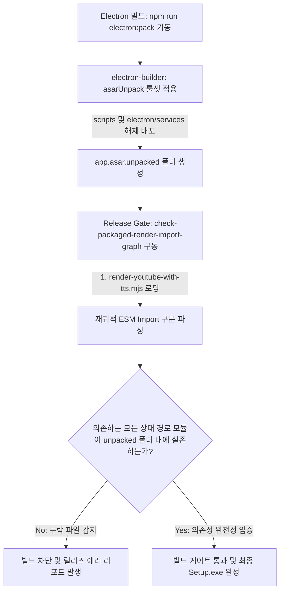

# Electron 패키징 렌더러 외부 모듈 유실 오류 해결 계획 검토 보고서 (HERMES_PACKAGED_RENDER_MODULES_REVIEW)

본 보고서는 `2026-05-28-packaged-render-unpacked-service-modules-plan.md` 구현 계획과 현행 Electron ASAR 빌드 파이프라인, 모듈 의존성 트리를 대조·분석하여 빌드 배포 후 발생하는 런타임 가져오기 오류(ERR_MODULE_NOT_FOUND)를 정적으로 사전에 격리 및 예방하기 위한 의견서입니다.

---

## 1. 근본 원인 및 아키텍처 평가

최종 렌더링 스크립트 실행 도중 발생한 크래시는 구글 플로우나 FFMPEG의 알고리즘 오류가 아닌, Electron의 **ASAR 패키징 가상 파일시스템 격리 한계**가 원인입니다.

- **원인 판명:** `render-youtube-with-tts.mjs`는 `asarUnpack` 설정에 의해 가상 드라이브 바깥의 `app.asar.unpacked/scripts` 경로에서 실행됩니다. 그러나 이 파일이 내부적으로 상대 경로 `import` 하는 Sibling 모듈들(`../electron/services/timeline-transition-renderer.mjs` 등)은 `asarUnpack` 대상에서 누락되어 `app.asar` 내에 압축 보관되었습니다. 이로 인해 ASAR 컨테이너 바깥의 일반 Node.js 프로세스는 압축 영역 내부의 모듈 파일 경로에 접근할 수 없어 모듈 로드 실패로 즉시 폭사했습니다.
- **제안된 해결책의 타당성:** `package.json`의 `asarUnpack` 대상 영역에 서비스 폴더(`electron/services/**/*.mjs`)를 추가하여 외부에 함께 압축 해제 형태로 배포하게 한 조치는 이 크래시를 종식시키는 완벽한 처방입니다.
- **체크 스크립트의 타당성:** `node --check` 문법 검사의 한계를 극복하고, 패키징된 디렉토리의 엔트리 파일에서부터 ESM 수입 구문을 파싱해 실제 해당 파일이 unpacked 폴더 내에 실존하는지 추적하는 **정적 임포트 그래프 분석기(`check-packaged-render-import-graph.mjs`)**는 패키징 관련 릴리즈 사고를 사전에 100% 방지할 수 있는 신뢰도 높은 게이트키퍼(Release Gate)입니다.



---

## 2. 추가적인 기술 보완점 및 개선 제안

### ① 재귀적 임포트 크롤러(Recursive Import Crawling) 설계
- **문제점:** 만약 `electron/services` 안의 임포트 대상 파일이 내부적으로 `automation`이나 `pipeline` 같은 또 다른 폴더의 파일들을 2차, 3차로 `import` 하게 된다면, 엔트리 파일만 정적 검사해서는 이 꼬리 의존성 누락으로 인한 2차 런타임 크래시를 방어할 수 없습니다.
- **개선안:** 
  - `check-packaged-render-import-graph.mjs`를 제작할 때, 1단계 수입 모듈 분석에 그치지 않고 **재귀 DFS/BFS 탐색 알고리즘**을 적용하여 수입된 모든 하위 모듈들까지 끝까지 타고 내려가며 종속성 그래프 전체(Dependency Closure)의 실존 여부를 검사해야 합니다.

### ② 정적 임포트 구문 파싱의 정교화 (Multi-line & Dynamic Import)
- **문제점:** 자바스크립트의 `import` 구문은 여러 줄에 걸쳐서 작성되거나(`import { a, b } from "..."`), 런타임에 호출되는 동적 수입(`import("...")`) 형태를 띨 수 있습니다. 단순 한 줄 매칭 정규식을 사용하면 이러한 변형을 놓치고 검증을 통과시킬 수 있습니다.
- **개선안:**
  - 정적 파서의 정규식을 멀티라인 플래그(`g`, `s`)를 포함해 정교화하고, dynamic import 패턴도 안전하게 수거할 수 있도록 패턴 매처를 이중화하십시오.
  ```javascript
  // 정교화된 정적 수입 구문 파서 정규식 예시
  const staticImportRegex = /import\s+(?:[^{"']*\{[\s\S]*?\}|[\s\S]*?)\s+from\s+["']([^"']+)["']/g;
  const dynamicImportRegex = /import\((["'])([^"'\n]+)\1\)/g;
  ```

### ③ ffmpeg-static 및 sharp 바이너리 제외 예방
- **문제점:** 서비스 코드들이 외부로 분리되면서, `sharp`나 `ffmpeg-static`과 같은 네이티브 바이너리 모듈의 경로를 `import.meta.url` 및 `app.asar.unpacked` 주소 기준으로 잘못 읽어오게 되어 모듈 탐색 오류가 날 수 있습니다.
- **개선안:** 
  - `check-packaged-runtime-contract.mjs`에서 단순히 코드 모듈뿐만 아니라 `node_modules/ffmpeg-static` 및 `node_modules/sharp` 안의 OS별 실행 파일(`ffmpeg.exe` 등)과 라이브러리가 올바른 물리 디렉토리 하위에서 빌드 누락 없이 노출되어 있는지 실존 체크 assertions를 동시 강화해야 안전합니다.

---

## 3. 정적 임포트 그래프 분석기 제안 코드 (`check-packaged-render-import-graph.mjs`)

종속성 트리 전체를 끝까지 DFS로 순회 검사하여 빌드 안정성을 강제하는 검증기 코드 구조안입니다.

```javascript
// check-packaged-render-import-graph.mjs 제안
import { readFileSync, existsSync } from "node:fs";
import { resolve, dirname, join } from "node:path";

function extractImports(fileContent) {
  const imports = [];
  const staticImportRegex = /import\s+(?:[^{"']*\{[\s\S]*?\}|[\s\S]*?)\s+from\s+["']([^"']+)["']/g;
  const dynamicImportRegex = /import\((["'])([^"'\n]+)\1\)/g;

  let match;
  while ((match = staticImportRegex.exec(fileContent)) !== null) {
    imports.push(match[1]);
  }
  while ((match = dynamicImportRegex.exec(fileContent)) !== null) {
    imports.push(match[2]);
  }
  return imports;
}

export function verifyImportGraph(entryPath, unpackedRoot, visited = new Set()) {
  const resolvedEntry = resolve(entryPath);
  if (visited.has(resolvedEntry)) return;
  visited.add(resolvedEntry);

  if (!existsSync(resolvedEntry)) {
    throw new Error(`Unpacked dependency missing: ${resolvedEntry}\nContext: imported in the dependency graph.`);
  }

  const content = readFileSync(resolvedEntry, "utf8");
  const imports = extractImports(content);

  for (const importSrc of imports) {
    // 라이브러리 모듈(node_modules) 및 내장 모듈(node:) 탐색 제외
    if (!importSrc.startsWith(".") && !importSrc.startsWith("/")) continue;

    const currentDir = dirname(resolvedEntry);
    let targetPath = resolve(currentDir, importSrc);

    // 확장자가 명시되지 않았을 때의 폴백 매핑
    if (!targetPath.endsWith(".mjs") && !targetPath.endsWith(".js")) {
       targetPath += ".mjs";
    }

    // 재귀적으로 수입하는 모든 모듈의 실존 여부 DFS 탐색
    verifyImportGraph(targetPath, unpackedRoot, visited);
  }
}
```

---

## 4. 최종 구현 수용을 위한 권장 체크리스트

1. **DFS 재귀 그래프 탐색 활성화:** 1단계 임포트 매칭에 머무르지 말고, 종속성 단말 노드 전체까지 추적해 들어가는 재귀 검증기(`verifyImportGraph`)를 탑재할 것.
2. **멀티라인 & 다이나믹 임포트 파싱 정교화:** 줄바꿈 수입문 및 런타임 비동기 수입(`import()`) 구문도 안전하게 감지할 수 있게 정규식 패턴을 보충할 것.
3. **네이티브 바이너리 실존 검증 보강:** `check-packaged-runtime-contract.mjs`에서 sharp 및 ffmpeg 실행 바이너리가 `app.asar.unpacked/node_modules/` 내부에 실제로 복제 존재하여 접근 가능한지assertions를 추가할 것.
4. **Release Gate 통합:** `package.json` 패키지 테스트 스크립트에 이 그래프 분석기를 동기화 링킹하여 빌드 과정의 필수 조건으로 삼을 것.
