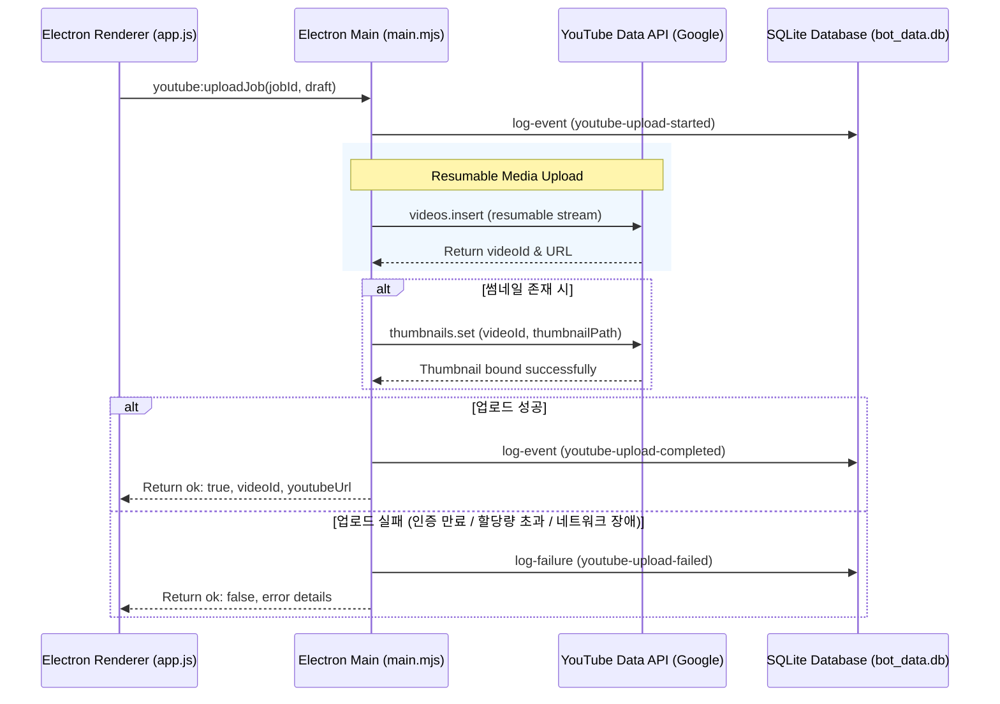

# Hermes Studio Post-Render YouTube Upload Panel Review

본 검토서는 `2026-06-01-post-render-youtube-upload-panel-plan.md` 구현 계획서와 Hermes Studio의 유튜브 업로드 파이프라인(`pipeline/youtube-upload.mjs`, `pipeline/youtube-auth.mjs`), Electron 메인 프로세스(`electron/main.mjs`), SQLite 데이터베이스 레이어(`bot_db_helper.py`, `workflow-db-events.mjs`), 그리고 UI 렌더러 레이어(`electron/renderer/app.js`, `electron/renderer/index.html`)를 종합 검토하여 안정적이고 유기적인 시스템 통합을 실현하기 위한 개선사항 및 분석 결과를 정리한 의견서입니다.

---

## 1. 개요 (Executive Summary)

제안된 유튜브 업로드 패널 계획서는 비디오 및 썸네일 생성이 완료된 후 사용자가 제목, 설명, 태그, 공개 범위, AI/합성 콘텐츠 표기 여부를 최종적으로 검수·수정하여 업로드할 수 있도록 보강하는 훌륭한 설계입니다. 

* **기존 문제점**: 기존 시스템은 글로벌 변수인 `latestCompletedJob`에 전적으로 의존하여 업로드를 처리함으로써 다중 작업이 실행되거나 앱이 재부팅되는 상황에서 엉뚱한 비디오가 업로드될 위험이 있었고, 유튜브 업로드 기능이 단순 stub(`upload-not-executed`)으로 구현되어 실질적인 배포 역할을 하지 못했습니다.
* **본 검토서의 중점**: 
  1. OAuth2 토큰 자동 갱신(Refresh Token) 시 파일 동기화 누락 해결.
  2. 대용량 비디오 해싱 시의 Electron 메인 스레드 프리징(Freeze) 방지 (비동기 스트림 해싱 적용).
  3. 유튜브 업로드 단계의 상태 변이 및 에러 발생을 SQLite DB(`bot_data.db`)와 `task_failures` 테이블에 명확히 미러링하는 추적 설계.
  4. 기존 테스트 계약 수트(`scripts/check-local-studio-product.mjs`)를 깨뜨리지 않기 위한 하위 호환성 브릿지 설계.
  5. 썸네일 크기 제한(2MB) 및 커스텀 로컬 썸네일 파일 교체 시의 예외 검증 강화.

---

## 2. 코드베이스 & 아키텍처 매핑 분석

### 2.1 OAuth2 토큰 갱신 시 `youtube-token.json` 동기화 보완
* **현상**: Google `OAuth2` 클라이언트는 토큰 만료 시 백그라운드에서 만료된 access_token을 refresh_token을 이용해 자동으로 갱신합니다. 하지만 갱신된 신규 access_token을 영속성 파일(`youtube-token.json`)에 쓰지 않으면, 애플리케이션을 껐다 켤 때마다 만료된 옛날 토큰으로 API를 호출하여 `401 Unauthorized` 또는 인증 오류를 유발합니다.
* **개선책**: `googleapis` 패키지가 제공하는 `tokens` 이벤트 리스너를 연동하여, 자동으로 갱신된 최신 자격 증명을 `saveYouTubeToken`을 통해 즉시 영속화해야 합니다.
* **추가 필요 매개변수**: 현재 `pipeline/youtube-upload.mjs` 내의 `uploadVideoToYouTube` 함수는 `clientSecretsPath`를 받지 않고 있는데, OAuth 토큰 갱신을 수행하려면 클라이언트 ID와 클라이언트 시크릿을 모두 포함한 OAuth2 인스턴스가 필요하므로 `clientSecretsPath` 역시 함께 전달받아야 합니다.

```javascript
// pipeline/youtube-upload.mjs 연동 개선안
import { loadYouTubeToken, saveYouTubeToken } from "./youtube-auth.mjs";
import { google } from "googleapis";
import { readFile } from "node:fs/promises";

export async function uploadVideoToYouTube({ videoPath, thumbnailPath, metadata = {}, tokenPath, clientSecretsPath }) {
  if (!videoPath) throw new Error("videoPath is required");
  if (!tokenPath) throw new Error("tokenPath is required");
  if (!clientSecretsPath) throw new Error("clientSecretsPath is required");

  const tokens = await loadYouTubeToken(tokenPath);
  if (!tokens) {
    return { ok: false, status: "oauth-token-missing", message: "OAuth 토큰이 존재하지 않습니다." };
  }

  const secrets = JSON.parse(await readFile(clientSecretsPath, "utf8"));
  const credentials = secrets.installed || secrets.web;
  
  const oauth2Client = new google.auth.OAuth2(
    credentials.client_id,
    credentials.client_secret,
    "http://127.0.0.1" // loopback redirect URI
  );
  oauth2Client.setCredentials(tokens);

  // 백그라운드 토큰 자동 갱신 시 파일에 덮어쓰기 바인딩
  oauth2Client.on("tokens", async (newTokens) => {
    const mergedTokens = { ...tokens, ...newTokens };
    await saveYouTubeToken(tokenPath, mergedTokens);
  });

  const youtube = google.youtube({ version: "v3", auth: oauth2Client });
  // ... resumable upload logic ...
}
```

### 2.2 대용량 영상 해싱(Hashing)의 비동기 스트림 처리
* **현상**: 비디오 멱등성 검사를 위해 파일 해시를 계산할 때 `fs.readFileSync` 등으로 전체 파일을 읽거나 동기식 `crypto.createHash`를 사용하면, 대용량 Shorts(수십 MB) 또는 롱폼(수백 MB~GB) 비디오 로드 시 Electron의 싱글 이벤트 루프가 수 초 동안 완전히 블로킹되어 UI가 멈추고 사용자가 먹통 상태를 겪게 됩니다.
* **개선책**: 반드시 `fs.createReadStream`을 이용한 비동기 청크 해싱을 수행하여 UI 스레드와 메인 프로세스의 반응성을 확보해야 합니다.

```javascript
// 비동기 스트림 해싱 함수 예시
import { createHash } from "node:crypto";
import { createReadStream } from "node:fs";

export function computeFileHash(filePath) {
  return new Promise((resolve, reject) => {
    const hash = createHash("sha256");
    const stream = createReadStream(filePath);
    stream.on("data", (chunk) => hash.update(chunk));
    stream.on("end", () => resolve(hash.digest("hex")));
    stream.on("error", (err) => reject(err));
  });
}
```

---

## 3. 워크플로우 & 데이터베이스(DB) 통합

### 3.1 SQLite DB 이벤트 미러링 고도화 (`workflow-db-events.mjs`)
유튜브 업로드 동작은 단순히 로컬 파일(`youtube-upload-state.json`)에만 기록되는 구조로는 한계가 있습니다. Hermes의 모니터링 허브인 `bot_data.db`에 통합되어야 봇 상태 조회 및 실패 진단이 가능해집니다.

1. **상태 진행률 바인딩**: `electron/services/job-progress-events.mjs`에 이미 선언된 `upload` 페이즈(`percent: 96`)를 적극 활용합니다.
2. **에러 감지 추가**: `workflow-db-events.mjs`의 `isFailureEvent` 및 `failureCodeOf`에 유튜브 업로드 실패 조건을 추가하여, 업로드 도중 에러가 나면 SQLite `task_failures` 테이블에 자동으로 구조화된 레코드가 생성되도록 합니다.

```javascript
// workflow-db-events.mjs 의 isFailureEvent 함수 내 추가 매핑
function isFailureEvent(event = {}) {
  return event.type === "desktop-job-failed"
    || event.type === "youtube-upload-failed" // 유튜브 업로드 전용 실패 타입 식별
    || event.details?.eventType === "flow-mode-mismatch"
    // ... 기존 조건들 ...
}

function failureCodeOf(event = {}) {
  const directCode = event.details?.failureCode || event.error?.code || "";
  if (directCode) return String(directCode);
  
  const text = [event.message, event.error?.message].filter(Boolean).join(" ");
  if (/quotaExceeded/i.test(text)) return "YOUTUBE_QUOTA_EXCEEDED";
  if (/invalid_grant|unauthorized/i.test(text)) return "YOUTUBE_OAUTH_EXPIRED";
  if (/upload-aborted|network/i.test(text)) return "YOUTUBE_NETWORK_INTERRUPTED";
  
  // ... 기존 조건들 ...
}
```

### 3.2 작업 이벤트 데이터 흐름도



---

## 4. 하위 호환성 (Backward Compatibility) 보호막

기존의 자동화 검증 도구인 [check-local-studio-product.mjs](file:///C:/Users/amd/hermes/scripts/check-local-studio-product.mjs)는 프리로드의 `youtubeApproveUpload` 메서드 및 HTML 내 `approveUploadBtn` 버튼 엘리먼트의 단언을 가지고 있습니다. 이를 삭제하면 빌드 및 QA 체크가 실패하므로, 아래와 같은 하위 호환성 보호막을 제공해야 합니다.

1. **Preload API 호환성**: `youtubeApproveUpload` 함수가 파라미터가 없을 때 기존처럼 메인 프로세스의 호환성 래퍼를 거쳐 `latestCompletedJob`을 조회하여 올릴 수 있게 하거나, 현재 화면에 선택된 `selectedJobId`를 찾아 전달하도록 구성합니다.
2. **HTML 엘리먼트 호환성**: 기존의 `#approveUploadBtn` 버튼은 보이지 않게 처리(`display: none`)하거나 레거시 폼 영역에 남겨두고, 실제 사용자 조작을 처리하는 주력 기능은 우하단에 배치할 `#youtubeUploadPanel` 및 `#uploadToYouTubeBtn`이 담당하도록 설계합니다.

```javascript
// electron/main.mjs 내의 하위 호환용 youtube:approveUpload 유지 및 보강
ipcMain.handle("youtube:approveUpload", async () => {
  const targetJob = latestCompletedJob;
  if (!targetJob?.finalVideo?.finalPath) {
    return { ok: false, status: "no-completed-video", message: "승인할 비디오가 준비되지 않았습니다." };
  }
  
  // 내부적으로 신규 리포지토리 패턴 및 job-scoped 업로드 프로세스 재호출
  return uploadVideoToYouTube({
    videoPath: targetJob.finalVideo.finalPath,
    thumbnailPath: targetJob.thumbnail?.path,
    tokenPath: paths.youtubeTokenPath,
    clientSecretsPath: paths.youtubeClientSecretsPath,
    metadata: {
      title: targetJob.assets?.draft?.title || targetJob.job.sourceValue,
      description: targetJob.assets?.draft?.script || "",
      privacyStatus: targetJob.job.upload?.privacyStatus || "private",
      containsSyntheticMedia: true,
    }
  });
});
```

---

## 5. 썸네일 검증 및 커스텀 업로드 개선안

1. **유튜브 썸네일 엄격한 정책 반영**: YouTube Data API의 `thumbnails.set`은 **최대 2MB 이하**의 이미지 파일(JPG, PNG)만 허용합니다. 사용자가 포토샵 등으로 보정한 초고화질 커스텀 썸네일을 `Choose Custom Thumbnail` 파일 피커로 올릴 때, 파일 크기가 2MB를 초과하면 API 호출 직전에 UI에서 경고를 띄워 차단해야 불필요한 네트워크 에러 및 API 지연을 사전에 방지할 수 있습니다.
2. **Sharp를 활용한 로컬 최적화 검토**: 파일이 2MB를 초과하는 경우, 메인 프로세스에서 `sharp` 모듈을 사용해 최대 2MB 이하로 자동 압축(Quality 조정)하여 업로드하는 편의 기능을 백그라운드 서비스 단에 심는 것을 적극 권장합니다.

---

## 6. 결론 (Conclusion)

본 계획서는 다중 비디오 생성 및 배포 작업이 수시로 교차하는 실무 현장에서의 안정성을 극대화하기 위한 매우 성숙한 발전안입니다. 본 검토서가 제안한 **OAuth2 토큰 갱신 콜백 영속화, 비동기 해싱 스레드 보호, SQLite task_failures 로그 통합 및 기존 UI/Preload API 하위 호환 브릿지**를 설계에 병합한다면, 한 차원 높은 품질의 프리미엄 배포 패널이 탄생할 것입니다.

* **의견서 저장 파일**: `C:\Users\amd\hermes\HERMES_POST_RENDER_UPLOAD_PANEL_REVIEW.md` (UTF-8 인코딩)
