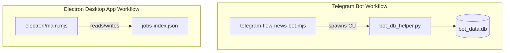

# Hermes AI 비디오 생성 진행 상태 구현 계획서 및 DB/워크플로우 종합 검토 의견서

본 검토서는 `2026-05-25-generate-final-video-progress-status-plan.md` 진행 상태 UI 구현 계획서와 Hermes 프로젝트의 코드베이스, 워크플로우, SQLite 데이터베이스(`bot_data.db` 및 `bot_db_helper.py`)를 심층 검토한 결과입니다. 

구현 시 발생할 수 있는 잠재적 결함(UI 프리징, 누락된 이벤트 흐름 등)과 데이터 아키텍처 관점에서의 개선 방향을 제시합니다.

---

## 1. 진행 상태 구현 계획서 (`2026-05-25...plan.md`) 검토 및 문제점

제안된 진행 상태 구현 계획서는 사용자 경험(UX) 측면에서 유용하지만, 실제 코드베이스의 동작 방식과 결합했을 때 **동작하지 않거나 심각한 UI 멈춤을 초래할 수 있는 논리적 결함**이 존재합니다.

### 1.1 `spawnSync` 동기 실행으로 인한 메인 프로세스 UI 프리징 (치명적)
* **현황**: `youtube-workflow.mjs` 파일의 `renderFinalYouTubeVideo` 함수는 비디오 렌더링 스크립트(`render-youtube-with-tts.mjs`)를 실행할 때 `spawnSync`를 사용합니다.
* **문제점**: Electron의 메인 프로세스(Main Process)는 단일 스레드로 동작합니다. `spawnSync`가 실행되는 동안 메인 프로세스는 **완전히 차단(Blocked)**됩니다.
  * 렌더링 및 TTS 생성 과정은 수초에서 수분까지 소요될 수 있으며, 이 동안 메인 프로세스의 이벤트 루프가 멈춥니다.
  * 이로 인해 렌더러 프로세스로부터 들어오는 IPC 호출을 처리할 수 없고, `webContents.send`를 통한 진행 상태 이벤트 전송 역시 실제로 화면에 도달하지 못하고 렌더링이 완전히 종료된 후에야 몰아서 전송됩니다.
  * 결과적으로 사용자는 24% 단계에서 화면이 완전히 멈춘 것처럼(Application Not Responding) 느끼게 됩니다.
* **개선책**: `spawnSync` 대신 비동기 `spawn`을 사용하도록 리팩토링하고, `Promise`를 반환하는 구조로 변경해야 합니다.

### 1.2 계획서 내 핵심 진행 상태(Progress Phase) 전송 누락
* **현황**: 계획서의 `job-progress-events.mjs`에는 아래와 같은 9개 단계가 정의되어 있습니다:
  - `submitted` (5%) -> `source-research` (12%) -> `script-draft` (24%) -> `scene-planning` (34%) -> `flow-media` (56%) -> `tts` (68%) -> `render` (82%) -> `thumbnail` (92%) -> `completed` (100%)
* **문제점**: 정작 Task 2의 백엔드 코드 수정안에는 아래 4개 단계만 전송 코드가 명시되어 있습니다:
  * `submitted` (작업 시작 시)
  * `source-research` (폴더 생성 시)
  * `script-draft` (작업 실행 직전)
  * `thumbnail` (썸네일 생성 시)
  * `completed` (최종 완료 시)
  * **누락**: 중간 핵심 단계인 `scene-planning` (34%), 일반 성공 경로에서의 `flow-media` (56%), `tts` (68%), `render` (82%) 단계에 대한 `emitJobProgress` 호출이 백엔드 코드(`youtube-job-service.mjs` 또는 `youtube-workflow.mjs`)에 전혀 구현되어 있지 않습니다.
* **개선책**: 워크플로우 진행 도중 각 시점에서 정확한 Phase 이벤트를 발행하도록 백엔드 수정안을 보완해야 합니다. 특히 TTS 및 렌더 단계는 메인 프로세스가 아닌 별도의 스크립트(`render-youtube-with-tts.mjs`)에서 실행되므로, 프로세스 표준 출력(stdout)을 파싱하여 실시간으로 이벤트를 중계하는 로직이 필요합니다.

---

## 2. 워크플로우 및 코드베이스 문제점 및 개선사항

### 2.1 하드코딩된 절대 경로 (배포 환경 결함)
* **현황**: 비디오 생성의 핵심인 `scripts/render-youtube-with-tts.mjs`와 `scripts/make-scenes-tts.py` 내부에 로컬 TTS 엔진 및 프로젝트의 경로가 하드코딩되어 있습니다.
  ```javascript
  // render-youtube-with-tts.mjs
  const ROOT = "C:/Users/amd/hermes";
  const TTS_ROOT = "C:/Users/amd/supertonic3-local-tts-20260517-r4/supertonic3-local-tts";
  ```
  ```python
  # make-scenes-tts.py
  TTS_ROOT = Path("C:/Users/amd/supertonic3-local-tts-20260517-r4/supertonic3-local-tts")
  ```
* **문제점**: 사용자 PC나 빌드/배포 환경이 달라지면 TTS 엔진을 실행하지 못해 프로그램이 즉시 실패합니다.
* **개선책**: Electron의 `config.json` 혹은 환경 변수(`HERMES_TTS_ROOT`, `HERMES_ROOT`)를 환경에 맞춰 넘겨받아 사용하도록 동적 로드 구조로 전환해야 합니다.

### 2.2 상세 오류 전파 부재
* **현황**: 외부 파이썬 스크립트(`make-scenes-tts.py`)나 FFmpeg 실행 도중 발생하는 문제에 대해 상위 Electron 애플리리케이션은 단순 종료 코드 실패(`exit code !== 0`) 정보만 수신합니다.
* **문제점**: 로컬 TTS 서버가 꺼져 있는지, 오디오 디렉토리 권한 문제인지, FFmpeg의 특정 필터 문법 에러인지 구분할 수 없기 때문에 사용자에게 "작업 실패"라는 모호한 오류 창만 노출됩니다.
* **개선책**: 서브프로세스의 `stderr` 또는 `stdout`을 파싱하여 구조화된 오류를 상위 프로세스로 전파하고, 화면에 구체적인 원인과 가이드를 함께 노출해야 합니다.

---

## 3. 데이터베이스 설계 및 데이터 스토어 아키텍처 검토 (db d)

현재 Hermes의 데이터 아키텍처는 **이원화(De-coupled)**되어 있어 유지보수성과 진단 기능 관점에서 큰 비효율을 가지고 있습니다.



### 3.1 SQLite DB 활용 부재 및 데이터 이중 관리
* **현황**: 텔레그램 봇은 SQLite(`bot_data.db`)와 데이터베이스 헬퍼(`bot_db_helper.py`)를 통해 작업(Jobs), 실패 로그(Failures), 대화 이력(Messages), 메모리(Memories)를 완벽하게 관리하고 있습니다. 반면, Electron 데스크톱 앱은 로컬 JSON 파일(`jobs-index.json` 및 `[job-id].json`)에만 데이터를 저장하고 있습니다.
* **문제점**:
  1. **진단 불가능**: 데스크톱 앱에서 발생한 오류나 작업 상태를 텔레그램 봇의 강력한 진단 시스템(`/diagnose` 명령어 및 자동 에러 진단 팩)이 인지할 수 없습니다.
  2. **동기화 불가**: 사용자가 동일 로컬 머신에서 텔레그램 봇과 데스크톱 앱을 함께 사용할 경우, 작업 이력이 공유되지 않고 파편화됩니다.
  3. **코드 중복**: JSON 기반 저장 구조(`job-store.mjs`)와 SQLite 기반 저장 구조가 각각 따로 존재하여 유지보수 비용이 증가합니다.
* **개선책**: Electron 메인 프로세스에서도 작업 등록 및 상태 변경 시 Python 헬퍼(`bot_db_helper.py`)를 호출하여 `bot_data.db`에 통합 기록하거나, Node.js 내에서 직접 SQLite 라이브러리를 사용해 하나의 데이터베이스를 공유하도록 아키텍처를 통합해야 합니다.

### 3.2 `bot_db_helper.py` 내의 경로 하드코딩
* **현황**: `bot_db_helper.py` 내부 역시 데이터베이스 경로가 아래와 같이 하드코딩되어 있습니다.
  ```python
  ROOT = Path("C:/Users/amd/hermes")
  DB_PATH = ROOT / "bot_data.db"
  ```
* **문제점**: Electron 앱 패키징 배포 시 해당 경로를 생성하지 못하거나 접근할 수 없어 DB 무반응 또는 권한 오류가 발생할 수 있습니다.
* **개선책**: DB 경로를 환경 변수(`HERMES_DB_PATH`)로 동적으로 설정할 수 있도록 변경하고, 기본값으로 `%APPDATA%/Hermes/bot_data.db`와 같은 사용자 안전 디렉토리를 채택해야 합니다.

---

## 4. 최종 개선안 및 아키텍처 제안

### 개선안 A: 비동기 프로세스 처리 및 진행률 중계 로직 (Electron Main)
기존 `renderFinalYouTubeVideo`를 동적 비동기 스트림 파싱 형태로 수정하여 메인 스레드 블로킹을 방지합니다.

```javascript
// youtube-workflow.mjs 내 리팩토링 제안
import { spawn } from "node:child_process";

export function renderFinalYouTubeVideoAsync(job, assets, context = {}) {
  const emit = context.emit || (() => {});
  return new Promise((resolve, reject) => {
    const jobDir = assets.jobDir;
    const scriptPath = context.renderScriptPath || join(ROOT, "scripts/render-youtube-with-tts.mjs");
    
    // 비동기 spawn 실행 (Main thread를 block 하지 않음)
    const child = spawn(process.execPath, [scriptPath, jobDir], {
      cwd: ROOT,
      env: { ...process.env, HERMES_YOUTUBE_FINAL_NAME: finalName }
    });

    let stdoutData = "";
    let stderrData = "";

    child.stdout.on("data", (chunk) => {
      const text = chunk.toString();
      stdoutData += text;
      
      // 스크립트 출력 메시지 파싱하여 세부 진행률 전송
      // 예: render-youtube-with-tts.mjs가 "[progress:tts] TTS 오디오 생성 중..." 문구를 출력하도록 수정
      if (text.includes("[progress:tts]")) {
        emit({ type: "job-progress", jobId: job.id, phase: "tts", status: "running", percent: 68 });
      } else if (text.includes("[progress:render]")) {
        emit({ type: "job-progress", jobId: job.id, phase: "render", status: "running", percent: 82 });
      }
    });

    child.stderr.on("data", (chunk) => {
      stderrData += chunk.toString();
    });

    child.on("close", (code) => {
      if (code !== 0) {
        reject(new Error(`Render failed: ${stderrData}`));
        return;
      }
      try {
        const parsed = JSON.parse(stdoutData.trim().match(/\{[\s\S]*\}\s*$/)?.[0] || "{}");
        resolve(parsed);
      } catch (e) {
        reject(new Error("Failed to parse render result JSON"));
      }
    });
  });
}
```

### 개선안 B: 데이터베이스 통합 아키텍처 제안
데스크톱 작업을 SQLite DB와 연동하여 텔레그램 봇과 데이터 저장소를 싱크합니다.

```javascript
// job-store.mjs 내 SQLite 연동 구현 제안
import { spawn } from "node:child_process";

export async function upsertJobToSQLite(job) {
  // bot_db_helper.py를 활용하여 bot_data.db에 동일하게 저장
  return new Promise((resolve) => {
    const dbHelper = process.env.HERMES_DB_HELPER || "C:/Users/amd/hermes/bot_db_helper.py";
    const child = spawn("python", [dbHelper, "upsert-job", JSON.stringify(job)]);
    
    child.on("close", (code) => {
      resolve(code === 0);
    });
  });
}
```

---

## 5. 결론 및 요약

1. **UI 프리징 방지**: 비디오 생성 UI가 렌더링 도중 먹통이 되지 않도록 `spawnSync` 기반의 렌더링 과정을 **비동기 `spawn`** 형태로 무조건 교체해야 합니다.
2. **진행 상태 연속성 확보**: `scene-planning`, `tts`, `render` 단계의 진행 정보가 유실되지 않도록 비디오 생성 스크립트 출력값을 파싱하여 상위로 전달하는 파이프라인이 필수로 추가되어야 합니다.
3. **경로 환경 변수 처리**: 배포 안정성을 확보하기 위해 모든 하드코딩된 로컬 경로(`C:/Users/amd/...`)를 환경 변수 또는 동적 해석 경로로 마이그레이션해야 합니다.
4. **SQLite DB 이중 구조 통합**: 장기적으로 `jobs-index.json` 관리를 중단하고, 텔레그램 봇이 사용하는 `bot_data.db`에 데스크톱 작업 데이터를 통합 관리하여 시스템 진단성 및 관리 효율을 높일 것을 권장합니다.
