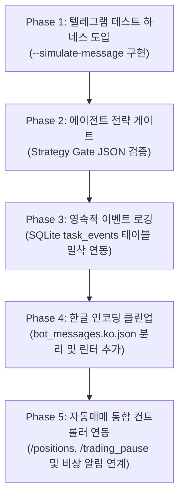

# Hermes 및 OKX/Binance 자동매매 시스템 분석 의견서 (Review & Opinions)

본 의견서는 `HERMES_SELF_TEST_AND_AGENT_IMPROVEMENT_PLAN.md` 계획서, 텔레그램 봇 코드베이스(`telegram-flow-news-bot.mjs`, `bot_db_helper.py`), SQLite DB(`bot_data.db`), 그리고 OKX/Binance 자동매매 프로젝트의 핵심 연구 및 이력(`research.md`, `timeline.md`)을 심층 분석한 결과를 바탕으로 문제점을 진단하고 개선 방향을 제안합니다.

---

## 1. 개요 및 분석 배경

현재 구축되어 작동 중인 시스템은 크게 두 가지 영역으로 나뉩니다:
1. **Hermes (텔레그램 에이전트 봇)**: 사용자의 명령에 반응하여 Playwright 웹 캡처, Google News RSS 요약, Google Flow를 활용한 쇼츠 영상 제작을 수행하거나, Codex SDK를 통해 로컬 파워쉘 명령 실행 및 웹 검색을 자동 처리하는 대리인(Agent) 시스템입니다.
2. **OKX/Binance 자동매매 (auto-trade-main-okx)**: Binance USDM 및 OKX 환경에서 FVG, VWMA 등의 기법을 기반으로 실시간 가격을 분석하여 진입/청산 주문을 넣는 퀀트 거래 시스템입니다. 최근(2026-05-12)에는 포지션 수를 최대 5개로 제한하는 리스크 관리 정책(`cap5`) 하에 **`lifecycle_quality_runner_live`**와 거래 맥락을 기록하는 **`trade_journal`** 메타프로세스를 도입하고 실거래를 본격 개시했습니다.

본 분석은 이 두 시스템의 유기적인 연계성과 개별 시스템 내부의 취약점(P0~P2급 이슈)을 보완하여, 전체 시스템의 완성도와 안정성을 Antigravity/Claude Code 스타일의 최고 수준 에이전트로 끌어올리기 위한 목적으로 수행되었습니다.

---

## 2. 텔레그램 에이전트 (Hermes)의 문제점 및 개선 방향

### [P0] 실제 인바운드 테스트 하네스(Test Harness) 부재
* **현황**: 현재 텔레그램 봇의 메시지 테스트는 실제 사용자가 텔레그램 메시지를 발송하거나, 텔레그램의 중간 중계 과정을 생략한 채 local API를 직접 쏘는 구조(`--test-generic` 등)로 분절되어 있습니다. 텔레그램 API 업데이트나 채널/그룹 성격에 따른 메시지 파싱 규칙 오류를 로컬에서 사전 방지하기 어렵습니다.
* **의견 & 대안**: `--simulate-message "<명령어>"` 옵션을 추가하여 모의 텔레그램 `Update` 객체를 직접 생성하고 내부 라우팅 함수인 `processUpdate(update)`로 즉각 전달할 수 있는 **인바운드 시뮬레이터**가 구현되어야 합니다. 모의 실행 단계에서는 디버깅을 위해 텔레그램 실제 전송(`sendMessage`) 부분을 모의 객체(Mock) 또는 표준 출력(stdout)으로 가로챌 수 있는 `--simulate-no-send` 옵션이 병행되어야 합니다.

### [P0] Codex 실행 경로의 비용/시간 무차별성 (Strategy Gate 누락)
* **현황**: 사용자가 "올해 한국 주식 중 최고 상승률 10개 찾기"와 같은 탐색 범위가 지나치게 넓고 자원 소모적인 질의를 할 때, Codex는 아무런 사전 필터링 없이 대량의 yfinance 다운로드 파이썬 스크립트를 작성하여 로컬에서 돌리려 시도합니다. 이는 실행 지연, 메모리 과다 사용, 감시견 타임아웃을 유발합니다.
* **의견 & 대안**: Codex가 직접 도구를 실행하기 전, 요청을 처리하기 위한 계획(Plan)을 구조화된 JSON 형태로 먼저 생성하게 유도하는 **전략 관문(Strategy Gate)** 설계가 필수적입니다.
  ```json
  {
    "task_type": "market_data_scan",
    "tools": ["web", "python"],
    "estimated_runtime_sec": 300,
    "risk": "slow_full_scan",
    "first_action": "Naver Finance API probe"
  }
  ```
  봇은 위와 같은 계획을 수신하여 실행 시간 예측치나 API 접근 횟수가 지정한 임계치(예: 90초 초과, 대규모 파일 다운로드)를 넘을 경우, 경고 메시지와 함께 단계를 즉각 거절(Gate Blocking)하거나 더 작은 범위로 먼저 수색(Probing First)하도록 피드백을 전달해야 합니다.

### [P0] 스트리밍 이벤트의 소실 (SQLite 데이터베이스와의 연동 미흡)
* **현황**: 에이전트가 작동 중에 Playwright를 열거나, 파이썬 헬퍼를 실행하거나, 임시 파일을 만드는 등의 모든 미세 행동(Micro-actions)은 `runStreamed()`를 통해 관찰되지만, 이 정보는 오직 일회성 전역 메모리(`currentJob.workflow`)에만 저장되다 작업 완료 후 휘발됩니다.
* **의견 & 대안**: `bot_data.db`에 정의되어 있는 `task_events` 테이블을 적극적으로 활용해야 합니다. `observeCodexEvent()` 내에서 도구 실행 상태, 명령어 라인, Exit Code, 에러 메시지 꼬리(Tail)를 실시간으로 `log_event` 쿼리를 통해 SQLite에 영속화해야 합니다. 또한 사용자가 텔레그램 상에서 `/lastjob` 또는 `/failures` 명령어로 최종 실행 흐름과 에러 상세 이력을 즉각 호출해 볼 수 있는 모니터링 핸들러의 구현이 수반되어야 합니다.

### [P1] 한글 모지바케(Mojibake) 현상 및 하드코딩
* **현황**: `telegram-flow-news-bot.mjs` 코드 내부에 유니코드 이스케이프 문자(`\uC811...`)와 일반 한글 리터럴이 난잡하게 뒤섞여 있으며, 윈도우 파워쉘 환경이나 텔레그램 웹훅 통신 과정에서 문자 인코딩 깨짐 현상(Mojibake: `???`, `占`, `媛` 등)이 발생할 잠재적 위험이 존재합니다.
* **의견 & 대안**: 소스코드에 한국어 텍스트를 하드코딩하지 않고, UTF-8로 저장된 외부 리소스 파일(`bot_messages.ko.json`)에 모든 알림/상태 메시지를 이관하는 방식으로 리팩토링해야 합니다. 이와 동시에, 릴리즈나 로컬 테스트 실행 시 발송 텍스트를 정규식으로 검증하여 모지바케 대표 패턴(`[\uFFFD]|???`)을 실시간으로 감지하고 빌드를 통과시키지 않는 인코딩 안전장치 검사 스크립트를 추가해야 합니다.

### [P1] 감시견(Watchdog) 중단 후 대안 경로로의 자율적 회복 메커니즘 부족
* **현황**: 현재의 3분 watchdog 감시 장치는 Codex가 멈춰있거나 과도한 시간 동안 루프를 도는 경우 프로세스를 죽이는 '강제 정지' 역할에 머무르고 있습니다. 정지 후 다시 사용자가 동일 명령을 내려 대체 경로를 밟게 유도하는 수준입니다.
* **의견 & 대안**: 프로세스를 강제 중단(Abort)하는 순간, 이전 시도에서 Codex가 어떤 스크립트의 어느 부분에서 막혔는지를 요약하여 SQLite 실패 메모리에 누적하고, **즉각 1회에 한해 제한을 둔 대안 재시도(Watchdog Recovery Prompt)**를 봇 스스로 수행해야 합니다.
  * *예시 재시도 명령어*: `"이전 시도에서 yfinance 전체 심볼을 받아오다 감시견이 중단했습니다. yfinance 전체 스캔 도구를 사용하지 마십시오. 네이버 금융의 상위 검색 종목 페이지를 웹스크래핑하여 수집하십시오. 최대 제한 시간은 60초입니다."*

### [P1] 동시성 처리가 불가능한 전역 busy 플래그와 큐(Queue) 모델의 단순성
* **현황**: 봇에 `busy = true` 전역 플래그를 하나만 두어, 무거운 웹 크롤링이나 동영상 생성이 진행 중일 때 다른 사용자의 가벼운 질의나 상태 확인 요청마저 완전히 차단되어 응답 없음으로 일관하게 됩니다.
* **의견 & 대안**: SQLite 기반의 **멀티 세션/멀티챗 작업 대기열(Queue)** 구조로 진화해야 합니다. 요청을 수신하면 작업 대기열 테이블에 삽입하고 백그라운드 워커가 순차 처리하게 만듭니다. 또한 `/cancel <job_id>`로 현재 실행 중인 에이전트의 스레드를 즉각 `kill` 하거나, `/status`를 통해 본인의 대기 순서 및 진행률을 실시간으로 안내받을 수 있도록 제어 명령어를 고도화해야 합니다.

---

## 3. 자동매매 시스템 (auto-trade-main-okx)의 강점 및 결합 방안

### 퀀트 거래 시스템의 성과 및 설계의 긍정적인 면
* **지극히 엄격한 잣대의 검증 프로세스**: `research.md`와 `timeline.md`에 드러난 연구 과정을 보면, 단순 백테스트 수익률에 만족하지 않고 거래 비용(90bps 수준의 가혹한 슬리피지/수수료 및 -10bps 펀딩비)을 적용하는 등 오버피팅(과적합) 제거에 탁월한 방어 전략을 취하고 있습니다. 그 결과, 수익 Edge가 극도로 우수한 `lc_conversion24` 등 소수의 핵심 피처 규칙만을 shadow 거래로 승격시키는 절제를 보여주고 있습니다.
* **리스크 안전장치**: 바이낸스 USDM에 `lifecycle_quality_runner_live`를 론칭하며 포지션을 최대 5개로 통제하는 `cap5` 기간을 10일간 유지하는 것 역시 실거래 손실을 예방하기 위한 훌륭한 엔지니어링 설계입니다. 또한 진입 시점의 가설과 청산 시점의 성과 결과를 추적할 수 있도록 `trade_journal` 메타데이터 레이어를 SQLite에 정밀 구축한 부분이 강점으로 돋보입니다.

### 두 시스템 간의 결합(Synergy)을 통한 가치 극대화 제안
현재 자동매매 시스템은 별도의 React frontend UI(`TradingTab`)와 FastAPI 백엔드에 전적으로 의존해 모니터링을 진행하고 있습니다. 텔레그램 봇(Hermes)이 로컬 시스템 파일과 DB에 자유롭게 접근할 수 있는 권한을 가진 만큼, 텔레그램을 통해 **자동매매 제어기 및 실시간 비상 알림기(Telegram Telemetry Controller)** 역할을 결합하면 상호 시너지가 폭발적으로 상승할 것입니다.

1. **실시간 트레이딩 텔레메트리 연동**:
   * OKX/Binance 봇에 예기치 못한 API 오류, 체결 슬리피지 급증, 혹은 일일 일시 손실 한도(Daily Loss Limit) 도달 시, Hermes 텔레그램 채널로 즉시 스크린샷과 로그 리포트를 자동 발송합니다.
2. **원격 텔레그램 트레이딩 제어 명령어 제공**:
   * 외부 이동 시 모바일 텔레그램으로 자동매매 현황을 통제할 수 있는 전용 보안 명령어를 구축합니다.
     * `/positions`: 현재 실거래 또는 Shadow로 잡혀 있는 포지션 수, 진입가, 수익률 현황 출력.
     * `/journal`: 최근 진입한 포지션들의 진입 가설(`trade_journal` 연동) 요약 확인.
     * `/trading_pause`: 비상 시장 급변 상황 발생 시 텔레그램 명령으로 트레이딩 프로세스를 안전하게 일시정지(Kill-switch) 처리.
     * `/performance`: 당일/당월 누적 실현 손익 및 최대 낙폭(MDD) 수치 요약 보고.

---

## 4. 최종 로드맵 제안 (Recommended Roadmap)

분석 결과 반영을 위해 아래와 같은 단계적 개선 로드맵을 추천합니다.



* **1단계 (즉시 실행)**: `--simulate-message`를 통한 로컬 인바운드 라우팅 테스트 구조를 안착시킵니다.
* **2단계 (안정성 강화)**: 무거운 작업을 사전에 차단하기 위한 Codex JSON 계획 검증 관문(Strategy Gate)을 구현합니다.
* **3단계 (가시성 확보)**: 스트리밍 도구 실행 과정을 SQLite에 상시로 써넣고 `/lastjob`과 같은 추적 명령어를 Telegram에 오픈합니다.
* **4단계 (정리)**: 유니코드 하드코딩 문자들을 한 파일로 모으고, 빌드 시 인코딩 오류 검사 필터를 배치합니다.
* **5단계 (통합 시너지)**: 트레이딩 DB와 API를 Hermes 봇과 교차 연동하여 원격 모니터링 및 비상 차단 기능을 가동합니다.

---
*본 검토 리포트 문서는 사용자 요청에 따라 **UTF-8** 형식으로 인코딩하여 저장되었습니다.*
*저장 경로: `C:\Users\amd\hermes\HERMES_REVIEW_AND_OPINIONS.md`*
