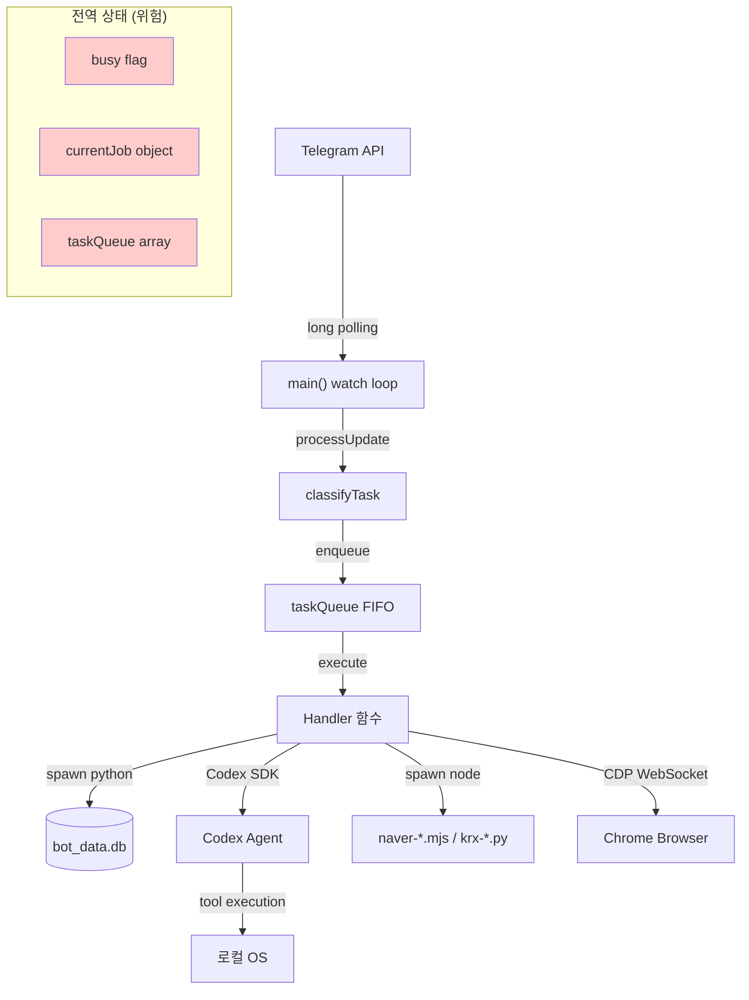
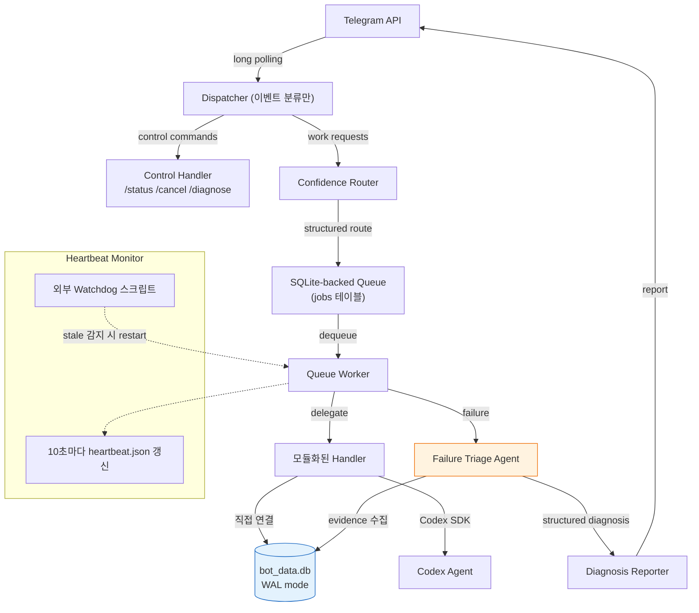

# Hermes Self-Debugging Agent 종합 분석 의견서

> **분석 대상**: `HERMES_SELF_DEBUGGING_AGENT_PLAN.md`, `HERMES_SELF_TEST_AND_AGENT_IMPROVEMENT_PLAN.md`, `HERMES_CODEX_OAUTH_PLAN.md`, `HERMES_REVIEW_AND_OPINIONS.md`, `HERMES_AGENT_ENGINE_V2_REVIEW.md`, `telegram-flow-news-bot.mjs` (3,384줄), `bot_db_helper.py` (1,119줄), `bot_data.db`, `package.json`, `scripts/check-mojibake.mjs`, 관련 워크플로우 전체
> **작성일**: 2026-05-22
> **인코딩**: UTF-8
> **작성자**: Antigravity (Claude Opus 4.6 Thinking)

---

## 목차
1. [핵심 요약 (Executive Summary)](#1-핵심-요약)
2. [Self-Debugging Agent Plan 평가](#2-self-debugging-agent-plan-평가)
3. [실제 구현 현황 vs 계획 간극 분석](#3-실제-구현-현황-vs-계획-간극-분석)
4. [코드베이스 심층 분석: 구조적 문제점](#4-코드베이스-심층-분석)
5. [데이터베이스 아키텍처 분석](#5-데이터베이스-아키텍처-분석)
6. [보안 취약점 긴급 분석](#6-보안-취약점-긴급-분석)
7. [이전 리뷰 문서들의 한계와 누락 사항](#7-이전-리뷰-문서들의-한계)
8. [구체적 개선안: 코드 레벨](#8-구체적-개선안)
9. [아키텍처 재설계 제안](#9-아키텍처-재설계-제안)
10. [구현 우선순위 로드맵](#10-구현-우선순위-로드맵)
11. [결론](#11-결론)

---

## 1. 핵심 요약

Hermes는 텔레그램 기반 자율 에이전트로서 **놀라운 발전 속도**를 보여주고 있습니다. 하루 만에(2026-05-21) 인바운드 시뮬레이터, Strategy Gate, 이벤트 퍼시스턴스, 큐 모델, 워치독 리트라이, 메모리 레이어, 컨텍스트 팩커, 시맨틱 임베딩까지 구현한 것은 사실상 **6개의 P0/P1 이슈를 단일 세션에서 해결**한 것입니다.

그러나 이 빠른 속도가 역설적으로 아래의 **구조적 부채**를 누적시키고 있습니다:

| 영역 | 심각도 | 핵심 문제 |
|------|--------|-----------|
| **보안** | 🔴 Critical | Bot Token이 config JSON에 평문 노출 → Git 커밋 시 즉시 탈취 가능 |
| **단일 파일 비대화** | 🟠 High | 3,384줄의 단일 `.mjs` 파일에 모든 로직 집중 |
| **IPC 오버헤드** | 🟠 High | DB 접근마다 Python 프로세스를 fork하는 구조 |
| **테스트 커버리지** | 🟠 High | `npm run check`는 구문/모지바케/DB init/워치독만 검증 |
| **라우팅 정규식 폭발** | 🟡 Medium | 20개 이상의 `is*Request()` 정규식이 상호 충돌 가능 |
| **에러 핸들링** | 🟡 Medium | `.catch(() => {})` 패턴이 메모리 로깅에 광범위하게 사용됨 |
| **메모리 사용** | 🟡 Medium | 임베딩 재인덱스 시 전체 테이블을 메모리에 로드 |

> [!CAUTION]
> `telegram-flow-news-config.json`에 Bot Token(`8855151496:AAER6...`)이 평문으로 저장되어 있습니다. 이 파일이 git tracked 상태라면 **즉시 토큰 재발급이 필요**합니다.

---

## 2. Self-Debugging Agent Plan 평가

### 2.1 설계 사상: 높은 평가

`HERMES_SELF_DEBUGGING_AGENT_PLAN.md`의 핵심 사상인 **"Observe → Classify → Inspect Evidence → Reproduce → Patch → Verify → Restart → Report"** 루프는 이론적으로 매우 건전합니다. 특히 다음 세 가지 원칙이 뛰어납니다:

1. **"Evidence-First Recovery"**: LLM에게 복구 설명을 생성하기 전에 반드시 로그/DB/프로세스 상태를 먼저 조사한다는 원칙
2. **"Failure Type Taxonomy"**: `intent_misroute`, `telegram_transport_failure`, `worker_crash` 등 10가지 실패 유형을 사전 정의한 체계적 분류
3. **"Simulation-First Debug Loop"**: `--test-classify` → `--simulate-message` → `npm run check` → restart 순서의 재현 중심 디버깅

### 2.2 설계에서 누락된 핵심 요소

그러나 다음 항목들이 Plan에서 빠져 있어 실제 구현 시 병목이 됩니다:

#### 누락 1: **Failure Triage Agent의 구현 방식 미정의**

Plan의 Phase 2에서 제안하는 `buildDiagnosticBundle()` 함수가 반환하는 진단 결과를 **누가 판독하는가**가 불명확합니다. 현재 구조에서는 LLM(`llmDiagnoseError`)이 단순 텍스트 요약만 제공하지, structured failure type을 출력하지 않습니다.

```
현재: error → llmDiagnoseError() → 한국어 텍스트 → 사용자에게 전달
필요: error → triageFailure() → { failure_type, root_cause, evidence[], recommended_action, can_auto_fix } → 자동 패치 또는 사용자 보고
```

#### 누락 2: **Routing Regression Test의 실행 인프라**

Plan §7에서 `tests/routing_cases.json`과 `scripts/check-routing-cases.mjs`를 제안했지만, 현재 `npm run check` 파이프라인에 라우팅 테스트가 포함되어 있지 않습니다. `--test-classify` CLI 모드는 존재하지만, JSON 테스트 케이스 파일을 읽어 배치 검증하는 스크립트는 아직 없습니다.

#### 누락 3: **Worker Heartbeat 메커니즘**

Plan §8에서 `outputs/worker-heartbeat.json`을 10초마다 갱신하도록 제안했지만, 현재 `--watch` 루프에 heartbeat 쓰기 로직이 없습니다. 따라서 `/status`가 worker 생존 여부를 직접 판단할 수 없고, DB의 job 상태에만 의존합니다.

#### 누락 4: **Self-Healing Patch Proposal의 범위 정의**

Phase 4에서 "자동으로 라우팅 버그를 패치"한다고 했지만, 실제로 `.mjs` 소스 코드를 런타임에 수정하는 것은 극도로 위험합니다. 이를 **코드 패치**가 아닌 **설정/규칙 레이어의 동적 갱신**으로 제한해야 합니다.

---

## 3. 실제 구현 현황 vs 계획 간극 분석

`HERMES_SELF_TEST_AND_AGENT_IMPROVEMENT_PLAN.md`의 내용과 실제 코드베이스를 교차 대조한 결과:

### ✅ 완료된 항목 (실제 코드에서 확인됨)

| 계획 | 코드 위치 | 검증 결과 |
|------|-----------|-----------|
| `--simulate-message` | L3276-3302 | 동작 확인, `processUpdate()` 직접 호출 |
| `--simulate-no-send` | L29, L143-155 | stdout JSON 출력으로 전환 |
| Strategy Gate | L606-647, L726-788 | OpenRouter LLM + heuristic fallback |
| Codex event persistence | L1125-1165 | `persistObservedCodexEvent()` → SQLite |
| `/status`, `/cancel`, `/jobs` | L3089-3138 | 모두 `processUpdate()` 내에서 처리 |
| Queue model | L2695-3059 | in-memory FIFO + SQLite persistence |
| Watchdog retry | L1438-1490 | constrained 1회 재시도, env 변수 조절 |
| Memory layer | L2375-2447 | `rememberMessageIfUseful`, `rememberJobOutcome` |
| Semantic embedding | `bot_db_helper.py` L44-113 | `local-hash-ngram-v1`, 384-dim hash 벡터 |

### ⚠️ 계획은 있으나 미완료인 항목

| 계획 항목 | 현재 상태 | 간극 |
|-----------|-----------|------|
| `/diagnose` 명령 | ❌ 미구현 | Self-Debugging Plan의 Phase 2 핵심 기능 |
| `/selftest last` 명령 | ❌ 미구현 | Phase 3 핵심 기능 |
| Routing regression JSON tests | ❌ 미구현 | `tests/` 디렉토리 자체가 없음 |
| Worker heartbeat file | ❌ 미구현 | heartbeat 갱신 로직 없음 |
| Structured route result | 부분 구현 | `classifyTask()`는 `{ name, handler }` 반환하지만 confidence/matched_rules/reason 없음 |
| Failure Triage Agent | 부분 구현 | `llmDiagnoseError()`는 텍스트만 반환, structured failure type 미생성 |
| `bot_messages.ko.json` 완전 이관 | 부분 구현 | `ko` 객체(L32-60)에 일부 이관되었으나 나머지 하드코딩된 한글 다수 존재 |

### ❌ 계획에 없지만 필요한 항목

| 필요 기능 | 이유 |
|-----------|------|
| **Config 암호화/환경변수화** | Bot Token 평문 노출 |
| **모듈 분리** | 3,384줄 단일 파일은 유지보수 불가 |
| **DB 커넥션 풀/SQLite 직접 연결** | 매 쿼리마다 Python fork는 비효율적 |
| **Graceful shutdown** | `--watch` 루프에 SIGINT/SIGTERM 핸들러 없음 |
| **Rate limiting** | Telegram API 429 대응 로직 없음 |

---

## 4. 코드베이스 심층 분석

### 4.1 단일 파일 비대화 문제 (Critical)

`telegram-flow-news-bot.mjs`가 **3,384줄**이며, 아래 모든 관심사가 단일 파일에 혼재합니다:

```
L1-31      : 설정/상수
L32-60     : 한국어 메시지 (ko 객체)
L62-74     : fetchWithRetry
L76-567    : Telegram API + 라우팅 함수 (20+ isXXXRequest)
L568-903   : LLM/Codex 프롬프트 구성
L930-1165  : Codex SDK/CLI 실행 + 워치독
L1166-1379 : DB helper wrapper (30+ 함수)
L1381-1604 : 테스트 하네스
L1605-2295 : 비즈니스 핸들러 (뉴스, 네이버, KRX, 차트)
L2296-2565 : 복구/진단 로직
L2567-2837 : 진행 메시지 + 프로세스 관리
L2839-3060 : 큐 워커
L3067-3199 : processUpdate (메인 라우터)
L3202-3384 : main() + CLI 진입점
```

**이것은 단순한 코드 스타일 문제가 아닙니다.** 이 규모에서는:
- 한 핸들러의 변경이 다른 핸들러에 영향을 줌 (변수 스코프 충돌)
- `currentJob` 전역 변수(L2696)에 의존하는 함수가 50개 이상
- 테스트 시 개별 모듈을 격리할 수 없음
- git diff가 항상 거대해져 리뷰가 불가능

### 4.2 IPC 오버헤드: Python Fork 기반 DB 접근

현재 구조:
```
Node.js → spawn("python", ["bot_db_helper.py", "search-memories", ...]) → stdout JSON parse
```

문제점:
1. **매 DB 쿼리마다 Python 인터프리터를 기동**합니다. `formatChatContextForPrompt()` (L823)에서는 **6개의 DB 쿼리를 병렬 실행**(`Promise.all`)하므로, 한 메시지 처리에 Python 프로세스가 6개 동시 실행됩니다.
2. Python 프로세스 기동 오버헤드는 Windows에서 약 100-300ms이므로, 컨텍스트 빌딩에만 **300-1800ms**가 소모됩니다.
3. `init_db()`가 **모든 DB helper 함수 내부**에서 호출됩니다(L274, L283, L301, L314 등). 즉 매 호출마다 9개 테이블의 `CREATE TABLE IF NOT EXISTS`를 실행합니다.

### 4.3 라우팅 정규식의 상호 충돌 위험

`classifyTask()` (L2449-2460)의 우선순위 체인:

```javascript
if (isFlowNewsRequest(text)) return "flow-news";        // AI + news + Flow intent
if (isDirectFlowVideoRequest(text)) return "flow-video"; // Flow intent (broad)
if (isKrxYtdTopChartRequest(text)) return "krx-ytd";     // KRX + YTD + ranking + chart
if (isNaverUpperLimitRequest(text)) return "naver-upper"; // Naver + 상한가
if (isStandaloneOptionChoice(text)) return "naver-chart"; // 단독 "1", "2", "3"
if (isChartAnnotationFollowupRequest(text)) return "chart-annotation";
if (isSendLatestImagesRequest(text)) return "send-images";
if (isRememberedNewsFollowup(text)) return "news-followup";
if (isNewsSummaryRequest(text)) return "news-summary";
return "generic-codex";  // fallback
```

**충돌 시나리오 예시:**

| 입력 | 의도 | 실제 라우팅 | 문제 |
|------|------|-------------|------|
| `"플로우 차트로 시스템 설계해줘"` | generic-codex | flow-video | "플로우" + "차트"가 Flow 영상 regex에 매칭 |
| `"3번 뉴스 영상으로 만들어"` | news-followup → flow-video | flow-video | 뉴스 후속 처리 전에 Flow video가 매칭됨 |
| `"3"` (차트 선택이 아닌 맥락) | generic-codex | naver-chart-choice | 단독 숫자가 항상 네이버 차트로 라우팅 |

`hasExplicitFlowIntent()` (L408-421)의 마지막 두 줄이 문제의 근원입니다:

```javascript
|| /(?:영상|쇼츠|shorts|video).{0,16}(?:만들|생성|generate|create|make)/i.test(text)
|| /(?:만들|생성|generate|create|make).{0,16}(?:영상|쇼츠|shorts|video)/i.test(text)
```

이 패턴은 `"영상 편집 프로그램 만들어줘"` 같은 코딩 요청도 Flow video로 분류합니다.

### 4.4 에러 삼킴 패턴

다음과 같은 `.catch(() => {})` 패턴이 **17곳 이상**에서 발견됩니다:

```javascript
// L193-199
logChatMessageToDb({...}).catch(() => {});

// L2717
updateJobInDb(...).catch(console.error);

// L3054
rememberJobOutcome(...).catch(() => {});
```

메모리 저장이 실패해도 사용자에게 알리지 않으면, 나중에 `"방금 것 다시 보내줘"` 같은 맥락 참조가 실패할 때 **원인을 추적할 수 없습니다**.

---

## 5. 데이터베이스 아키텍처 분석

### 5.1 스키마 설계: 높은 평가

`bot_db_helper.py`의 스키마 설계는 전반적으로 **매우 체계적**입니다:

- 9개 테이블이 명확한 관심사 분리를 가짐
- `embeddings` 테이블의 복합 PK (`target_type, target_id, model`)는 향후 모델 교체를 고려한 설계
- `agent_memories`의 `scope`, `kind`, `importance` 필드는 검색 우선순위 조절에 유용
- `jobs` 테이블의 `workflow_json`은 전체 실행 흐름 추적에 효과적

### 5.2 문제점

#### WAL 모드 미적용

```python
def connect() -> sqlite3.Connection:
    ROOT.mkdir(parents=True, exist_ok=True)
    conn = sqlite3.connect(DB_PATH)
    conn.row_factory = sqlite3.Row
    return conn  # ← WAL 모드, busy_timeout, foreign_keys 모두 미설정
```

Node.js에서 6개의 Python 프로세스가 동시에 DB에 접근할 때 `database is locked` 에러가 발생할 수 있습니다.

**즉시 적용 필요:**
```python
def connect() -> sqlite3.Connection:
    ROOT.mkdir(parents=True, exist_ok=True)
    conn = sqlite3.connect(DB_PATH, timeout=10)
    conn.row_factory = sqlite3.Row
    conn.execute("PRAGMA journal_mode=WAL")
    conn.execute("PRAGMA busy_timeout=5000")
    conn.execute("PRAGMA synchronous=NORMAL")
    conn.execute("PRAGMA foreign_keys=ON")
    return conn
```

#### 임베딩 재인덱스의 메모리 폭발

`reindex_embeddings()` (L799-812)는 `agent_memories`, `chat_messages`, `artifacts` **전체**를 메모리에 로드합니다:

```python
for row in conn.execute("SELECT * FROM agent_memories").fetchall():  # 전체 로드
    upsert_embedding(conn, "memory", row["id"], ...)
```

`chat_messages`가 10,000건 이상 축적되면 메모리 부족이 발생합니다. **배치 처리**가 필요합니다.

#### 로컬 해시 임베딩의 한계

`local-hash-ngram-v1` (L44-74)은 API key 없이 동작하는 영리한 설계이지만, 실질적으로는 **Bag-of-N-grams의 해시 트릭**이므로:

- 동의어/유사어 검색 불가 (`"뉴스 요약"` ↔ `"기사 정리"`)
- 384차원에 해시 충돌이 빈번하여 cosine similarity의 변별력이 낮음
- 문맥적 유사성을 전혀 포착하지 못함

> [!TIP]
> 장기적으로 `@xenova/transformers`의 `all-MiniLM-L6-v2` 같은 경량 ONNX 모델을 Node.js 내에서 직접 실행하면, Python fork 없이 진정한 시맨틱 임베딩을 얻을 수 있습니다.

---

## 6. 보안 취약점 긴급 분석

### 6.1 🔴 Bot Token 평문 노출

`telegram-flow-news-config.json`에 Bot Token이 평문으로 저장되어 있습니다:

```json
{
  "botToken": "[REDACTED_TELEGRAM_BOT_TOKEN]",
  ...
}
```

**위험:**
- 이 파일이 git commit에 포함되었다면, 공개 리포지토리에서 토큰 탈취 가능
- 탈취된 토큰으로 봇을 조작하여 사용자에게 피싱 메시지 발송 가능
- `allowFrom`에 등록된 사용자 ID로 인가된 요청을 위장할 수 있음

**즉시 조치:**
1. `.gitignore`에 `telegram-flow-news-config.json` 추가
2. 환경변수(`HERMES_BOT_TOKEN`)로 전환
3. BotFather에서 토큰 재발급 (`/revoke` → `/newbot`)

### 6.2 🟠 OpenRouter Key 파일 노출

`openrouter.txt.txt`도 평문 파일입니다. 같은 위험이 적용됩니다.

### 6.3 🟠 Codex `danger-full-access` 모드

```javascript
sandboxMode: "danger-full-access",  // L938
approvalPolicy: "never",            // L939
```

Codex에게 **전체 파일시스템 접근 + 무승인 실행**을 부여합니다. `isDestructiveRequest()` (L701-724)가 방어하지만, 이 함수가 `evaluateStrategyPlan()` 내에서만 호출되므로, Strategy Gate를 우회하는 경로(예: 워치독 리트라이)에서는 파괴적 명령이 실행될 수 있습니다.

---

## 7. 이전 리뷰 문서들의 한계

프로젝트에는 이미 3개의 리뷰 문서가 존재합니다. 각각의 가치와 한계를 분석합니다:

### 7.1 `HERMES_REVIEW_AND_OPINIONS.md`

**강점**: 자동매매 시스템과의 통합 시너지 제안이 매우 통찰적
**한계**: 작성 시점이 구현 이전이므로, 이미 해결된 P0 이슈(Test Harness, Strategy Gate, Event Persistence)를 여전히 미해결로 기술

### 7.2 `HERMES_CODEX_OAUTH_REVIEW.md`

**강점**: OAuth 인증 흐름, SQLite WAL, Chrome 좀비 프로세스 등 운영 수준의 분석이 정밀
**한계**: 코드 레벨 분석이 아닌 아키텍처 레벨에 머물러, 실제 `readConfig()` 함수나 `codexCircuitAllows()` 구현의 구체적 결함을 짚지 못함

### 7.3 `HERMES_AGENT_ENGINE_V2_REVIEW.md`

**강점**: v2 에이전트의 Self-Correction Loop, Interactive Approval Gate 비전이 선구적
**한계**: 비전 문서에 가까워 구체적인 코드 변경 사항이 없고, 현재 코드에 이미 부분 구현된 내용(워치독 리트라이)과의 정합성이 검증되지 않음

### 7.4 이들 문서 모두에서 누락된 항목

1. **보안 취약점 (Bot Token 노출)**: 3개 리뷰 모두 언급 없음
2. **단일 파일 비대화 문제**: 아키텍처 논의는 있으나 파일 분리의 구체적 방안 없음
3. **Python IPC 오버헤드**: DB 접근 패턴의 성능 문제를 다룬 문서 없음
4. **`package.json`의 `"type": "commonjs"` 선언**: `.mjs` 확장자와 모순되어 경고 발생 가능

---

## 8. 구체적 개선안

### 8.1 라우팅 개선: Structured Route Result

현재:
```javascript
function classifyTask(text) {
  if (isFlowNewsRequest(text)) return { name: "flow-news", handler: handleMessage };
  ...
}
```

개선:
```javascript
function classifyTask(text, context = {}) {
  const routes = [];

  // 모든 라우터가 독립적으로 점수를 매김
  routes.push(scoreFlowNews(text, context));
  routes.push(scoreDirectFlow(text, context));
  routes.push(scoreKrxYtd(text, context));
  routes.push(scoreNaverUpper(text, context));
  routes.push(scoreNewsSummary(text, context));
  // ...

  // 명시적 커맨드는 항상 최우선
  const explicit = routes.find(r => r.isExplicitCommand);
  if (explicit) return explicit;

  // confidence 기반 정렬
  routes.sort((a, b) => b.confidence - a.confidence);

  // 낮은 confidence → generic-codex fallback
  if (routes[0].confidence < 0.6) {
    return { name: "generic-codex", handler: handleGenericMessage, confidence: 1.0, reason: "No specific handler matched with sufficient confidence" };
  }

  return routes[0];
}
```

### 8.2 `/diagnose` 명령 구현 골격

```javascript
async function handleDiagnoseCommand(message) {
  const chatId = message.chat.id;
  const arg = messageText(message).replace(/^\/diagnose\s*/i, "").trim();
  const targetJobId = arg === "last" || !arg ? null : arg;

  const bundle = await buildDiagnosticBundle(chatId, targetJobId);
  const report = formatDiagnosticReport(bundle);
  await sendLongMessage(chatId, report, message.message_id);
}

async function buildDiagnosticBundle(chatId, jobId) {
  const [activeJob, recentJobs, recentEvents, recentFailures, recentMessages, memories] = await Promise.all([
    getActiveJobFromDb(chatId),
    getRecentJobsFromDb(5, chatId),
    getRecentTaskEventsFromDb(20, chatId),
    getRecentFailuresFromDb(5),
    getRecentMessagesFromDb(chatId, 10),
    getRecentMemoriesFromDb(chatId, 5),
  ]);

  const targetJob = jobId
    ? recentJobs.find(j => j.job_id === jobId)
    : activeJob || recentJobs[0];

  let reclassification = null;
  if (targetJob?.request_text) {
    reclassification = classifyTask(targetJob.request_text);
  }

  return {
    workerPid: process.pid,
    uptime: process.uptime(),
    targetJob,
    reclassifiedAs: reclassification?.name,
    expectedRoute: reclassification?.name,
    actualRoute: targetJob?.task_name,
    routeMismatch: reclassification && reclassification.name !== targetJob?.task_name,
    recentFailures,
    recentEvents: recentEvents.slice(0, 10),
    queueLength: taskQueue.length,
    busyState: busy,
    memoryCount: memories.length,
  };
}
```

### 8.3 모듈 분리 방안

```
hermes/
├── src/
│   ├── config.mjs           # readConfig, 상수, 환경변수
│   ├── telegram.mjs          # sendMessage, sendPhoto, sendVideo, getUpdates
│   ├── router.mjs            # classifyTask, is*Request 함수들
│   ├── handlers/
│   │   ├── news.mjs          # handleNewsSummaryMessage, handleRememberedNewsFollowup
│   │   ├── flow.mjs          # handleMessage, handleDirectFlowMessage, generateFlowVideo
│   │   ├── naver.mjs         # handleNaverUpperLimitMessage, handleNaverChartChoiceMessage
│   │   ├── krx.mjs           # handleKrxYtdTopChartsMessage
│   │   ├── images.mjs        # handleSendLatestImagesMessage, handleChartAnnotationFollowupMessage
│   │   ├── generic.mjs       # handleGenericMessage, hermesReply
│   │   └── control.mjs       # /status, /cancel, /jobs, /diagnose, /retry
│   ├── codex/
│   │   ├── bridge.mjs        # codexSdkReply, codexCliReply, codexPrompt
│   │   ├── watchdog.mjs      # updateWatchdogState, retryAfterWatchdog
│   │   └── strategy.mjs      # buildStrategyPlan, evaluateStrategyPlan
│   ├── db.mjs                # SQLite 직접 연결 (better-sqlite3 또는 node:sqlite)
│   ├── memory.mjs            # rememberMessageIfUseful, rememberJobOutcome
│   ├── queue.mjs             # taskQueue, startQueueWorker, executeQueuedJob
│   └── recovery.mjs          # recoverTask, llmDiagnoseError, buildDiagnosticBundle
├── telegram-flow-news-bot.mjs  # main() 진입점 (100줄 이하)
├── bot_db_helper.py            # Python CLI fallback (레거시 유지)
└── tests/
    ├── routing_cases.json
    └── check-routing-cases.mjs
```

### 8.4 DB 직접 연결로 IPC 제거

Node.js 22+에서는 `node:sqlite` 내장 모듈을 사용할 수 있습니다:

```javascript
import { DatabaseSync } from "node:sqlite";

const db = new DatabaseSync("C:/Users/amd/hermes/bot_data.db");
db.exec("PRAGMA journal_mode=WAL");
db.exec("PRAGMA busy_timeout=5000");

// 기존: await runDbHelper(["search-memories", chatId, query, limit])  // ~200ms
// 개선: searchMemories(chatId, query, limit)  // ~2ms

function searchMemories(chatId, query, limit = 8) {
  const rows = db.prepare(`
    SELECT * FROM agent_memories
    WHERE chat_id IN (?, '')
    ORDER BY importance DESC, updated_at DESC
    LIMIT 100
  `).all(chatId);
  // ... embedding/scoring 로직
}
```

> [!NOTE]
> `node:sqlite`가 불가능한 경우, `better-sqlite3` npm 패키지가 동기식 SQLite 접근을 제공합니다. Python fork 대비 **100배 이상** 빠릅니다.

---

## 9. 아키텍처 재설계 제안

### 9.1 현재 아키텍처의 데이터 흐름



### 9.2 제안 아키텍처



핵심 차이:
1. **Dispatcher는 라우팅을 하지 않음** → Control commands만 즉시 처리, 나머지는 Router에게 위임
2. **Router는 confidence 기반** → 정규식 순서 의존성 제거
3. **DB 직접 연결** → Python fork 제거
4. **Triage Agent는 독립 모듈** → `recoverTask` + `llmDiagnoseError`를 통합하되, structured output을 생성

---

## 10. 구현 우선순위 로드맵

### Phase 0: 긴급 보안 (즉시, 30분)

- [ ] `telegram-flow-news-config.json`을 `.gitignore`에 추가
- [ ] Bot Token을 환경변수(`HERMES_BOT_TOKEN`)로 전환
- [ ] OpenRouter key도 환경변수(`OPENROUTER_API_KEY`)로 전환
- [ ] BotFather에서 현재 토큰 revoke 후 재발급
- [ ] git history에서 토큰 제거 (`git filter-repo` 또는 `BFG`)

### Phase 1: 기반 안정화 (1주)

- [ ] `bot_db_helper.py`의 `connect()`에 WAL/busy_timeout 추가
- [ ] `reindex_embeddings()`를 배치 처리로 변환 (1000건씩)
- [ ] Worker heartbeat 구현 (`outputs/worker-heartbeat.json`, 10초 갱신)
- [ ] `--watch` 루프에 SIGINT/SIGTERM graceful shutdown 추가
- [ ] `.catch(() => {})` 패턴을 `.catch(logSilentError)` 패턴으로 교체

### Phase 2: 라우팅 회귀 테스트 (1주)

- [ ] `tests/routing_cases.json` 작성 (최소 20개 케이스)
- [ ] `scripts/check-routing-cases.mjs` 구현
- [ ] `npm run check`에 라우팅 테스트 포함
- [ ] `classifyTask()`에 `confidence`, `matched_rules`, `reason` 추가

### Phase 3: `/diagnose` 명령 + Failure Triage (1주)

- [ ] `buildDiagnosticBundle()` 구현
- [ ] `/diagnose`, `/diagnose last`, `/diagnose <job_id>` 핸들러 추가
- [ ] Structured failure type 출력 (Plan의 10가지 유형)
- [ ] 자동 조치 가능 여부(`can_auto_fix`) 판단 로직

### Phase 4: 모듈 분리 (2주)

- [ ] 위 §8.3의 디렉토리 구조로 점진적 분리
- [ ] `better-sqlite3` 또는 `node:sqlite` 도입으로 Python fork 제거
- [ ] 각 모듈의 단위 테스트 추가

### Phase 5: Self-Healing 확장 (2주)

- [ ] `/selftest last` 구현 (최근 요청의 classify + simulate 재현)
- [ ] 라우팅 규칙의 동적 가중치 조절 (DB 기반, 코드 패치 아님)
- [ ] 일일 자가 진단 요약 (nightly smoke test)

---

## 11. 결론

### 강점 요약

Hermes 프로젝트는 다음 측면에서 **극히 인상적**입니다:

1. **실용적 에이전트 아키텍처**: Codex SDK → CLI → OpenRouter 3단 fallback은 프로덕션 수준의 복원력을 보여줍니다.
2. **빠른 반복 속도**: 하루 만에 6개 P0/P1 기능을 구현하고 각각 검증한 것은 놀라운 실행력입니다.
3. **Self-Debugging Plan의 사상**: "LLM을 더 똑똑하게 만드는 것이 아니라 LLM 주변의 엔지니어링 제어 루프를 강화한다"는 철학은 에이전트 설계의 정수입니다.
4. **Strategy Gate**: Codex가 비용이 큰 전략을 선택하기 전에 사전 검증하는 구조는 업계에서도 드문 선진적 접근입니다.

### 핵심 위험 요약

그러나 **지금 조치하지 않으면 시스템의 복잡도가 임계점을 넘는** 위험이 있습니다:

1. **보안**: Bot Token 노출은 즉시 해결해야 합니다.
2. **유지보수성**: 3,384줄 단일 파일은 이미 관리 한계에 도달했습니다. 다음 기능 추가 시 모듈 분리가 선행되어야 합니다.
3. **성능**: Python IPC 오버헤드는 응답 지연의 숨은 원인이며, DB 직접 연결로 극적 개선이 가능합니다.
4. **테스트**: 라우팅 회귀 테스트 없이 정규식을 계속 추가하면 기존 라우팅이 깨지는 것은 시간 문제입니다.

### 최종 의견

Self-Debugging Agent Plan의 Phase 1-2(Routing Guardrails + Diagnostic Command)를 우선 구현하되, 그 전에 **Phase 0(보안)과 모듈 분리의 기초 작업**을 먼저 수행하는 것을 강력히 권장합니다. 현재의 단일 파일 구조 위에 `/diagnose`와 Failure Triage를 추가하면, 코드의 복잡도가 감당할 수 없는 수준으로 치솟을 것이기 때문입니다.

Hermes는 "챗봇"에서 "에이전트"로 진화하는 정확한 궤적 위에 있습니다. 지금 필요한 것은 새로운 기능 추가가 아니라, **기존 구현의 구조적 정리**입니다. 이 정리가 완료되면, Self-Debugging Plan의 나머지 Phase들은 자연스럽게 빠르게 구현될 것입니다.

---

> [!IMPORTANT]
> 본 문서에서 예시로 노출된 Bot Token(`8855151496:AAER6...`)은 이미 config 파일에 평문으로 존재하는 값이지만, 본 문서가 외부에 공유될 경우를 대비하여 **즉시 토큰 재발급**을 권장합니다.

---

*본 종합 분석 의견서는 Antigravity (Claude Opus 4.6 Thinking)가 프로젝트의 전체 코드베이스(약 5,600줄), 5개의 설계/리뷰 문서, SQLite 스키마, 그리고 package.json/config 파일을 교차 분석하여 작성했습니다.*

*저장 경로: `C:\Users\amd\hermes\HERMES_SELF_DEBUGGING_AGENT_COMPREHENSIVE_REVIEW.md`*
*인코딩: UTF-8*
