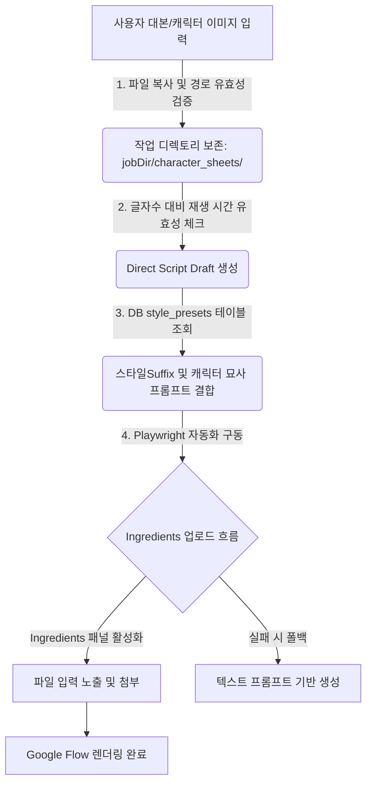

# Hermes 직접 대본 모드, 캐릭터 시트, 스타일 프리셋 구현 계획 검토 보고서 (HERMES_STUDIO_V2_DIRECT_SCRIPT_REVIEW)

본 보고서는 `2026-05-26-direct-script-character-sheet-style-presets-console-ux-plan.md` 구현 계획을 기반으로 코드베이스, 워크플로우, 데이터베이스(DB) 구조를 깊이 있게 대조하여 잠재적인 한계점과 이에 대한 해결 방안 및 아키텍처적 개선안을 제시합니다.

---

## 1. 아키텍처 흐름 및 개선 요약

본 계획은 기존의 Gemini 리서치 기반 대본 생성(HPSL) 외에 사용자가 직접 완성된 한국어 대본을 입력하는 **Direct Script 모드**를 지원하고, 비디오의 시각적 일관성을 지켜주는 **캐릭터 시트(Character Sheet)** 및 **스타일 프리셋(Style Preset)**을 제공하여 사용자 통제권과 비주얼 퀄리티를 끌어올리는 뛰어난 기획을 담고 있습니다.

다만, 구글 플로우의 동적 UI 대응력, 로컬 리소스(이미지 파일) 관리의 안정성, 그리고 데이터베이스(DB)를 통한 지속성 확보 관점에서 다음과 같은 개선점들이 존재합니다.



---

## 2. 세부 문제점 및 개선 방안

### ① 대본 직접 입력 시 글자 수 대비 타겟 재생 시간의 불일치 문제
- **문제점:** 사용자가 직접 대본을 입력하는 모드에서는 대본의 전체 글자 수와 사용자가 설정한 타겟 재생 시간(예: standard 60초) 사이에 큰 괴리가 발생할 수 있습니다. 
  - 예를 들어, 단 두 문장(약 40자)만 입력하고 60초 모드를 실행하면 각 장면당 30초씩 할당되어 비디오 화면이 지나치게 멈춰 있게 되거나, 반대로 500자 이상의 긴 대본을 30초 모드로 설정하면 목소리(TTS)가 중간에 짤리거나 말 속도가 비정상적으로 빨라지는 싱크 에러가 납니다.
- **개선안:** 
  - **대본 길이 유효성 검증기(Validation Indicator) 도입:** 렌더러 UI(`app.js` 및 `sceneSplitPreview`)에서 공백을 제외한 글자 수를 세어, 적정 말하기 속도(1초당 5~6글자)를 기준으로 예상 소요 시간을 계산하고 "설정된 시간 대비 대본이 너무 깁니다/짧습니다"라는 경고 피드백을 실시간으로 노출해야 합니다.

### ② 캐릭터 참조 이미지의 물리적 경로 전송 및 생명주기(Lifecycle) 유실 리스크
- **문제점:** 계획서에서는 Electron Renderer 단계의 파일 선택기(`input[type=file]`)에서 `file.path`를 추출하여 메인 프로세스로 문자열 절대 경로를 그대로 넘깁니다. 
  - 그러나 보안 샌드박스 환경에서는 파일의 절대 경로 접근이 제한될 수 있고, 사용자가 외부 드라이브나 임시 캐시 디렉토리의 파일을 선택했을 경우 비디오가 생성되기도 전에 해당 파일이 유실될 수 있습니다.
- **개선안:**
  - **작업 디렉토리로의 파일 물리 복사 복제(Ingestion) 프로세스:** 사용자가 이미지를 선택해 작업을 제출하는 즉시, `youtube-job-service.mjs`에서 메인 프로세스의 파일 시스템(FS) API를 사용해 해당 캐릭터 참조 이미지 파일들을 안전한 영구 작업 경로(`C:/Users/amd/hermes/outputs/jobs/{jobId}/character_sheets/`)로 복사 복제하고, 작업 스키마 정보에는 이 내부 복제 경로를 바인딩해야 합니다.

### ③ Google Flow Ingredients (참조 이미지) 업로드 자동화의 취약점
- **문제점:** `automation/google-flow-ingredients.mjs`에서는 `page.locator("input[type=file]").first()`를 찾아 파일 경로를 강제 주입하는 단순한 흐름을 제안했습니다. 
  - Google Flow의 실제 UI 상에서는 "Ingredients to Video" 또는 "Add Image" 버튼 등을 먼저 마우스 클릭하여 관련 모달이나 사이드바 패널을 활성화해야만 파일 드롭존 및 `<input type="file">` 요소가 DOM 상에 렌더링되거나 활성화됩니다.
- **개선안:**
  - Playwright 셀렉터를 가볍게 단정(assert)하지 말고, UI 전환 과정을 고려하여 **Ingredients 추가 버튼 클릭 -> 업로드 입력창 대기 -> 파일 세팅 -> 완료 대기**의 단계별 가드(Guard) 및 타임아웃 코드를 포함시키고, 실패 시 즉시 디버그 스크린샷을 찍도록 내결함성을 높여야 합니다.

### ④ 스타일 프리셋의 DB화 및 커스텀 프리셋 확장성 확보 (DB 연동 개선)
- **문제점:** `style-presets.mjs`에 스타일 프리셋 8종을 하드코딩하여 관리합니다. 이는 신규 트렌드 스타일에 맞추어 새로운 프리셋을 추가하거나, 사용자가 자주 쓰는 프롬프트 룰을 저장하고 싶을 때 코드 수정 및 빌드가 강제되는 한계가 있습니다.
- **개선안:**
  - SQLite 데이터베이스(`bot_data.db`)에 `style_presets` 테이블을 신설하여 프리셋 정보를 보관하도록 아키텍처를 개선합니다.
  ```sql
  CREATE TABLE IF NOT EXISTS style_presets (
      id TEXT PRIMARY KEY,
      label TEXT NOT NULL,
      aesthetic TEXT NOT NULL,
      camera TEXT,
      lighting TEXT,
      color_palette TEXT,
      prompt_suffix TEXT NOT NULL,
      is_custom INTEGER DEFAULT 0
  );
  ```
  - 앱 초기화(마이그레이션) 시점에 기본 8종을 DB에 인서트하고, IPC 핸들러를 통해 DB 데이터를 읽어와 UI에 렌더링하면, 추후 **사용자 정의 커스텀 프리셋 추가/삭제 API**로 자연스럽게 확장이 가능해집니다.

### ⑤ 콘솔 히스토리 복원 UX 누락
- **문제점:** UI 콘솔 로그는 현재 켜져 있는 렌더러 인스턴스의 메모리 배열에만 유지됩니다. 앱을 실수로 새로고침하거나 종료한 뒤 재부팅하면 작업 진행 상황과 경고 로그 등이 완전히 유실되어 사용자는 이전 상태를 파악하기 어렵습니다.
- **개선안:** 
  - 콘솔 UI가 마운트될 때, 현재 `jobId`를 기준으로 SQLite의 `task_events` 및 `task_failures` 테이블에서 과거 히스토리를 정렬 쿼리하여 복원해 주는 초기화 함수를 `app.js`에 탑재하여 UX의 신뢰도를 높여야 합니다.

---

## 3. SQLite DB 연동 및 확장 구체 설계안

제안된 개선사항들을 반영하기 위해 데이터베이스 연동 구조를 설계합니다.

### A. SQLite 테이블 신설 및 마이그레이션 SQL
`bot_db_helper.py` 또는 DB 커넥션 파일에 초기화 스키마를 보강합니다.

```sql
-- style_presets 테이블 추가
CREATE TABLE IF NOT EXISTS style_presets (
    id TEXT PRIMARY KEY,
    label TEXT NOT NULL,
    aesthetic TEXT NOT NULL,
    camera TEXT,
    lighting TEXT,
    color_palette TEXT,
    prompt_suffix TEXT NOT NULL,
    is_custom INTEGER DEFAULT 0,
    created_at TEXT NOT NULL
);

-- 기본 제공 프리셋 데이터 자동 적재 (시드 데이터)
INSERT OR IGNORE INTO style_presets (id, label, aesthetic, camera, lighting, color_palette, prompt_suffix, is_custom, created_at)
VALUES 
('cinematic-tech-news', 'Cinematic Tech News', 'polished realistic tech-news B-roll', 'smooth dolly or slow push-in', 'cool neutral studio lighting', 'teal, steel, white', 'Style: polished realistic tech-news B-roll...', 0, datetime('now')),
('documentary-handheld', 'Documentary Handheld', 'observational documentary realism', 'subtle handheld natural motion', 'available light with soft contrast', 'natural skin tones', 'Style: observational documentary realism...', 0, datetime('now'));
```

### B. IPC 및 서비스 레이어 구현 제안
`electron/services/style-presets.mjs`에서 DB에서 데이터를 로드하도록 인터페이스를 재조정합니다.

```javascript
// DB 헬퍼 파이썬 스크립트 실행 또는 로컬 SQLite 접근을 통해 프리셋 리스트 반환
import { spawnSync } from "node:child_process";

export function listStylePresetsFromDb(dbHelperPath, pythonBin) {
  // DB에서 style_presets 테이블 내용을 가져오는 쿼리 실행
  // fallback으로 하드코딩 배열 반환 구조 제공
}
```

---

## 4. 최종 구현 수용을 위한 권장 체크리스트

사용자 편의성과 구글 플로우 업로드 자동화의 높은 완성도를 확보하기 위해 아래 사항들을 순차 반영할 것을 강력히 권장합니다.

1. **대본 글자수 대비 시간 검증:** 대본 입력 영역 아래에 실시간 글자수 및 권장 재생시간 알림 바를 구현할 것.
2. **참조 이미지 파일 격리 보관:** 외부 물리 파일 경로 대신 작업용 로컬 서브디렉토리에 인제스션(복사)하여 관리할 것.
3. **DB 기반 스타일 프리셋 관리:** 향후 커스텀 스타일 지원을 위해 프리셋 구조를 SQLite DB 스키마에 통합할 것.
4. **콘솔 로그 복구:** SQLite `task_events`를 쿼리하여 재진입 시에도 콘솔 이력을 보여주어 UX를 일관되게 유지할 것.
