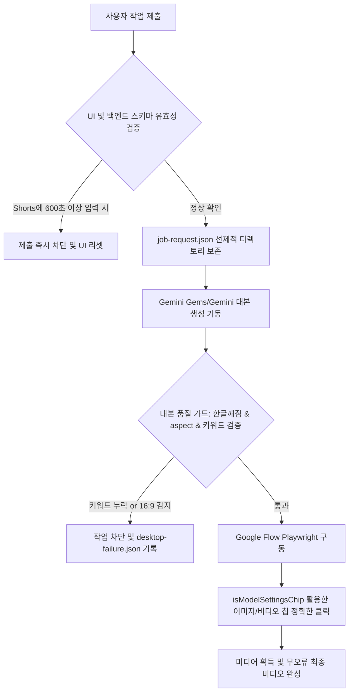

# Hermes Studio 최근 워크플로우 실패 해결 계획 검토 보고서 (HERMES_WORKFLOW_FAILURE_FIX_REVIEW)

본 보고서는 `2026-05-27-recent-workflow-failure-fix-plan.md` 구현 계획과 현행 코드베이스, Playwright 자동화 제어 로직, 그리고 SQLite DB 연동 상태를 면밀히 분석하여 최근 발생한 오작동 사유를 진단하고 이를 안정적으로 종식시키기 위한 추가 개선안을 제안합니다.

---

## 1. 실패 진단 및 해결책 타당성 평가

최근 Hermes Studio에서 식별된 오류들은 시스템의 고도화 과정에서 파생된 UI-백엔드 정합성 불일치와 구글 플로우(Google Flow)의 비정상 엘리먼트 클릭 오작동이 주원인입니다.

1. **Google Flow 모델 칩 오작동 (mismatch 버그):** 이미지 모드와 비디오 모드 변경 클릭 시 하단 제너레이터 팝업을 띄우지 않고 엉뚱한 `에이전트` 칩을 클릭해버리는 버그가 있었습니다. `isAgentChip`을 엄격히 필터링하고 실제 이미지/비디오 모델 속성(Veo, Nano Banana, Imagen 등)을 지닌 요소를 정확히 찾아 클릭하는 **isModelSettingsChip 칩 판별 및 가치 점수 정렬 알고리즘**은 이 문제를 매우 우아하게 종식시킵니다.
2. **Shorts 와 Longform의 혼합 설정 문제:** 720초(롱폼) 시간이 선택된 상태에서 Shorts 모드가 비정상적으로 제출되어 발생했던 오픈라우터 오류는, UI 진입 지점과 백엔드 `youtube-job-schema.mjs`에 **상호 억제식 예방 룰(Longform mode is required for 600s+)**을 도입함으로써 근본적으로 사전 차단됩니다.
3. **대본 품질(Aspect Ratio, Grounding) 저하 방치:** 대본 내 종횡비 불일치(`16:9` 표기 감지) 및 필수 핵심 키워드가 제목/첫 문장에 포함되어 있는지를 검증하는 **SOURCE_GROUNDING_MISMATCH** 가드 필터는 산출물의 질적 저하를 영구 차단합니다.
4. **원자적 쓰기(Atomic Write) 도입:** `provider-fallback-chain.json` 유실을 방어하기 위해 임시 파일 작성 후 리네임하는 패턴은 파이프라인 중단 시 발생하던 0바이트 손상을 차단합니다.



---

## 2. 추가적인 기술 보완점 및 개선 제안

### ① 한국어 조사 처리를 고려한 키워드 추출기 고도화 (Korean Josa Trimming)
- **문제점:** Task 7에서 제안된 required token 추출 방식은 공백(`\s+`)을 기준으로 분리합니다. 만약 사용자가 조사와 붙여서 입력한 경우(예: "gemini**의** 소식", "제미나이**를** 분석") 검색 키워드는 `gemini의` 또는 `제미나이를`로 쪼개져, 대본 속의 순수한 명사형 `gemini`, `제미나이` 텍스트와 불일치하여 정상 대본이 **`SOURCE_GROUNDING_MISMATCH` 오판으로 기각**될 수 있습니다.
- **개선안:** 
  - required token 추출 시 분리된 각 단어에서 한국어 조사(의, 를, 을, 은, 는, 이, 가, 에, 에서, 와, 과, 로, 으로, 하고, 이다 등)를 정규식으로 안전하게 트리밍(Trimming Josa)한 순수 명사 원형을 대상으로 includes 매칭을 수행해야 실오동작을 방지할 수 있습니다.
  ```javascript
  // Josa Trimming 헬퍼
  function cleanJosa(token = "") {
    return token.replace(/(?:의|를|을|은|는|이|가|에|에서|와|과|로|으로|하고|이다)$/g, "").trim();
  }
  ```

### ② Windows OS 환경의 파일 잠금(EACCES) 충돌 방지 재시도 헬퍼
- **문제점:** Windows 파일 시스템에서는 다른 비동기 이벤트 리스너(Electron의 watch 서비스 등)가 파일을 미세하게 물고 있는 동안 `fs.promises.rename()`을 수행하면 `EACCES` 또는 `EPERM` 에러를 던지며 원자적 쓰기가 크래시를 유발할 수 있습니다.
- **개선안:** 
  - `writeJsonAtomic` 함수 내의 `rename` 동작이 Windows 파일 잠금으로 인해 실패할 경우, 100ms 대기 후 최대 3회까지 재시도하는 **재시도 백오프 래퍼(Retry Backoff Wrapper)**를 아래와 같이 보완하여 이식성을 높여야 합니다.

### ③ SQLite DB의 task_failures 테이블 내 실패 분류 코드 체계 연동
- **문제점:** 새롭게 명확히 정의된 에러 코드(`FLOW_PROMPT_ASPECT_MISMATCH`, `SOURCE_GROUNDING_MISMATCH`, `HPSL_STRUCTURE_MISMATCH` 등)들이 DB 실패 테이블에 단순 문자열 메시지로 적재되면 사후 통계 및 통찰력 확보가 어렵습니다.
- **개선안:** 
  - SQLite `task_failures` 테이블의 `error_msg`에 이 에러 코드 상수를 명시적으로 Prefix하여 기록하십시오. 이를 통해 텔레그램 봇이나 대시보드 진단(`/diagnose`) 화면에서 사용자의 잘못된 대본 세팅 비율, 모델 변경 오류 비율 등을 한눈에 시각화할 수 있는 통계 쿼리를 지원할 수 있게 됩니다.

---

## 3. 세부 리팩토링 및 마이그레이션 코드 예시

### A. Windows 대응형 원자적 파일 쓰기 보강 (`writeJsonAtomic`)
Windows OS의 고질적인 파일 권한 잠금 오류를 방어하는 원자적 쓰기 제안 코드입니다.

```javascript
// writeJsonAtomic 개선안
import { writeFile, rename } from "node:fs/promises";

async function delay(ms) {
  return new Promise((resolve) => setTimeout(resolve, ms));
}

export async function writeJsonAtomic(path, value) {
  const tmpPath = `${path}.tmp`;
  await writeFile(tmpPath, JSON.stringify(value, null, 2), "utf8");
  
  for (let attempt = 1; attempt <= 3; attempt += 1) {
    try {
      await rename(tmpPath, path);
      return;
    } catch (error) {
      if (attempt === 3) {
        throw new Error(`Atomic write failed after 3 attempts due to Windows file lock: ${error.message}`);
      }
      await delay(100); // 100ms 백오프 대기 후 재시도
    }
  }
}
```

### B. 한국어 조사 제거를 포함한 키워드 추출 가드 (`youtube-draft-quality.mjs`)
조사 부착 키워드 입력 시에도 대본 탈락 오진을 유발하지 않도록 최적화된 토큰 정제 로직입니다.

```javascript
// youtube-draft-quality.mjs requiredKeywordTokens 보완
export function requiredKeywordTokens(sourceValue = "") {
  const stopwords = new Set(["최신", "소식", "뉴스", "이슈", "기사", "정리", "요약", "영상", "유튜브"]);
  
  return String(sourceValue || "")
    .split(/\s+/)
    .map((token) => token.trim())
    .filter((token) => token.length >= 2)
    // 조사를 제거한 순수 한글 형태소 명사 원형 정제
    .map((token) => token.replace(/(?:의|를|을|은|는|이|가|에|에서|와|과|로|으로|하고|이다)$/g, ""))
    .filter((token) => token.length >= 2)
    .filter((token) => !stopwords.has(token.toLowerCase()));
}
```

---

## 4. 최종 구현 수용을 위한 권장 체크리스트

1. **조사 트리밍 필터링 반영:** 한글 조사 부착 키워드 입력 시 발생하는 대본 탈락 오판을 막기 위해 조사 필터(`cleanJosa`)를 장착할 것.
2. **Windows Lock 재시도 래퍼 구현:** `rename` 시 발생하는 EACCES/EPERM을 회피할 수 있는 재시도 루프를 `writeJsonAtomic`에 장착할 것.
3. **DB 실패 코드 상수 적재:** `task_failures` DB의 오류 로그에 `SOURCE_GROUNDING_MISMATCH` 등 구조화된 실패 코드를 Prefix하여 관측 분석 편의성을 높일 것.
4. **Agent 칩 클릭 명시 배제:** 구글 플로우 칩 매칭 점수표에서 `isAgentChip`을 배제하는 로직을 견고히 하여 하단 칩 토글 버그를 근본적으로 종식시킬 것.
