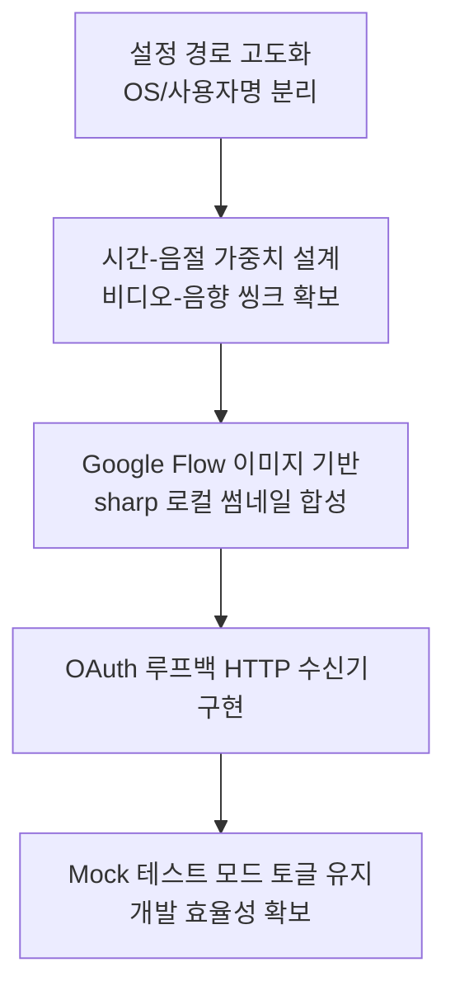

# Hermes Local Studio 구현 계획서 정밀 검토 및 아키텍처 개선 제안서

본 문서는 [2026-05-24-local-studio-complete-product-plan.md](file:///C:/Users/amd/hermes/docs/superpowers/plans/2026-05-24-local-studio-complete-product-plan.md) 파일과 현재 Hermes 프로젝트의 코드베이스, 자동화 워크플로우를 종합적으로 연계하여 다각도로 분석한 결과물입니다. 로컬 데스크톱 제품의 완성도를 높이고 실제 배포 단계에서의 리스크를 사전 차단하기 위한 문제점 진단 및 개선 방향을 제안합니다.

---

## 1. 종합 요약 (Executive Summary)

제안된 구현 계획서는 기존 텔레그램 봇 의존적 워크플로우를 **독립형 Electron 데스크톱 저작 도구**로 재구성하고, 인증/설정/제작/검수/업로드가 조화롭게 결합된 프로덕션 스튜디오를 설계하는 방향성을 잘 보여줍니다. 

하지만 **실제 배포(Distribution), 사용자 경험(UX), 그리고 렌더링 신뢰성** 관점에서 아래와 같은 치명적인 리스크들이 상존합니다.
* **배포 환경 호환성 결여**: 특정 로컬 경로(`C:/Users/amd/` 등) 및 로컬 설치된 Chrome 위치의 하드코딩.
* **불안정한 외부 의존성**: ChatGPT 웹 UI 자동화를 통한 썸네일 생성 방식의 차단 및 취약성 문제.
* **워핑/타이밍 왜곡 리스크**: 씬의 비디오 길이 계산과 실제 합성되는 TTS 내레이션 음성 재생 시간의 편차로 인한 비디오 싱크 왜곡.
* **개발 생산성 저하**: QA를 위한 모크(Synthetic) 렌더링 기능을 완전히 삭제하여 발생하는 테스트 속도 저하.

이 제안서는 이러한 문제들을 예방하고 제품 품질을 끌어올리기 위한 구체적인 가이드와 수정 코드를 제시합니다.

---

## 2. 세부 구현 계획(Task 1~10)별 문제점 및 개선안

### Task 1: Runtime Paths And Persistent Config
> [!WARNING]
> **하드코딩된 경로 및 이식성 리스크**
> * **문제점**: 설정 스토어의 기본값(`DEFAULT_CONFIG`) 및 코드베이스 전반에 개발자 개인 환경 경로인 `C:/Users/amd/supertonic3-local-tts-20260517-r4` 등이 하드코딩되어 있습니다. 사용자가 다른 경로에 TTS를 압축 해제했거나 사용자명(`amd`)이 다를 경우, 첫 실행 즉시 크래시가 발생합니다.
> * **개선안**: 특정 절대 경로를 기본값으로 지정하지 않고, 앱 실행 시 OS의 사용자 홈 디렉토리를 감지하거나 최초 실행 시 마법사(Setup Wizard)를 띄워 TTS의 경로와 설정값을 수동 지정 또는 동적으로 탐색하도록 변경해야 합니다.

* **개선된 `path-resolver.mjs` 구현 코드 제안**:
```javascript
import { app } from "electron";
import { join, resolve } from "node:path";
import { fileURLToPath } from "node:url";
import { dirname } from "node:path";
import os from "node:os";

const __dirname = dirname(fileURLToPath(import.meta.url));

export function getRuntimePaths() {
  const appRoot = resolve(__dirname, "..", "..");
  const userData = app.getPath("userData");
  const runtimeRoot = app.isPackaged ? userData : appRoot;
  const resourcesRoot = app.isPackaged ? process.resourcesPath : appRoot;
  const unpackedRoot = app.isPackaged ? join(process.resourcesPath, "app.asar.unpacked") : appRoot;
  
  // 사용자 홈 디렉토리 기반의 유연한 기본 경로 생성
  const defaultTtsRoot = join(os.homedir(), "supertonic3-local-tts");

  return {
    appRoot,
    userData,
    runtimeRoot,
    resourcesRoot,
    unpackedRoot,
    defaultTtsRoot,
    outputDir: join(runtimeRoot, "outputs"),
    configPath: join(userData, "config.json"),
    jobsDir: join(userData, "jobs"),
    chatgptProfileDir: join(userData, "browser-profiles", "chatgpt-profile"),
    flowProfileDir: join(userData, "browser-profiles", "flow-profile"),
    geminiProfileDir: join(userData, "browser-profiles", "gemini-profile"),
    renderScriptPath: join(unpackedRoot, "scripts", "render-youtube-with-tts.mjs"),
  };
}
```

---

### Task 2: Authentication Buttons And Persistent Sessions
> [!CAUTION]
> **Chrome 경로 탐색 실패 및 Playwright/CDP 중복 락 리스크**
> * **문제점 1 (경로)**: Chrome 실행 경로가 `C:/Program Files/Google/Chrome/Application/chrome.exe`로 고정되어 있으나, 64비트가 아닌 32비트 Windows 환경이나 사용자 단에서 크롬을 로컬에 설치한 경우(`%LOCALAPPDATA%`) 실행에 실패합니다.
> * **문제점 2 (CDP 락)**: 사용자가 앱 내에서 브라우저를 열어둔 상태로 플레이라이트(Playwright) 워크플로우를 트리거하면, 동일한 사용자 데이터 디렉토리(`--user-data-dir`)에 다중 인스턴스가 락(Lock)을 시도하면서 브라우저 구동 오류가 생깁니다.
> * **개선안**: Chrome의 알려진 설치 경로들을 순차 탐색하는 헬퍼 기능을 구현하고, Playwright 실행 전 현재 실행 중인 persistent chrome 인스턴스가 있는지 프로세스 또는 포트 단위의 연결 확인을 도입해야 합니다.

---

### Task 3: Custom Script Length And Dynamic Scene Planning
> [!IMPORTANT]
> **대본 기반 씬 시간 배분 왜곡과 영상 씽크 리스크**
> * **문제점 1 (문장 분리)**: `splitKoreanSentences` 함수가 마침표 뒤의 공백만을 기준으로 분리하도록 정규식이 짜여 있어, 문장 중간의 생략 부호(`...`)나 구두점 배치에 따라 문장이 제대로 잘리지 않거나 단일 문장으로 뭉칠 수 있습니다.
> * **문제점 2 (시간 배분)**: 각 씬의 재생 시간을 `Math.round(seconds / count)`로 균등하게 쪼갭니다. 예를 들어, 1씬 문장은 10자(말하는 데 2초)이고, 2씬 문장은 100자(말하는 데 20초)인데 둘 다 동일하게 12초로 배정됩니다. 이는 최종 인코딩 단계에서 1씬 비디오는 지나치게 슬로우 모션이 되고, 2씬 비디오는 오버런되어 잘리는 심각한 씽크 왜곡을 낳습니다.
> * **개선안**: 문장별 음절 수(공백 제외 한글 글자 수)를 계산하여 각 문장의 실제 발화 예상 시간 비율에 비례하도록 `duration_seconds`를 동적으로 부여해야 합니다. (한글의 경우 초당 3.5~4음절을 읽는 것이 표준적인 속도입니다.)

* **시간 배분 공식 개선 코드**:
```javascript
export function planScenesFromScript({ script, title, targetSeconds, customDurationSeconds, characterProfile }) {
  const totalDuration = Number(customDurationSeconds || targetSeconds || 60);
  const sentences = splitKoreanSentences(script);
  const count = targetSceneCount({ sentenceCount: sentences.length, targetSeconds: totalDuration });
  
  // 1. 문장을 타겟 씬 개수로 그룹핑
  const perScene = Math.max(1, Math.ceil(sentences.length / count));
  const tempScenes = [];
  let totalSyllables = 0;
  
  for (let index = 0; index < count; index += 1) {
    const narration = sentences.slice(index * perScene, (index + 1) * perScene).join(" ") || script;
    const syllables = narration.replace(/\s+/g, "").length;
    totalSyllables += syllables;
    tempScenes.push({ order: index + 1, narration, syllables });
  }

  // 2. 글자 수(음절) 비례 가중치를 적용하여 시간 배분 (최소 4초 보장)
  let allocatedSeconds = 0;
  const scenes = tempScenes.map((scene, idx) => {
    let duration = Math.round((scene.syllables / Math.max(1, totalSyllables)) * totalDuration);
    duration = Math.max(4, duration); // 씬별 최소 4초 확보
    allocatedSeconds += duration;
    
    return {
      order: scene.order,
      narration: scene.narration,
      duration_seconds: duration,
      image_prompt: [
        "9:16 cinematic YouTube shorts scene.",
        `Title: ${title}.`,
        `Narration context: ${scene.narration}.`,
        characterProfile ? `Consistent character: ${characterProfile}.` : "",
        "No subtitles, no readable text, no logos, no watermarks.",
      ].filter(Boolean).join(" "),
    };
  });

  // 3. 반올림 오차로 인한 전체 재생 시간 보정
  const diff = totalDuration - allocatedSeconds;
  if (diff !== 0 && scenes.length > 0) {
    scenes[scenes.length - 1].duration_seconds += diff;
    if (scenes[scenes.length - 1].duration_seconds < 4) {
      scenes[scenes.length - 1].duration_seconds = 4;
    }
  }

  return scenes;
}
```

---

### Task 4: Professional Voice Catalog
> [!NOTE]
> **엔진 파라미터 매핑 누락**
> * **문제점**: `voice-presets.mjs`에는 프리셋별로 `speed`와 `pitch` 값이 상세히 지정되어 있으나, 이를 수신하여 실행하는 파이썬 스크립트 `make-scenes-tts.py`에는 `pitch` 값을 파라미터로 넘겨주고 반영하는 코드가 빠져 있어 프리셋 지정 효과가 반감됩니다.
> * **개선안**: `make-scenes-tts.py`에 `pitch` 인자를 전달하도록 프로세스 호출 파라미터 목록을 보강해야 합니다.

---

### Task 5: Subtitle Style Designer With Live Preview
> [!WARNING]
> **CSS 미리보기와 ffmpeg 렌더러의 시각적 불일치 및 폰트 깨짐 리스크**
> * **문제점 1 (아웃라인 렌더링 차이)**: CSS의 `-webkit-text-stroke` 스타일은 글자 경계선을 중심으로 안과 밖에 모두 획을 그려 폰트를 흐리게 만들지만, ffmpeg(ASS 스타일)의 `Outline` 옵션은 텍스트 바깥쪽에만 획을 적용합니다. 
> * **문제점 2 (폰트 부재)**: 대상 PC에 한글 폰트(`Malgun Gothic` 등)가 없을 때 자막이 두꺼운 사각형(Tofu)으로 깨지거나 렌더링에 실패합니다.
> * **개선안**: 
>   - CSS 미리보기는 아웃라인이 겹치지 않도록 `text-shadow`를 상/하/좌/우 및 대각선 8방향으로 겹쳐 렌더링하는 스타일로 시뮬레이션 품질을 극대화합니다.
>   - 배포 패키지 내부에 가볍고 가독성이 우수한 오픈소스 한글 폰트(예: `Noto Sans KR Bold` 등)를 리소스로 포함하고, ffmpeg 렌더 시 해당 폰트 경로를 가리키도록 설정해야 합니다.

* **개선된 CSS 8방향 섀도우 예시**:
```css
#subtitlePreviewText {
  text-shadow: 
    -2px -2px 0 #000,  2px -2px 0 #000,
    -2px  2px 0 #000,  2px  2px 0 #000,
     0px -2px 0 #000,  0px  2px 0 #000,
    -2px  0px 0 #000,  2px  0px 0 #000;
}
```

---

### Task 6: Replace Test Scene Generator With Real Workflow Service
> [!CAUTION]
> **Mock 테스트 렌더러 제거로 인한 개발/검증 생산성 저하**
> * **문제점**: 실제 리리즈를 위해 synthetic scene generator(임시 6씬 생성기)를 본선 빌드에서 완전 차단할 경우, 프론트엔드 UI 수정이나 자막 정렬 상태 조정 같은 단순 시각 요소 변경 작업 시에도 반드시 느리고 비용이 드는 Google Flow 자동화를 매번 실행해야만 테스트가 가능해집니다.
> * **개선안**: 메인 코드에서 무조건 제거하는 대신, 디버그/테스트 모드 옵션을 제공하여 UI 설정에서 `Mock Media Mode` 토글을 켜면 로컬 ffmpeg의 `lavfi` 컬러 캔버스로 즉각적인 비디오를 임시 렌더링해주는 개발 생산성 우회로를 보존해야 합니다.

---

### Task 7: Job History, Review, And Local Output Management
> [!NOTE]
> **수백 개 파일 로드 시의 블로킹 리스크**
> * **문제점**: `job-store.mjs`에서 작업 목록 조회를 위해 디렉토리 내부의 모든 JSON 파일을 파일 시스템 단에서 직접 읽고 파싱하는 것은 이력 파일이 쌓일 경우 앱 프리징(Freezing)의 주원인이 됩니다.
> * **개선안**: 단일 파일 인덱스(`jobs-index.json`)를 통해 제목, 일시, 상태 정보만 가볍게 읽어 리스트를 표시하고, 개별 세부 정보는 해당 아이템 클릭 시에만 `${job.id}.json`을 개별 조회하는 Lazy-loading 패턴을 도입해야 합니다.

---

### Task 8: ChatGPT Thumbnail Generation With Authenticated Session
> [!WARNING]
> **Turnstile 보안 및 DOM 변경 취약성**
> * **문제점**: Playwright로 ChatGPT의 웹 대화 입력창을 찔러 넣고 DALL-E를 유도하는 구조는 Cloudflare Turnstile 감지 및 봇 방어벽에 의해 로그인 세션이 무효화될 확률이 대단히 높습니다. 또한 OpenAI 웹 서비스의 UI 레이아웃이 개편되는 즉시 자동화 코드가 작동 불능 상태가 됩니다.
> * **개선안**:
>   1. 이미 로그인 정보가 영속화되어 있고 Playwright 세션이 확립되어 있는 **Google Flow(Image FX) 모듈을 재사용**하여 썸네일용 배경 이미지를 추출합니다.
>   2. Node.js의 네이티브 고속 그래픽 처리 라이브러리인 `sharp`를 이용해, 추출된 이미지에 대본 핵심 키워드를 이용한 텍스트 배너를 입히는 '자체 합성 방식'을 택하면 속도, 비용, 안정성이 수십 배 향상됩니다.

---

### Task 9: YouTube Upload OAuth And Approval
> [!IMPORTANT]
> **패키지 미등록 및 OAuth 리다이렉트 서버 부재**
> * **문제점 1**: `googleapis` 패키지가 의존성(`package.json`)에 들어있지 않아 빌드/설치 시 로드가 원천적으로 차단됩니다.
> * **문제점 2**: 사용자가 데스크톱 Electron 앱에서 OAuth 승인을 누르면, 구글 서버가 엑세스 코드를 전송할 수 있는 로컬 리다이렉트 루프백 주소(예: `http://localhost:3000`)에 대한 임시 HTTP 서버 수신기(Listener) 구동 로직이 계획서상 빠져 있습니다.
> * **개선안**: `package.json`에 `googleapis`를 추가하고, `youtube-auth.mjs` 내부에서 OAuth2 클라이언트를 활성화할 때 일시적으로 빈 포트(임의의 포트)의 HTTP 서버를 구동해 구글의 리다이렉트 콜백 토큰을 캡처한 뒤 스스로 종료하는 루프백 리시버 흐름을 코드로 반영해야 합니다.

---

### Task 10: Packaged App Acceptance Before Installer
> [!CAUTION]
> **TTS 가상환경 번들링 불가에 따른 설치본 한계**
> * **문제점**: Python 런타임 및 Supertonic TTS의 모델 바이너리는 수 기가바이트(GB)에 이르므로 Electron Installer 내부에 온전히 패키징할 수 없습니다. 따라서 설치본만 실행한다고 해서 즉시 영상 생성이 구동되지 않고 에러가 발생합니다.
> * **개선안**: 최초 설치 마법사에서 사용자의 로컬 컴퓨터 내에 설정된 `Supertonic TTS`의 실행 파일(`.venv-win/Scripts/python.exe`)과 모델 파일의 위치를 선택하게 강제하고, 해당 위치의 무결성을 검증하는 프로세스 가이드를 UI에 명확히 표기해주어야 합니다.

---

## 3. 권장 아키텍처 로드맵 및 결론

본 로컬 YouTube Studio 구축 프로젝트가 개발용 임시 프로젝트를 넘어 **안정적인 커머셜 제품**으로 안착하기 위해, 본 제안서의 검토 내용을 바탕으로 아래의 아키텍처 개선 단계를 최우선 순위로 진행할 것을 제언합니다.



위 개선점을 제품 계획서와 코드베이스에 추가로 수용하면, 런타임 안정성과 배포 이식성을 동시에 거머쥔 완성도 높은 데스크톱 스튜디오를 최종 인도할 수 있습니다.
